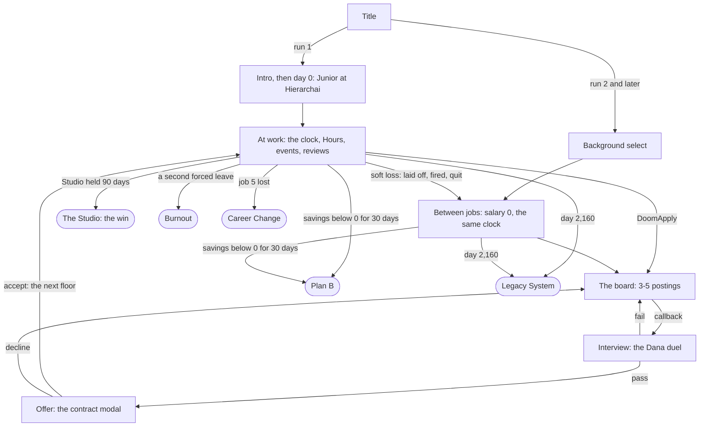
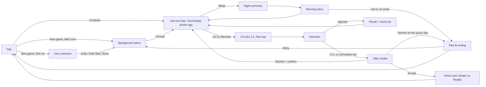
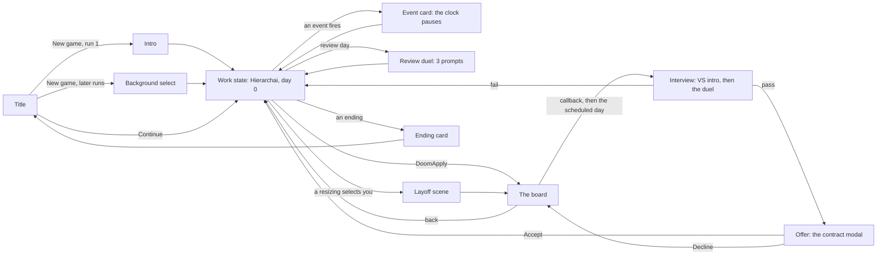

# Software Engineer Simulator - Game Design Document

| | |
|---|---|
| Version | 2.0, the career run (2026-10-07): Run Spec v1 merged (DECISIONS W8). The game is a satirical career roguelite: one run is one career of up to five jobs, the work state is the game, and the Phase 1 job hunt lives on as the DoomApply app, the Dana duel and the contract modal behind an adapter. 1.2 (2026-09-29) matched the v0.1 grey-box review: CV editing and lying removed (D9), coach marks close on a tap (D11), the VS intro waits for a tap (D12) |
| Date | 2026-09-26 (v1.2: 2026-09-29; v2.0: 2026-10-07) |
| Engine | Godot 4.7.2-stable, GDScript, `gl_compatibility` renderer |
| Platforms | iPhone first (built on the developer's MacBook; free Apple ID signing for development), Android LATER |
| Companion file | `docs/CONTENT.md`: every player-facing string, with the ids used below |
| Scope of this doc | The whole game. **The career run** (Run Spec v1) is sections 0, 2.11, 3, 4.5-4.6, 5.14-5.22, 6.1, 7.1, 8.5-8.6, 9.5, 10.7, 11.7 and 13. **Phase 1** is the rest: the v0.1 grey-box as built (intro -> background select -> job hunt -> interview -> offer -> Hired or Plan B). Each Phase 1 section the career run changes opens with a **Run Spec v1 status** line: kept, adapted, or retired when the career run is built. The code is still Phase 1 today |
| Sources | Phase 1: these docs since 2026-09-26. The career run: Run Spec v1 (2026-10-05, @Quy), merged on 2026-10-07 and archived read-only as `docs/run-spec-v1.md`. `docs/merge-report.md` maps every spec section to its place here and lists every conflict |

How to read this:
- Every decision has a one-line **Why**.
- Your (the developer's) decisions are marked **Decided (Dn)** and collected in section 12. D1-D8, plus the platform decision P1, were decided on 2026-09-26, and D9-D12 on 2026-09-29 after the grey-box review. The Run Spec's decisions keep its own ids, with a hyphen (D-01..D-25, P-01..P-08: D-12 is not D12); they are summarized at the end of section 12. `docs/DECISIONS.md` is the log for both series.
- **Which material wins** (DECISIONS W8): on game design (run structure, systems, rules, numbers, events, endings) the Run Spec material wins over the Phase 1 material and over every earlier work-loop note. On pixel-art style, engine and language, code conventions, shipped UI conventions and existing characters, the original rules win. A conflict neither rule settles is listed in `docs/merge-report.md` with a proposed resolution; text marked **Open (MC-nn)** here is one of them, waiting for you, and **Settled (MC-nn, D-nn)** is one you have answered (all of them were, on 2026-10-08: D-29..D-34).
- The Run Spec's ids are kept everywhere: D-, P-, Q- (decisions and questions), R- (requirements), E01-E26 (events), S1-S5 (the Studio's conditions), O1-O9 (objectives), A-01..A-05 (assumptions) and M1-M6 (milestones).
- Every number here is a starting value. Section 11 lists them all with the file that owns them. Section 5.12 shows what Phase 1's numbers produce in a 4,000-runs-per-background simulation; the career run's numbers (11.7) are set by the balancing harness (5.22).
- **MUST / SHOULD / LATER** tags follow the cut line in section 10. The career run's tags are set: build every MUST and SHOULD (D-36; 10.7).

---

## 0. The whole game on one page

- **Hook.** In influencer videos, software engineers wake at 10:47, "work" for 12 minutes and live in a cozy studio. It's 2026, the market is brutal, and you want that life anyway. Software Engineer Simulator is a satirical **career roguelite**: one run is one career of up to five jobs, and you win by living the influencer's video as a Senior engineer (D-08, D-24).
- **Run.** One career takes 25-35 minutes and about 3-4 in-game years, with at most 5 jobs (floors). Sessions last 5-12 minutes; you can save anywhere, and no time passes while the app is closed (D-06, D-13, D-16).
- **The work state is the game.** A macro clock runs one in-game day per second (pause, 1x, 2x, 4x) while you survive rent, burnout and an inherited codebase through events (D-01, D-12). Four numbers are on screen: Runway, Burnout, Ticket and Codebase (5.16).
- **Your controls grow with your level.** A Junior has one control, the Hours slider; a Mid picks tickets and can push back; a Senior sets the quality bar and owns the Codebase (D-07, D-14, 5.17).
- **Events.** About 25 decisions a year at the first job: scheduled ones on a 60-day calendar strip, telegraphed ones that arrive with rumors, random ones (incidents grow with the Codebase). Layoffs select for cost, not performance (5.19, P-03).
- **Job hunt.** The DoomApply app on your phone: a board of 3-5 postings, each a node on your career's route map (P-02). Interviews are still the Dana duel, now fed by the work state, and offers are still the contract modal (D-03, 5.20).
- **First run.** The Intern, converted to Junior, employed at Hierarchai (a startup) on day 0. Job 1 ends in a telegraphed layoff on day 240, two months after a possible promotion: performance doesn't protect you (D-02, D-23, P-06).
- **Win and losses.** The Studio: Senior, remote, living in The Studio, Burnout 30 or less and 6 months of runway, all held for 90 days (P-05, 3.4). The hard losses are Plan B (the ClikClok career coach), Burnout, Career Change and Legacy System (3.3). Most runs end in a loss; skilled play wins 5-10% of the time (D-15).
- **Between runs.** Every Ducky tip goes into the Handbook for good: options, a few small edges and lore. Each job in a run is harder than the last (floor depth, Scars), and each run a little easier than the last (the Handbook) (D-18, P-01, P-04, 5.21).
- **Teaching.** Every failure shows the joke, then the cause, then one true career tip from Ducky the rubber duck.
- **Art.** The original pixel-art style, with no commissioned art and existing sprites reused first (D-21, D-25; 2.5, 2.11).

### Phase 1 on one page (v1.2, as built)

**Run Spec v1 status:** this is the v0.1 grey-box, the code today. When the career run is built, its day loop, energy pips and separate rent countdown retire (D-04), CV tailoring goes (D-05) and the Hired card stops being an ending (D-24); the duel and the contract modal stay, behind an adapter (R-JOB-06). Negotiate, a SHOULD that was never built, is removed (D-27): the contract modal is Accept or Decline. The bullets below are the v1.2 text.

- **Hook.** In influencer videos, software engineers wake at 10:47, "work" for 12 minutes and live in a cozy studio. It's 2026, the market is brutal, and you want that life anyway. You tailor your (true) CV, swipe through job postings, survive a fighting-game-style interview with Dana from HR, and get an offer that's never quite what the video promised.
- **Run.** One run is one job search: about 8-16 minutes, 2-4 interviews, a median of 3-7 in-game days to an offer, with rent due in 12-15 days.
- **Background = difficulty + character.** The Intern (Easy), The Graduate (Medium) or The Self-Taught (Hard). The choice changes numbers at every stage of the loop (section 6).
- **Day loop.** Played portrait, one-handed: the hub screen is your phone, running the DoomApply job app. Morning inbox -> spend energy pips (apply, tailor, study) -> sleep. Rent is due in N days.
- **Interview.** A 2-second VS intro that waits for your tap, then an HP duel (your Composure against Dana's Doubt) on a side-view stage across the top of the screen, with the answers under your thumb. 5 prompts: 2 workplace-ethics choices and 3 knowledge questions answered on the one-tap **Answer Meter**. Stats decide most of it; your thumb nudges it.
- **Offer.** A contract modal: salary, work mode, commute, perks, fine print. Accept, Negotiate (once) or Decline.
- **Endings.** Hired card with a "Dream vs Reality" score, or the Plan B ending when rent runs out ("You became a ClikClok career coach").
- **Teaching.** Every failure shows the joke, then the cause, then one true career tip from Ducky the rubber duck.

---

## 1. Vision

### 1.1 Hook
"Chase the influencer's dream job through the 2026 hiring gauntlet." The satire is the gap between the dream (remote, rich, relaxed) and the process (ghost jobs, knockout filters, 5-round interviews, exploding offers).

The career run (Run Spec v1) carries the hook past the offer: you get the job, then you have to survive it, and then the next one. The satire follows you to work: layoffs that select for cost, reviews with forced distribution, a codebase that rots while you hustle, a rent that rises faster than your raises (3.3, 5.15, 5.19).

### 1.2 Pillars
Every feature must serve at least one. If it serves none, cut it.

1. **The satire is the mechanic.** Every joke is a rule you play against: ghost jobs really never reply, the "3+ years for entry level" filter really rejects you, the committee really spins a wheel. If a joke can't be a rule, it is one line of flavor text, not a feature.
   *Why:* jokes that are rules get remembered; jokes that are text get skipped.
2. **One thumb, one decision.** Each screen has at most 3 main actions and reads in about 5 seconds. No typing except an optional name. Tap-anywhere wherever possible.
   *Why:* portrait phone, one thumb, short sessions.
3. **Stats decide, skill nudges.** Character stats plus visible luck decide about 75% of each outcome; the player's input decides about 25%. Odds are shown as 5-dot bands, never as exact percentages.
   *Why:* the brief says interviews depend mostly on intelligence and experience; visible luck is forgiven, hidden luck feels rigged.
4. **Laugh, then learn.** Every failure has a visible cause and exactly one true tip. The tip always comes after the joke.
   *Why:* comedy first keeps it a game; the tip is the reward for reading.

The Run Spec's design objectives O1-O9 (13.1) carry these pillars into the career run. For example, O1 "performance doesn't protect you" makes a rule out of a joke (pillar 1: layoffs really select for cost, P-03), O3 "Junior eye level" keeps one control on a Junior's screen (pillar 2), and O7 "every failure teaches" is pillar 4. Pillar 3's display rule holds there too: odds show as 5-dot bands, never as percentages (a posting's callback chance included).

### 1.3 Tone and satire rules
- **Punch up.** Targets: hiring systems, corporate doublespeak, hype culture, influencer grift, AI hype. Never individuals, genders, ethnicities, nationalities, ages, rural people, or people who are struggling (the player, other applicants, laid-off workers).
- **Parody names only.** No real company, product, platform, school or person. The world naming sheet is in CONTENT.md section 1. Archetype parodies ("OmniGlobal Dynamics") are fine; one-letter-off brand parodies ("Amazoom") are not.
  - `tests/test_content_lint.gd` fails the build if any string contains a banned real brand (list in CONTENT.md section 1.3). Run a trademark and app-store search on every name before a public release.
- **Real tech terms are allowed for teaching** (SQL, HTTP, Git, REST, hash map). When a technology is the butt of a joke, invent one.
- **Dana, the interviewer, is competent, dry, overworked and fair.** She keeps getting laid off and rehired at another company (running gag). The punchline is always the process, never her.
  *Why:* the brief's "HR lady" can easily become a demeaning stereotype; making her the most competent person in the room avoids that and is funnier.
- **Hard mode is "the filters are stacked", not "self-taught people are worse."** Dana to the Self-Taught: "Our ATS hates 'no degree'. I don't. Show me what you shipped."
- **PG-13, no profanity.** Burnout and layoffs: the employer is the joke, never the person's mental health.
- **The career run's satire stings** (Run Spec risk; ROADMAP 8): layoffs and burnout are real. The joke is never on the player, a laid-off coworker or anyone's health; it's on the euphemism, the process and the employer, and Ducky's tip is always genuine. Dana delivers the layoff scene and is resized herself: the punchline is the script she has to read ("We're reshaping how we're shaped"), never her. The new coworkers (5.18), the event cards and the ending lines are draft copy for your tone sign-off (W4).
- **Tips are true.** Exaggeration only lives in the joke half of a line. No statistics in tips.
- **Second person.** UI text says "you". The protagonist has a default name (Alex) the player can re-roll.
- **Topical 2026 AI-hype jokes live in data** (news ticker, recruiter spam, influencer posts), so they can be refreshed without code changes.

### 1.4 Education goals
By the end of one run a player should have met these real ideas, each through a mechanic, not a lecture:

| Real lesson | Where the game makes it true |
|---|---|
| ATS systems auto-reject on **knockout questions** (degree, years, location), not on keyword percentages | Knockouts are the only auto-reject; the rejection email names the knockout |
| Tailored applications beat spraying | Tailor & Apply has better odds per energy pip; only relevant applications fill the Recruiter Radar |
| Tailor honestly: describe what you really did in the posting's terms | Tailor & Apply sends each CV line's honest Polished reframing (projects and TA work count as experience, numbers added): more matching tags and a pass on "1+ years" filters, with nothing invented. A degree filter yields only to a referral (5.4, D9) |
| A referral gets a human to read your CV | Referrals skip knockouts and multiply odds |
| Research the company | Research unlocks the insider "Why us?" answer (the strongest choice answer in the game; research before every interview raises first-interview pass rates by 10-15 points) |
| Ghost jobs exist | Some postings never reply; research shows "Posted 412 days ago" |
| Think aloud, use STAR, ask a question at the end | Knowledge and choice questions reward these; the model answer is always shown |
| Negotiating politely rarely backfires | Negotiate never rescinds in the MVP (removed 2026-10-07 with Negotiate, D-27: no mechanic teaches this now) |
| Compare total compensation, including commute | The offer shows commute hours; the Dream vs Reality score counts them |
| Rest matters | Arriving Tired speeds up the interview needle |

**Run Spec v1 status:** the first six rows teach through the Phase 1 hunt (knockouts, tailoring, honest reframing, referrals, research, ghost jobs). The career run's board (5.20) has no place for them: Settled (MC-07, D-34), keep the Run Spec's board for M1-M4 and consider ghost and knockout flags on postings at M6. The interview rows (think aloud, STAR, ask a question) stay with the duel, and the total-compensation row with the contract modal; the negotiation row left with Negotiate (D-27). "Rest matters" moves from energy to Burnout, which lowers your Composure (5.20).

The career run adds these lessons, each through a rule (the event tips are in 5.19):

| Real lesson | Where the game makes it true |
|---|---|
| Layoffs select for cost, not performance; prepare anyway | P-03: a resizing picks 80% by salary rank and 20% by chance, and Manager Opinion is no input. The counterplay is savings, Rapport and a live application (E07) |
| Standing still is never safe | Salary is fixed within a level while living costs and rent rise (D-10): a coasting Junior runs a deficit in year 3 (5.15) |
| Raise your savings rate before your rent | Every raise offers a bigger home (E21); the Penthouse is the trap (R-ECO-05) |
| Burnout makes your decisions for you | From Burnout 75, an event may pick its "exhausted" choice for you, and says so (R-EVT-02) |
| Keep a brag doc; your manager forgets, documents don't | Review Evidence +10 (E02), one of the Handbook's edges (5.21) |
| Get remote in writing | Pushing back on an RTO mandate needs the tip and a remote clause (E08) |
| Heroics are a staffing bug | Fixing prod yourself makes you its owner (E12) |
| An emergency fund is boring until it's the only thing that works | E20; the Handbook's edge starts each run with a month saved |
| Information is free: take the recruiter's call | E18 opens a posting that skips to the interview |

---

## 2. Platform and presentation

### 2.1 Orientation: portrait only
**Decided (D1, 2026-09-26): portrait only** (`display/window/handheld/orientation = 1`, SCREEN_PORTRAIT; no upside-down).
*Why:* the developer's call, and it suits the game. One-handed play fits the 3-5 minute sessions it is built for (bus, queue, bed); the job hunt becomes the thing it satirizes, a swipe-card app on the same phone the influencer hooked you through; one orientation still halves UI work.
*Art consequence:* the 16:9 side-view reference is re-composed for tall frames: its bands (sky, trees and buildings, fence, ground) stack top to bottom (2.5). The side-view scenes (interview, VS, commute) become a horizontal **stage band** across the upper part of the screen. The influencer's video needs no phone drawn inside a panel: the screen is the phone.

### 2.2 Base resolution and scaling
**Decided (D2): 270x480 base** (the portrait mirror of 480x270), stretch mode `viewport`, aspect `expand`, scale mode `integer`, plus a runtime **scale guard** in the `Device` autoload.
*Why:* one art pixel stays 4 screen pixels on 1080-class phones, the density of the reference (about 450 px wide at native resolution), so art cost and text capacity (about 40 characters x 40 lines) match the landscape plan. 360x640 would need about 1.8x more art pixels for the same look. A 12 px text line at 4x is physically the same size as a 16 px line at 3x. `canvas_items` + fractional was rejected: at 3.275x a pixel font renders with uneven 3 px and 4 px rows.

Verified engine behavior (Godot 4.7.2 source, `Window::_update_viewport_size`): integer + expand on its own **letterboxes** (e.g. 1179x2556 would show 270x585 with 50/108 px black bars). The guard sets `content_scale_size = floor(window / s)`, so the game area grows to fill the screen with square pixels. With the guard, players see:

| Device (portrait px) | Scale used | Visible game area | Notes |
|---|---|---|---|
| 540x960 / 1080x1920 (desktop test window) | 2x / 4x integer | 270x480 | exact |
| 750x1334 (iPhone SE 2/3) | 2.78x **fractional** | 270x480 | integer 2x would make a 34 px target only 34 pt; expect slightly uneven pixel rows |
| 828x1792 (iPhone 11) | 3x integer | 276x597 | |
| 1080x2340 (iPhone 12/13 mini) | 4x integer | 270x585 | |
| 1170x2532 (iPhone 12-14) | 4x integer | 292x633 | |
| 1179x2556 (iPhone 14 Pro-16) | 4x integer | 294x639 | leftover 3/0 px |
| 1206x2622 (iPhone 16 Pro) | 4x integer | 301x655 | |
| 1290x2796 / 1320x2868 (Pro Max) | 4x integer | 322x699 / 330x717 | the tallest and widest iPhones |
| 1640x2360 (iPad, only if iPad-native ships: LATER) | 4x integer | 410x590 | |
| 1080x2400 (Android, LATER) | 4x integer | 270x600 | |
| 720x1600 (budget Android, LATER) | 2.67x **fractional** | 270x600 | integer 2x would waste 25% |

Design rules that follow:
- **All critical content fits the central 270x480, which is inside the safe area on every iPhone above (2.9).** Extra width shows more background, never more UI: the UI column stays 254 px wide and centered (2.7). Extra height goes to the middle zone (2.8): the stage or card area grows, and backgrounds show more sky.
- Backgrounds are built from layers that tile sideways and are anchored to the screen bottom (2.5). Never stretch pixel art.
- Test every screen at game sizes 270x480 (the default 540x960 window), 294x639 and 330x717: resize the desktop window to those sizes, or to double them where the monitor allows.

The guard code (tech-verified; in `autoload/device.gd`):

```gdscript
var _base := Vector2(
	int(ProjectSettings.get_setting("display/window/size/viewport_width")),
	int(ProjectSettings.get_setting("display/window/size/viewport_height")))  # 270x480

func _update_scale_mode() -> void:
	var win := get_tree().root
	var w := Vector2(win.size)
	if w.x <= 0.0 or w.y <= 0.0:
		return
	var exact := minf(w.x / _base.x, w.y / _base.y)
	var s := floorf(exact)
	var stretch := Window.CONTENT_SCALE_STRETCH_INTEGER
	var game_size := Vector2i(_base)
	if s >= 1.0 and s / exact >= 0.8:
		game_size = Vector2i(floori(w.x / s), floori(w.y / s))  # 1179x2556 (iPhone 15) -> 294x639 @4x
	else:
		stretch = Window.CONTENT_SCALE_STRETCH_FRACTIONAL       # 720x1600 -> 270x600 @2.67x
	if win.content_scale_stretch != stretch or win.content_scale_size != game_size:
		win.content_scale_stretch = stretch
		win.content_scale_size = game_size
		layout_changed.emit()
```

On desktop, `size_changed` doesn't always fire when a resize leaves the viewport size unchanged, so `Device` compares `win.size` every frame (phones are fine: their window size is fixed at launch).

### 2.3 Project settings (applied; all keys verified to exist in 4.7.2)

| Key | Value | Why |
|---|---|---|
| `display/window/size/viewport_width` / `_height` | 270 / 480 | base resolution (D2) |
| `display/window/size/window_width_override` / `_height_override` | 540 / 960 | desktop test window, 270x480 at 2x (believed ignored on phones; unverified) |
| `display/window/stretch/mode` | `viewport` | renders at low res, so pixels are uniform |
| `display/window/stretch/aspect` | `expand` | plus the guard above |
| `display/window/stretch/scale_mode` | `integer` | the guard switches to fractional on SE- and 720p-class screens |
| `display/window/handheld/orientation` | `1` (SCREEN_PORTRAIT) | portrait only (D1); the iOS export writes it as `UIInterfaceOrientationPortrait` only |
| `rendering/textures/canvas_textures/default_texture_filter` | `0` (Nearest) | crisp pixels |
| `rendering/2d/snap/snap_2d_transforms_to_pixel` | `true` | no half-pixel shimmer |
| `rendering/textures/vram_compression/import_etc2_astc` | `true` | required by the iOS and Android exporters; reimport after changing it |
| `input_devices/pointing/emulate_touch_from_mouse` | `true` | mouse acts like a finger on desktop |
| `application/config/quit_on_go_back` | `false` | Android Back (LATER) goes back instead of quitting; no effect on iOS |
| `application/run/max_fps` | `60` | stops 120 Hz iPhones rendering at 120 fps |
| `gui/common/default_scroll_deadzone` | `6` | about 1.3 mm on an iPhone 15 if the unit is game px (unit unverified; test on the device) |
| `application/boot_splash/use_filter` | `false` | crisp splash |
| `application/boot_splash/bg_color` and `rendering/environment/defaults/default_clear_color` | `Color(0.07, 0.07, 0.10)` | near-black, so any 1-3 px leftover is invisible |
| `debug/gdscript/warnings/untyped_declaration` | `1` (warn) | keeps code typed; `res://addons` is already excluded |
| `application/config/version` | `"0.1.0"` | |
| `gui/theme/custom` | `res://ui/theme/main_theme.tres` | not yet: only after the file exists |
| `application/run/main_scene` | `res://features/title/title.tscn` | via `project_manage set_main_scene` (settings_set refuses this key) |

Keep as they are: renderer `gl_compatibility` (on iOS that is native OpenGL ES 3.0, its only iOS driver in 4.7.2), vsync on, `keep_screen_on`, low-processor mode off, and the iOS keys `display/window/ios/hide_home_indicator`, `hide_status_bar`, `suppress_ui_gesture` and `allow_high_refresh_rate` (all `true`, checked 2026-09-26). `suppress_ui_gesture` makes system edge swipes need two swipes, which protects the card swipe.

### 2.4 Viewpoint per scene

| Scene | Viewpoint (portrait) | MVP tag |
|---|---|---|
| Title | Side-view street at dawn in the 2.5 vertical template: sky and logo on top, skyline and street in the middle, buttons over the road | MUST (static), parallax SHOULD |
| Intro cutscene | Still 270x480 panels with pans or tilts; the influencer's video fills nearly the whole screen, as the phone in your hand | MUST |
| Background select | Flat UI: one full-width background card plus a 3-button selector | MUST |
| Job hunt hub | Flat UI: **the screen is your phone**. The DoomApply job app fills it, with a HUD strip on top and an app dock at the bottom | MUST |
| Job hunt hub, room version | **Top-down** static room illustration with 4 tappable hotspots in the lower 60% (phone, laptop, bed, door); the character is drawn into the image, no walking sprite | SHOULD |
| Hard-mode commute strip | Side-view parallax bus-window band (270x160) across the middle of the screen, 2 s | SHOULD |
| VS intro | Flat UI, diagonal split: Dana top-right, you bottom-left, VS on the diagonal | MUST |
| Interview | **Side-view stage band** in the upper part (you left, Dana right, desk between, company background); dialogue and answers below | MUST |
| Offer | Paper contract that slides up over the dimmed stage | MUST |
| Endings | Illustration card: side-view illustration on top, text below | MUST (one per ending), per-tier variants SHOULD |
| Work loop (Phase 2) | Top-down office that scrolls vertically, with walking characters | LATER (superseded by the next row, W8) |
| Work state (career run) | **The office diorama:** a top-down pixel-art floor plan about three screens tall that scrolls vertically; coworkers walk fixed lanes; the camera steps in on events (2.11) | Run Spec v1, built at M5 (the grey-box M2-M4 has no diorama) |
| Remote work (career run) | Your home room, top-down; its furniture follows your home tier (2.11) | M5 |
| Review duel, layoff scene (career run) | The duel's side-view stage with a manager portrait; the VS layout with no fight (5.16, 5.19) | M3 |
| The win's ending (career run) | A ClikClok-style vertical "video" from your run log (3.4) | M5 |

*Why top-down is SHOULD/LATER:* every viewpoint needs its own character sprite set. A static illustration with hotspots gets the top-down feel with zero extra sprites. **Run Spec v1 status:** the career run makes the top-down office part of the design (D-25). That cost is why the diorama comes after the grey-box milestones and reuses existing sprites and tiles first (D-21).

### 2.5 Art direction (derived from the reference image)
What the reference does, and the rule we take from it:

| Reference observation | Our rule |
|---|---|
| Native art is about 400-500 px wide, upscaled about 4-5x | 1 art pixel = 1 base pixel at 270x480, everywhere (4 screen pixels on 1080-class phones, the reference's density). Never scale art by non-integer factors. |
| Bright daylight: a 4-5 step sky-blue ramp, big dithered cumulus clouds | Sky and clouds are the only places with heavy dithering. In portrait the sky is the tallest band: each ramp step is a horizontal stripe 25-40 px tall, and 2-3 big clouds stack vertically. Hunt and title scenes use daylight. |
| Two greens: dark conifer and bright leafy, 5-6 steps total | Plants, parks and office greenery reuse these ramps. |
| Architecture in warm beige and cool greys, glass as blue-grey planes | Offices use the same grey/beige ramps; glass = 2-3 flat blue-greys with one highlight diagonal. |
| Clean, mostly dark-hued outlines (not pure black); selective, lighter on inner edges | 1 px outline in the darkest shade of the object's own hue; inner lines one step lighter. |
| Light from the upper left | Always light from the upper left; shadows fall to the lower right. |
| Spectators readable by one dominant outfit color (white tee, mustard sweater, brown jacket, black, navy suit) | Every character has one dominant outfit color. The player's hoodie color is fixed per background (Intern teal, Graduate maroon, Self-Taught mustard). |
| Clear layering: sky, clouds, trees, building, fence, track | The same layers, stacked top to bottom in a tall frame (template below), built as 4-5 `Parallax2D` layers that still scroll **horizontally** (2.6). |

**Portrait composition.** Full-screen scenes (Title, room hub) share one vertical template, anchored to the screen bottom, so taller phones show more sky, never more floor. Intro panels use the same vertical composition inside their own 270x480 frame, which sits centred on the near-black on taller phones (2.6, ARCHITECTURE 11.2):

| Band | y in the 480 frame | Holds |
|---|---|---|
| Sky | 0-130 | The ramp and 2-3 cumulus. Logo and HUD panels sit here on solid panels. It continues upward under the Dynamic Island. |
| Skyline | 130-220 | Far buildings, one pine and one leafy tree as vertical anchors, and one focal building (the reference's grandstand becomes an office tower or an apartment block). |
| Character | 220-288 | The ground line with a rail or fence; the 40-48 px characters stand on it, just above the thumb band. |
| Foreground / UI | 288-480 | Flat road, floor or grass with little detail, because buttons cover it. It continues downward under the home indicator. |

- **Side-view stages** (interview, VS, commute) are a wide vignette inside a band at least 270x160, anchored at its bottom edge (the desk or road line). Extra height shows wall, window and sky above the characters.
- **Cropping the reference:** keep its scale and crop its width. Long horizontal runs (the grandstand, the fence, a pack of jockeys) show one segment and run off both edges; never shrink them to fit. Favor tall subjects (pine, tower, lamp post, ring light) for vertical rhythm.
- **Motion** stays horizontal: the Title's slow idle drift, the commute bus, sideways intro pans. Vertical movement appears only as intro tilts.
- **Palette:** one master palette of about 32 colors (Endesga 32 from Lospec is a good starting point) plus at most 8 UI and brand accents. Tier mood comes from which ramps dominate: Big corp cool blue-greys and glass; Mid-size warm beige and fluorescent; Startup purple and teal neon over a dark warehouse.
- **Detail level:** match the reference's density. Big readable shapes, 2-4 shade ramps, no noise textures.
- **Art sourcing (D-21, D-25, 2026-10-05/07): no commissioned art.** Grey-box first. Reuse existing sprites and tiles first, and draw anything new yourself in this style: the hero pieces (player busts x3, Dana bust with 3 outfits and 4 expressions, 6 intro panels, 3 interview backgrounds) and the office diorama (2.11). CC0 pixel packs can fill gaps if they match the palette (check each license); whether a paid pack counts as the "art budget" D-21 rules out is Settled (MC-16, D-34): free or CC0 packs only, unless you OK one. AI-generated art: reference and mood boards only, never shipped. Double every art estimate you make. (Until D-21 this read: "draw or commission only the hero pieces ... Buy office props and UI frames from one itch.io pack family and palette-map them.")
- **The career run keeps this style** (D-25): the office diorama uses the same pixel grid, palette and character proportions (2.11). Where the Run Spec and these rules differ on a detail, these rules win.

### 2.6 Asset sizes (at 270x480)

| Asset | Size | Notes |
|---|---|---|
| Side-view full-body character | 40-48 px tall | matches the reference spectators (about 40 px) |
| VS and interview busts | 96 px tall, at most 80 px wide | player x3 backgrounds, Dana x3 tier outfits x4 expressions (neutral, impressed, unimpressed, glasses-glint). Two busts plus the desk share 254 px. S03 shows the bust cropped to its top 72 px (crop, never scale). |
| Interview background | 330x400, bottom-anchored at the desk line | The essential area is the bottom-center 270x160 (you, desk, Dana). Above it is wall, window and sky: the visible background runs from the screen top to the dialogue box, 188 px on a 270x480 screen, 321 on an iPhone 15, 399 on the largest Pro Max. One per tier; per-company prop swaps SHOULD. |
| Title background | `Parallax2D` layers, tiles at least 270 wide; the sky layer 720 tall; bottom-anchored | extra height = more sky |
| Room hub (SHOULD) | 330x720, bottom-anchored | hotspots in the lower 60% |
| Intro panels | 270x480 (up to 480x480 for a sideways pan, 270x720 for a tilt) | 6 panels. On taller phones the panel sits centered on the near-black clear color like a comic panel, so no bleed is needed. Keep the focal content in the top 350 px: captions cover the bottom. |
| Ending illustrations | 254x140 | inside the Hired and Plan B cards |
| Job card header strip | 238x48 | a crop of the tier's interview background; no new art |
| Company logos | 16x16 | one per company |
| Icons | 16x16 (energy pip 6x8) | dock icons sit above a 12 px label |
| App icon | 32x32 or 64x64 pixel art, upscaled by a whole number to 1024x1024 | the iOS preset's icon interpolation must be Nearest (2.10) |
| UI panels | 9-slice, 4 px border + 3 px padding, whole-pixel margins | one panel style; a full-width panel is 254 px outside and 240 px of text |
| Office diorama tiles (career run) | 16x16 (ARCHITECTURE 11.8) | a column about three screens tall; the asset list is in 2.11 |
| Top-down characters (career run) | set at M5 | the side-view characters are 40-48 px; the top-down ones need their own size and walk cycle (2.11) |
| Manager portrait (career run) | 96 px bust, like Dana's | the review duel (P-08); not on the Run Spec's asset list (2.11) |

Parallax layer defaults (`Parallax2D.scroll_scale.x`): sky 0.1 (clouds `autoscroll` -4 px/s), far 0.3, buildings 0.6, props 0.9, ground 1.0. Set `repeat_size.x` to the texture width and `repeat_times` to 2-3, so 330 px wide screens are covered.

### 2.7 UI and typography
- **Body font: monogram (CC0) at size 16** = a 12 px line with a 6 px advance: 45 characters edge to edge and 40 lines in the 270x480 frame (47 lines in an iPhone 15's 568 px safe height). Use it for everything except titles. The Step 2 font test measured a 6 px advance, as assumed, and a 13 px glyph height; the theme's line spacing of -1 keeps the 12 px line (DECISIONS A3, ARCHITECTURE 1.4). How it reads at 4x still needs the iPhone.
- **Text column:** a full-width panel or button is 254 px (8 px gutter each side); with a 4 px border and 3 px padding it leaves **240 px = 40 characters**, and every budget below is checked at 40 columns. Narrower slots: action-bar primary 168 px = 25 characters; Back 80 px = 11; half-width button 124 px = 18; dock labels 6.
- **Display font: Press Start 2P (OFL)** at 8/16/24/32 (30/15/10/7 characters per 240 px line), only for the title logo, the VS screen and big banners (K.O., OFFER!, HIRED!). Banners wrap by word; a banner that needs more than 3 lines drops one size. Ship its OFL license text in the Credits.
- **Font import settings** for every `.ttf`: antialiasing = **None**, hinting = None, subpixel_positioning = Disabled, mipmaps off, MSDF off. Use fonts only at their native size or whole multiples.
- **Text always sits on solid panels**, never directly over dithered sky or parallax.
- **Text budgets** (enforced by `tests/test_content_lint.gd`, which also word-wraps each string at 40 columns and checks the line cap):

| Field | Max | Lines at 40 columns | Where / why |
|---|---|---|---|
| Dialogue / reaction line | 120 characters | up to 4 | dialogue box (4 lines tall: word wrap loses about 10%) |
| Question prompt | 100 characters | up to 3 | dialogue box |
| Answer button | 40 characters | 1 | 254 - 2 x (4 + 3) = 240 px = exactly 40 x 6 px: zero slack, so no icons, letters or numbers in front of answer text, autowrap off |
| Knowledge spoken answer (green/yellow/red) | 80 characters | up to 3 | dialogue box, with your name tab |
| Posting joke, company card joke, background one-liner | 60 characters | up to 2 | job card / background card |
| CV line text | 60 characters | up to 2 | not shown in the MVP since the CV screen was removed (D9); the lint keeps the budget for a later CV view |
| Tip on screen | 120 characters | up to 4 | full-width Ducky note (full version in the Notebook) |
| Email body | 240 characters | up to 7 | inbox card (the list scrolls) |
| Player name | 10 characters | 1 | `LineEdit.max_length`; the VS plate fits 9 at Press Start 2P 16, so longer names use size 8 |

- **Colorblind-safe:** green/red is never the only signal. Match tags carry a check or cross icon; Answer Meter zones carry text labels; odds bands are dots plus a word.
- **All displayed strings go through `tr()`** from day one (content JSON stores keys or English text used as keys), so a translation CSV can be dropped in later. If you plan Vietnamese or another language, check monogram's glyph coverage before committing to it.
- **Theme:** one `main_theme.tres`, default font monogram 16, type variations `PrimaryButton`, `DangerButton`, `PaperPanel`, `HeaderLabel`.

### 2.8 Touch rules (portrait, one thumb)
1. **Target size:** art at least 32x32 game px, **hit area at least 34x34**, with at least 4 px gaps. At 4x on a 3x iPhone, 34 px is 45 pt (32 px would be 42.7 pt, just under Apple's 44 pt minimum). Answer buttons and the action bar are 36 px tall (48 pt). Hit areas may be larger than the art.
2. **Three zones** in the 270x480 frame (y measured from the safe-area top):
   - **Top band, y 0-72:** information only (HUD, HP bars, headers). It sits just below the Dynamic Island and is the hardest reach for one thumb.
   - **Middle, y 72-288:** content (cards, stage, dialogue, lists). Large surfaces may be tappable anywhere (the job card, tap-anywhere); occasional small controls are allowed (Research, the invite's GO NOW, interview pause).
   - **Thumb band, y 288-480 (bottom 40%):** every control used more than once a day: answers, SKIP/APPLY, primary buttons, the dock.

   Extra height on taller phones goes to the middle zone. The thumb band stays glued to the bottom safe edge, so buttons sit the same distance from the thumb on every iPhone.
3. **Action bar** at the bottom of the thumb band: `[ < Back ][ PRIMARY ]`, 80 + 168 px, 6 px gap, 36 px tall. The primary is bottom-right and spans the screen center (x 94-262), so left and right thumbs both reach it; Back and secondary actions go bottom-left. A screen with one action uses a full-width 254 px button, never a lone small primary in a corner.
4. **Hub navigation is a bottom dock, not a left rail:** 4 app slots of 60 px (5 of 47 px with Network, SHOULD; the CV slot left with D9), 4 px gaps, 40 px tall, each an icon plus a label of up to 6 characters. A left rail would cost 32 of 270 px and put its top icons out of reach.
5. **Gestures:** tap; swipe left/right on job cards (always mirrored by visible SKIP and APPLY) and on the S03 card (mirrored by the selector); hold only for Skip in cutscenes. No swipe-up, no long-press menus, no drag except the SHOULD drag-to-sign. Swipe surfaces stay out of the safe-area insets: `suppress_ui_gesture` only defers the home-indicator swipe, it doesn't disable it.
6. **Tap-anywhere** stops the Answer Meter needle and advances text. A control that consumes its own tap (the interview pause) never counts as the needle tap.
7. **250 ms input lock** whenever answer buttons appear, so a tap meant to finish the typewriter text can't pick an answer.
8. Answer buttons are stacked full width (254x36) with 6 px gaps, anchored to the bottom of the thumb band.
9. Controls handle mouse events only (touch arrives as emulated mouse). Only swipe code reads `InputEventScreenTouch/Drag`.
10. Buttons use `action_mode` Button Release. **Test in week 1 on the iPhone** whether dragging a ScrollContainer triggers a button release; if it does, ignore releases when the pointer moved more than the deadzone since the press.

### 2.9 Safe area (Dynamic Island, notch, home indicator)
Portrait only, so each device's insets are fixed: **top** = the Dynamic Island or notch (the status bar is hidden, but the inset stays reserved), **bottom** = the home indicator (reserved even while it auto-hides), **left and right** = 0 on iPhones. Backgrounds are full-bleed: sky runs up under the island, ground down under the home indicator. Everything the player reads or taps goes inside a `SafeAreaMargin` container (at least 4 px per side; left and right use the larger of the two insets in case a device reports them unevenly). The 270x480 design frame is the safe rect, and every iPhone below leaves at least that much.

Verified: in `viewport` stretch mode `get_final_transform()` is the identity for the root, and on iOS `get_display_safe_area()` returns native pixels, so the safe area is converted by hand (`Device.safe_insets()`):

```gdscript
var win := get_tree().root
var game := win.get_visible_rect().size      # real render size, e.g. 294x639
var px := Vector2(win.size)
var s := minf(px.x / game.x, px.y / game.y)
if win.content_scale_stretch == Window.CONTENT_SCALE_STRETCH_INTEGER:
	s = maxf(floorf(s), 1.0)
var origin := ((px - game * s) * 0.5).round() # letterbox offset
var safe := Rect2(DisplayServer.get_display_safe_area())
var tl := (safe.position - origin) / s
var br := (safe.end - origin) / s
inset = Vector4(maxf(tl.x, 0.0), maxf(tl.y, 0.0), maxf(game.x - br.x, 0.0), maxf(game.y - br.y, 0.0))
```

Results at the guard's scale (SafeAreaMargin rounds up):

| Device | Game area | Insets top / bottom | Usable |
|---|---|---|---|
| iPhone 14 Pro-16 (1179x2556) | 294x639 | 59 / 34 pt -> 44.25 / 25.5 -> **45 / 26** | **294x568** |
| Pro Max (1290x2796) | 322x699 | 59 / 34 pt -> 45 / 26 | 322x628 |
| iPhone 12-14 (1170x2532) | 292x633 | 47 / 34 pt -> 36 / 26 (unverified) | 292x571 |
| iPhone 12/13 mini (1080x2340) | 270x585 | 50 / 34 pt -> 38 / 26 (unverified) | 270x521 |
| iPhone 11 (828x1792, game at 3x) | 276x597 | 48 / 34 pt -> 32 / 23 (unverified) | 276x542 |
| iPhone SE 2/3 (750x1334) | 270x480 | 0 / 0 with the status bar hidden (unverified) | 270x480 |

On an iPhone 15 the 88 px beyond the 480 frame go to the middle zone (2.8). Desktop preview: a 294x639 window with `debug_fake_insets = Vector4i(0, 45, 0, 26)` on the scene's root SafeAreaMargin. Week-1 device check: confirm Godot still reports the 59 pt top inset while the status bar is hidden (unverified).

### 2.10 Platform constraints to plan around
- **iOS first (P1).** Built on the MacBook with Godot 4.7.2 (the godotengine.org zip, which never auto-updates), the matching iOS export templates and the Xcode that supports the iPhone's iOS version (iOS 27 needs Xcode 27 on macOS Tahoe 26.6+). Export the Xcode project (`application/export_project_only` on) to `builds/ios/` and run it from Xcode. A free Apple ID's Personal Team is enough for your own iPhone: its builds expire after 7 days (run again from Xcode) and it allows 10 App IDs per 7 days, so pick one bundle id (`com.<you>.swesimulator`, also a valid Android package name) and never change it. TestFlight, the App Store, Game Center and iCloud need the paid Apple Developer Program (99 USD a year): not before the release candidate.
- **iOS preset:** `application/targeted_device_family` = iPhone. iPad-native is LATER: iPadOS 26 deprecated `UIRequiresFullScreen`, so an iPad build must handle any window size and orientation (iPhone-only apps run on iPads in compatibility mode; how iPadOS 26 presents them is unverified). `application/icon_interpolation` = Nearest neighbor (the default Lanczos blurs pixel art). Orientation is not a preset option; it comes from 2.3.
- **iOS runtime (verified: 4.7.2 source and docs):** Compatibility = native OpenGL ES 3.0 (deprecated by Apple since iOS 12, still works). No Back button (`NOTIFICATION_WM_GO_BACK_REQUEST` is Android-only): every screen has an on-screen Back (4.4). After `NOTIFICATION_APPLICATION_PAUSED` iOS allows about 5 s before it may kill the app: keep `save()` small. The exported PCK is case-sensitive while Windows and macOS are not: match `res://` path case exactly.
- **Android (LATER):** JDK 17 and the Android SDK with `platforms;android-36` (the 4.7.2 Gradle template targets API 36, which Google Play has required for new apps and updates since 2026-08-31); the editor generates the debug keystore itself; `permissions/vibrate` for haptics; Play needs a Data safety form even for apps that collect nothing.
- **Both machines** run exactly 4.7.2 with matching export templates. The Windows Steam build can auto-update: commit first and update both machines together. **Exclude** `addons/godot_ai/*, tests/*` from every export (the addon's export plugin already strips its autoload). Setup steps: ARCHITECTURE.md section 13 and ROADMAP Step 2.

### 2.11 The office diorama (Run Spec v1 section 12, R-DIO-01..05)

The work state's main view: the office, drawn in this section's pixel-art style. "No art budget" means no commissioned art: reuse existing sprites and tiles first, and draw anything new in the same style (D-21, D-25, R-DIO-01). Where the Run Spec and the art rules (2.5-2.6, ARCHITECTURE 1.3, ROADMAP 5) differ on a detail, the art rules win. It's built at M5, after the grey-box milestones (10.7).

**Visual language (R-DIO-01)**
- A top-down pixel-art floor plan in a tall column about three screens high; scrolling it reads the company's health. It scrolls vertically, which suits the portrait screen.
- The same pixel grid, palette and character proportions as the rest of the game.
- Top to bottom: the manager's office and meeting rooms, the server rack, the desk rows, the pantry, the exit.
- You stand out the way the game already marks the player: your background's hoodie color (2.5).

**State as sprite and tile swaps (R-DIO-02)**

| What changes | How it looks |
|---|---|
| Time of day | a palette or lighting shift across each tick |
| Overtime | at 18:00 coworkers walk to the exit; your desk-lamp sprite stays lit |
| Burnout | your sprite's posture frames: upright, slumped, head on the desk |
| Codebase | a server-rack sprite with 10 LED pixels; one turns red per 10 points |
| Headcount | a removed coworker's desk swaps to an empty, unlit desk tile |
| Incident | every monitor sprite flashes red (never more than 3 flashes per second, 9.1) |
| Remote work | the view swaps to your home room; its furniture follows your home tier, and The Studio has the window, plant and lamp from the video |

**Walking (R-DIO-03).** Coworkers move along fixed waypoint lanes (desk, pantry, meeting room, exit) with no pathfinding, using the game's walk cycle. You walk only inside event scenes. (The Run Spec calls the walk cycle "existing"; the game has none yet: it is drawn with the top-down characters at M5.)

**Pause-and-zoom (R-DIO-04).** When an event fires, the camera steps from 1x to 2x or 3x on the event's focus location, and the card slides up into the thumb band. The zoom stays at whole-number steps with nearest filtering, so the pixels stay crisp: it cuts from step to step and never tweens through a fractional scale (ARCHITECTURE 1.3; the intro's "never zoom" rule, A19, is about its panels). Closing the card zooms back out, and the clock resumes.

**Asset list (R-DIO-05).** Each milestone lists the sprites and tiles it needs (size, frames, states) and marks which already exist. Until the art exists, labelled placeholders sit on the same pixel grid. CC0 pixel packs can fill gaps if they match the palette; check each pack's license first. The list is an estimate until it is checked against the existing assets; today the repo has none (`art/` holds placeholders until Steps 9-11), so "existing" means what the art steps and earlier milestones produce.

| Likely new art | States or frames |
|---|---|
| Office floor, wall and room tiles | day and night palettes |
| Desk with monitor | normal, red, empty and unlit |
| Desk lamp | on, off |
| Server rack | 10 LED pixels, set in code |
| Coworkers: 5 at Hierarchai, palette swaps elsewhere | idle, walk |
| Your sprite | upright, slumped, head on the desk |
| Home room | Shared room, One-bed, The Studio, Penthouse |

The Run Spec implies two more: a manager portrait for the review duel (P-08), at the duel's 96 px bust size (2.6), and Dana's expressions for the layoff scene (her 4 expressions may cover it). Tiles are 16x16 (ARCHITECTURE 11.8); the top-down characters' size is set at M5.

---

## 3. Core loop and meta loop

### 3.1 Loop diagram

**The career run (Run Spec v1 section 3).** The spec's own diagram ("2 starts, the career loop, 1 win, 4 hard losses") was an embedded picture that didn't come with the spec file; this one is redrawn from its text (3.3).



Every soft loss sends you to the board and the next floor; The Studio is the only way out that counts as a win. META across runs: the Handbook (every Ducky tip, for good), the background unlocks, an ending gallery (5.21).

**Phase 1 (v1.2, as built).** **Run Spec v1 status:** retired by D-04 when the career run is built: one macro clock (5.14) replaces the Morning / Day / Night cycle, and unemployment is the same clock with salary 0. The WORK-mode line at the bottom was an earlier work-loop note; the Run Spec supersedes it (W8).

```
META (across runs): Career Notebook of tips (SHOULD) - [best Dream score per background, LATER: D10] - intro_seen - run_count
 |
 RUN = one job search
 |-- Title -> [Intro cutscene: first run only, skippable] -> Background select (difficulty + name)
 |
 |-- DAY CYCLE (shared skeleton; HUNT is the MVP mode, WORK plugs in for Phase 2)
 |     MORNING  inbox reveal: invites first, rejections as one stack, ghosts silent
 |              [+ 1 event card, SHOULD]  [+ Hard: 2 s commute strip, SHOULD]
 |     DAY      spend energy pips:
 |                Jobs deck: Skip / Quick Apply (1) / flip -> [Research (1)] / Tailor & Apply (2) / referral
 |                Study (2): KNOWLEDGE +5
 |                [Network (2), SHOULD]
 |                Interview (3, +1 travel for the Self-Taught in person) if an invite is waiting
 |                   VS intro (tap) -> 5 prompts -> K.O. | Committee wheel | Rejection
 |                     K.O. / wheel win -> OFFER modal -> Accept -> HIRED card (MVP ends)
 |                                                      -> Decline -> back to the day
 |                     Rejection -> Ducky tip + model answer -> back to the day
 |     NIGHT    Sleep -> "Rent due in N days" -1 -> summary card
 |              N = 0 and no invite waiting -> PLAN B ending
 |
 |-- WORK mode (Phase 2): commute -> standup -> tasks/meetings -> evening -> payday
       laid off / quit / startup folds -> back to HUNT with more EXPERIENCE
```

*Why one Day Cycle:* HUNT and WORK share morning, energy, commute, sleep and the rent/paycheck tick. Building the cycle generically now makes Phase 2 "add a mode", and getting laid off sending you back to HUNT is both the joke and the replay loop. (D-04 keeps the idea, one clock for working and job hunting, and drops the day cycle; being laid off still sends you back to the hunt, now with a Scar or none, 5.21.)

### 3.2 Pacing targets

**The career run (Run Spec v1, D-06):**

| Target | Value | How it's enforced |
|---|---|---|
| One career run | 25-35 min, about 3-4 in-game years (a median run of 1,100-1,400 days) | 1 day per second at 1x (5.14); the harness checks it (5.22) |
| Session | 5-12 min; save anywhere; no time passes while the app is closed | auto-pause on events; a save at every event and when the app goes to background (5.14) |
| Jobs per run | 5 at most, then a forced hard loss | D-16 |
| Win rate | 5-10% for skilled play (the Planner bot) | R-BAL-01 |
| Total content | 2.5-4 h | D-06 |
| Decisions | about 25 a year at floor 1 | the event tiers (5.19) |
| First promotion | reachable inside job 1 (the review on day 180) | D-23; the Planner reaches Mid inside job 1 in 60% or more of run-1 seeds |
| A duel | at most 90 s including the VS intro (Phase 1's target, kept) | 5 prompts; a review duel has 3 |

**Phase 1 (v1.2, as built).** **Run Spec v1 status:** the rows about the hunt day, rent and the run length are retired by D-04 and D-06 when the career run is built; the interview row stays.

| Target | Value | How it's enforced |
|---|---|---|
| First interview | by day 2 (minute 3-5) on every background | first-run day-2 guarantee; good startup odds after |
| Hunt day length | at most 90 s | 6 new cards/day, 6-9 pips, one-tap actions |
| Interview length | at most 90 s including the 2 s VS | 5 prompts, 250 ms lock, typewriter 40 chars/s with tap-to-finish; the VS screen then waits for a tap, so reading it is the player's time (D12) |
| Interviews per run | 2-4 | tier odds, Doubt HP, Recruiter Radar |
| Run length | 10-15 min, Hard at most 20 | sim: Easy about 8, Medium about 14, Hard about 16 (section 5.12, D8) |
| Mobile session | any 3-5 min bite | autosave after every committed action |

### 3.3 Run structure (Run Spec v1 section 3)

A run is one career: up to five jobs (floors), each left by a soft loss or a voluntary exit, until you win or a hard loss ends it (D-08, D-11, D-16).

**The first playthrough and later runs**

| | Run 1 | Run 2 and later |
|---|---|---|
| Background | The Intern, converted to Junior (P-06) | pick The Intern, The Graduate or The Self-Taught, as unlocked (5.21) |
| Start | employed at Hierarchai (Startup), day 0 | between jobs, with the DoomApply board open |
| Floor 1 | always Hierarchai, with 5 authored coworkers (5.18) | chosen from the board |
| Guaranteed layoff | yes, on day 240, telegraphed from about day 150 (R-RUN-02) | no; every exit is earned |
| First review | day 180; a promotion to Mid is reachable (D-23) | on the archetype's cadence (5.18) |

**Run 1's beats:** the influencer clip on day 0; the first rumor around day 150; the review and a possible promotion on day 180; more signs; Dana's invite around day 235; the layoff scene on day 240; then the DoomApply board. A promotion followed by a layoff 60 days later is deliberate: it teaches that performance doesn't protect you (O1). How the intro hands over to day 0 is Settled (MC-11, D-34): a new last caption (CONTENT 16.6).

**Exits from a job**

| Exit | Type | Trigger | Scar (5.21) |
|---|---|---|---|
| Laid off | soft | a resizing event selects you (5.19) | none: a layoff is not your fault |
| Fired | soft | two "Below" reviews in a row with the PIP not cleared (5.16) | Bad Reference |
| Quit | soft, voluntary | you accept another offer, or quit from an event | Short Tenure, if under 180 days |
| Forced leave | an interrupt, not an exit | Burnout reaches 100 | Burnout History |

Losing job 5 by any route becomes a hard loss (D-16).

**Endings**

| Ending | Type | Trigger | Card line (draft, CONTENT 16.5) |
|---|---|---|---|
| The Studio | win | all five Studio conditions held for 90 days (3.4) | "You woke at 10:47. It took {jobs} jobs." |
| Plan B | hard loss | savings below zero for 30 days in a row (5.15) | "You became a ClikClok career coach." (the existing Plan B card, S12; D-19) |
| Burnout | hard loss | a second forced leave in one run | "You took the leave. You didn't come back." |
| Career Change | hard loss | you lose job 5 | "You teach a bootcamp now. You show them the video." |
| Legacy System | hard loss | day 2,160 (6 in-game years) without a win | "Six years. Same service. You are the legacy system." |

Every ending card shows the career-long Dream vs Reality score; its formula is Settled (MC-09, D-34): the 5 rows, rebased to runway months and clauses, scored per job. Phase 1's Hired card is no longer an ending (D-24): what Accept shows instead is Settled (MC-08, D-34), the HIRED! stamp as a short beat, with `end_tbc` dropped.

### 3.4 Win condition: The Studio (Run Spec v1 section 4, R-WIN-01..08)

You win by living the influencer's video as a Senior engineer: five conditions true at once, held for 90 in-game days (D-24, P-05). "Successful in IT" needs a measurable definition, or it collapses into "reach Senior", which is too easy and isn't the video. So success is the video's own conditions.

| # | Condition | The video's promise | Req |
|---|---|---|---|
| S1 | Level is Senior | a software engineer who made it | R-WIN-01 |
| S2 | Work mode is Remote | wakes at 10:47 | R-WIN-02 |
| S3 | Home tier is The Studio | the cozy studio | R-WIN-03 |
| S4 | Burnout at or below 30 | "works" 12 minutes a day | R-WIN-04 |
| S5 | A runway of 6 months or more at Studio rent | can actually afford it | R-WIN-05 |

- **Hold (R-WIN-06).** When all five are true, the ClikClok app starts "Filming...", a 90-day bar (90 s at 1x). Any condition breaking resets it to zero (Q-06: the default, reset rather than keep half).
- **Always visible (R-WIN-07).** The checklist lives in the ClikClok app, and a "Studio 3/5" chip sits on the HUD from day 0, so the player knows the target in the first minute.
- **Final threats (R-WIN-08).** While filming, these events get 3x weight: the RTO mandate rumor (threatens S2), the 2 a.m. incident and the overtime ask (S4), the Penthouse offer (S5), the resizing rumor (all five).
- **The ending.** A ClikClok-style vertical "video" assembled from your run log, captioned with your real career: "10:47 - woke up. 4 jobs. 2 layoffs. 1 Studio." Dream vs Reality shows what it cost.

**Why it's hard: no archetype gives you all five.** The win is a routing puzzle across jobs.

| Archetype | Remote postings | Senior pay vs Studio costs | Speed to Senior |
|---|---|---|---|
| Startup | often, 60% | barely covers it; savings build slowly | normal |
| Agency | rarely, 10% | doesn't cover it | fast, but you drop a level when you leave |
| MegaCorp | sometimes, 25%, threatened by RTO | covers it with room to save | slow |

Typical winning routes chain archetypes: an Agency for the title, then a MegaCorp or a remote Startup posting for the pay. A remote MegaCorp posting is the rare "dream job" node on the board.

---

## 4. MVP screen flow

### 4.1 Flow

**Run Spec v1 status:** Phase 1's flow, the code today. The career run's flow is 4.5: it reuses the Title, the Intro, Background select (runs 2 and later), the VS intro, the interview, the offer and the Plan B card, and retires the hub's day loop (S04-S06) and the Hired card as an ending (S11) when it is built.



Game-flow phases (the `GameFlow` enum): `TITLE, INTRO, BACKGROUND_SELECT, JOB_HUNT, INTERVIEW, OFFER, PHASE2_STUB (Hired card), GAME_OVER (Plan B)`. Night, Morning and Result are states inside their phase's scene, not phases. Only `GameState.change_phase()` changes phase; scenes call verbs.

### 4.2 Screens

Transitions are a 0.2 s fade (SceneRouter) unless noted. Every screen has an on-screen way back, because iOS has no Back button (4.4). Positions are in the 270x480 frame with y measured from the safe-area top; extra height on taller phones goes to the middle zone (2.8). Mockups are schematic (the real text column is 40 characters).

**S01 Title** (MUST) - side-view, 2.5 portrait template
- Contents: a static street at dawn (parallax SHOULD). The logo sits on a sign panel in the sky band (y 40-130): "SOFTWARE" and "ENGINEER" in Press Start 2P 24, "SIMULATOR" in 16, 216 px wide. [News ticker strip under the logo, SHOULD.] Skyline and street fill the middle, the road runs under the buttons, version text bottom-right.
- Touch without a save: tap anywhere = New game ("Tap to start" blinks at about y 400).
- Touch with a save: `[ New game ]` (y 350-386) above `[ CONTINUE ]` (y 392-428, full width, primary); "Replay intro" is a small text button bottom-left (y 440-474).
- Back: Android Back (LATER) and desktop Esc show "Quit?". iOS apps never quit themselves, so iOS has no quit.

**S02 Intro cutscene** (MUST) - side-view panels
- Contents: 6 still panels (270x480), 40 s or less, 2022 (age 17) to 2026, typewriter captions, background-neutral (it plays before the pick). Script: CONTENT.md section 2. Build it as text-only slides first; final art goes in last.
- Layout: captions on a solid band at y 360-432 (up to 4 lines). **Skip** is a "Hold to skip" pill bottom-right (96x34, y 442-476): hold 0.5 s while a ring fills. Panel 2's ClikClok video fills nearly the whole screen: the screen becomes the kid's phone.
- Touch: tap = finish the current caption, tap again = next caption (never skips the whole thing). Android Back (LATER) and desktop Esc also skip. Captions never advance by themselves (Step 6 agent default): the 40 s is the panels' pan time, and the player sets the reading pace.
- Auto-plays on the first run only (`intro_seen` in settings). Pauses when the app loses focus.
- Out: the title slams in on panel 6 (its third caption), the last caption follows, then Background select.

**S03 Background select = customization** (MUST) - flat UI with portraits

**Run Spec v1 status:** run 1 skips this screen (P-06), and runs 2 and later show only the unlocked backgrounds (5.21). The card's energy pips and rent-runway rows retire with the day loop (D-04); starting savings are `BackgroundData.start_savings_months` (1.0 / 0.8 / 0.8: A68, D-30), and the header that ends the intro is Settled (MC-11, D-34).

```
+-------------------------------------------+
| How did you spend those four years?       |   header, info only
| +---------------------------------------+ |
| | +------+ THE GRADUATE - MEDIUM        | |
| | | bust | Energy/day oooooooo..        | |   .. = commute pips, greyed
| | | 72px | Rent runway: 12 days         | |
| | +------+                              | |
| | "One diploma, one student loan, zero  | |
| |  callbacks."                          | |
| | KNOWLEDGE  [###--]                    | |
| | EXPERIENCE [#----]                    | |
| | NETWORK    [#----]                    | |
| | + DIPLOMA: passes 'degree required'   | |
| |   filters. TEXTBOOK ANSWER: wider     | |
| |   zone on your first knowledge        | |
| |   question.                           | |
| | - ENTRY-LEVEL PARADOX: '1+ years'     | |
| |   filters reject you unless you       | |
| |   Tailor & Apply.                     | |
| +---------------------------------------+ |   swipe the card = switch background
| NAME [ Alex                    ] [dice]   |
| +-----------+ +-----------+ +-----------+ |
| |  INTERN   | |*GRADUATE* | |SELF-TAUGHT| |   selector, 80x40 each
| |   EASY    | |  MEDIUM   | |   HARD    | |
| +-----------+ +-----------+ +-----------+ |
| [ < Title ] [           CHOOSE          ] |   action bar
+-------------------------------------------+
```

- Contents: the header; **one full-width background card** (254 wide, about 250 tall) with the 96 px bust cropped to 72 px, name + difficulty, energy pips per day (commute pips greyed), rent runway in days, the one-liner, 3 stat bars (5 segments each: KNOWLEDGE, EXPERIENCE, NETWORK), perk (+) and flaw (-), and for the Self-Taught its 2 rolled knowledge gaps. Below the card: the name row (Alex + dice), a 3-button **selector** and `[ < Title ][ CHOOSE ]`.
- *Why a selector plus one card:* three cards side by side would be 80 px wide each (13 characters a line), three stacked full cards need about 750 px, and a plain carousel hides two of the three choices. The selector keeps all three visible in the thumb band and jumps straight to any of them.
- Touch: tap a selector button, or swipe the card left/right, to switch; CHOOSE confirms. The last background played is preselected, otherwise The Graduate. Dice re-rolls the name from 20 neutral names (CONTENT.md section 3.2). Typing is optional (tap the field, 10 characters max); the iOS keyboard covers roughly the bottom 40%, so the name row lifts above it while typing (`DisplayServer.virtual_keyboard_get_height()`, implemented on iOS; its unit, likely native pixels, is unverified). The dice stays the main path.
- Out: the chosen card flies up and the phone "boots" DoomApply (0.35 s) -> day 1.

**S04 Job hunt hub: your phone, DoomApply open** (MUST) - flat UI, full screen

**Run Spec v1 status:** the deck, energy, the HUD's rent countdown and the Night/Morning screens retire with the day loop (D-04) and CV tailoring (D-05); the career run's DoomApply is a board of 3-5 postings (5.20). The phone frame and the bottom dock are shipped UI conventions the career run's phone shell can reuse (4.6).

The screen is your phone and DoomApply is the job app: the influencer hooked you through a phone video, DoomApply's tagline is already "Swipe right on your future", and a portrait screen already is a phone, so the frame costs nothing. The old laptop dashboard maps 1:1: top bar -> HUD, left rail -> app dock, deck -> the app's main view.

```
+-------------------------------------------+
| Day 3                 Rent due in 10 days |   HUD, info only (y 0-32)
| Energy oooooo.. 6/8      Radar [###---]   |
| ----------------------------------------- |
| DoomApply              (*) Invite waiting |   app header, info only
| +---------------------------------------+ |
| | ~~~~ office strip (tier bg crop) ~~~~ | |
| | [logo] Beigeware Financial        MID | |
| | Backend Developer                     | |
| | [v Java]  [v SQL]  [x APIs]           | |   job card, 254 wide:
| | "Read code from someone who left in   | |   tap = flip, swipe = skip/apply
| |  2009."                               | |
| | [ Knockout: 1+ years experience ]     | |
| | Quick apply  [##---] Unlikely         | |
| +---------------------------------------+ |
| [ MegaBoard ] [HumbleBrag ] [LaunchPadd ] |   site tabs (SHOULD)
| [=] [   SKIP   ] [       APPLY  1       ] |   action row; [=] = menu/pause
| [ Jobs  ]  [ Mail* ]  [ Study ]  [Sleep]  |   dock; * = invite badge
+-------------------------------------------+
```

| y (of 480) | Element |
|---|---|
| 0-32 | HUD, information only: day, rent countdown (red at 3 days), energy pips (commute pips greyed), Recruiter Radar |
| 36-52 | App header, information only: "DoomApply", plus a gold "Invite waiting" pill while one is waiting |
| 56-348 | Job card, 254 wide, anchored just above the site tabs; extra height on taller phones goes above the card |
| 356-384 | Site tabs (SHOULD): 3 segments of 82 px; without them the card is 36 px taller |
| 392-428 | Action row: `[=]` menu 34, SKIP 80, APPLY 128 (APPLY spans the screen center, 2.8) |
| 436-476 | Dock: Jobs, Mail, Study, [Network, SHOULD], Sleep (moon) at the right end |

- **Dock:** each app opens full screen and `[ < Back ]` returns to Jobs. Jobs = DoomApply; Mail = the inbox, with a gold badge while an invite is waiting (its GO NOW lives there); Study = BigOhNo; [Network = HumbleBrag coffee chat, SHOULD]; Sleep.
- **Jobs deck:** 6 new cards per morning (2 per tier), at most 10 on the board, oldest drop off. Card front: a 238x48 header strip cropped from the tier's interview background, logo + company + tier, job title, 3 tags marked check/cross against your honest CV (what Quick Apply sends, 5.4), 1 joke line (60 chars), a knockout chip if that CV fails one, the Quick Apply odds band. Swipe right or APPLY = Quick Apply (1 pip). Swipe left or SKIP = skip (card goes to the back of the deck). Tap the card = flip.
- **Card back:** tier, applicants ("1,247 applicants in 2 hours"), posted N days ago, salary text, tailored odds band. In the card's lower half: [Research (1), SHOULD], whose ghost flag, red flags and real salary band expand inside the card, and the [Use referral (n left)] toggle if you have tokens. The action row becomes `[ < Back ][ TAILOR & APPLY  2 ]`.
- `[=]` opens Pause (S13): it is the hub's on-screen Back.
- The first 3 applications play the full Parsinator 3000 scan (1 s) over the card; after that a 0.3 s "SENT" stamp.
- Sleep: if 2+ pips remain, confirm "You still have N energy. Sleep anyway?" with `[ < Back ][ Sleep ]`.
- **Night summary:** the phone's lock screen at night with one notification card, "Applied 4 - Rejected 2 - Ghosted 1 - Rent due in 9 days". Tap anywhere -> Morning inbox.

**S04 room version** (SHOULD) - top-down static illustration of your room (330x720, bottom-anchored; props differ per background). Wall and window fill the top 40%, and ghosts float there (one per ghosted application). 4 pulsing hotspots (48x48 or larger) sit in the lower 60%: phone on the desk bottom-right (opens DoomApply; the most used, so the easiest reach), laptop (Study), bed (Sleep), door bottom-left (Network). Ramen cups stack on the desk as rent runs down. The camera zooms into the phone (0.35 s) before DoomApply opens; DoomApply's `[=]` then becomes `[ < Room ]`, and the room gets the `[=]`.

**S05 CV screen (Buzzwordsmith)** (removed 2026-09-29, DECISIONS D9)
- Replaced by nothing: your CV is your background's true CV and has no screen. Quick Apply sends it as is; Tailor & Apply on the card back sends each line's honest Polished reframing (5.4). There is no separate "Polish CV" button either: no stat fits it, and Tailor & Apply already is the per-job polish.

**S06 Morning inbox** (MUST) - DoomApply's Mail, full screen, a vertical list
- The HUD sits on top as in S04. Below it, a scrolling list in this order: (1) invites: golden envelope, fanfare, confetti, the email, "Interview with {company}: today or tomorrow", and inside the card `[ Later ]` and `[ GO NOW  3 energy ]` (4 for the Self-Taught in person); (2) rejections as **one stack card** "5 rejections" [Flip all], which expands in place to one short line each, knockout rejections showing the knockout reason; (3) a quiet footer "2 applications: no reply. Probably ever." (ghosts are silent); (4) the Radar update; (5) [event card, SHOULD].
- `[ Start day ]` is pinned full width at the bottom, outside the scroll, always visible. Later keeps the invite in Mail (gold dock badge) until it expires.
- The first rejection ever shows the Ducky tip `tip_ats_knockouts` or `tip_rejection_numbers` as a full-width note under the stack.

**S07 VS intro** (MUST) - flat UI with busts, a 2 s clip that then waits for a tap, portrait split
- Layout: a diagonal split across the middle (about y 210-270). Dana's half is on top (company color, company background behind), her 96 px bust top-right with her plate to its left: name, her title on 2 lines and **one** joke stat, then **one** special move full width. Your half is below (hoodie color), your bust bottom-left with your plate to its right: name, nickname ("THE THEORIST") and 3 stat bars (the S03 StatBar). The tier banner sits at the bottom (Press Start 2P 16, up to 2 lines). You stay left and Dana right, as on the interview stage.
- Dana's stat and move take turns by `times_met_dana`, with no dice: the first interview of a run shows "Candidates today: 11" and "Special move: The Five-Year Plan", the second "Coffee: 4th cup" and "Special move: The Salary Expectation Trap", the third "Patience: [###--]" and "Special move: The Awkward Silence", then it starts over (`vs_dana_stat_1..3`, `vs_dana_move_1..3`).
- The clip starts once the scene fade is over, so the fade reveals its first frame. 0.00 s white flash. 0.05-0.35 s the busts slide in along the diagonal (Dana down from the top-right, you up from the bottom-left). 0.35 s "VS" slams onto the diagonal (hit-stop 100 ms, 4 px whole-pixel shake, haptic). 0.4-0.9 s the plates and the banner appear. 2.0 s the last frame holds and "Tap to continue" (`ui_tap_to_continue`) blinks under the banner (0.5 s on, 0.5 s off) on its own small panel.
- **Tap anywhere, or Back** (Decided D12): before the slam it does nothing; during the rest of the clip it jumps to the last frame; on the last frame it starts the interview (Dana's greeting). It never moves on by itself, and a resumed interview plays it again and waits.
- *Why:* the developer found the old auto-advance too fast for the amount of text (grey-box review, 2026-09-29). Waiting for a tap lets each player read at their own pace, and one stat plus one move halves the reading.

**S08 Interview** (MUST) - side-view stage band

```
+-------------------------------------------+
| COMPOSURE        ROUND 2/5         DOUBT  |   bars band, info only (y 0-28)
| [##################] [################--] |
|       (company background layers)         |   stage band (y 28-188; grows
|                                           |   to 248 px on an iPhone 15)
|   +------+                   +------+     |
|   | you  |                   | Dana |     |
|   | 96px |                   | 96px |     |
| ==+======+=======desk========+======+==== |
| +---------------------------------------+ |
| | DANA                            [II]  | |   dialogue box 254x76 (y 188-264),
| | "Friday, 4:55 PM. Your app update is  | |   4 lines; [II] = pause
| | done, but nobody has tested it yet.   | |
| | What do you do?"                      | |
| +---------------------------------------+ |
|                                           |   answer area (y 268-480)
|                                           |
| [ Test it, then release it on Monday.   ] |   answers 254x36, 6 px gaps,
| [ Ask the team chat what to do.         ] |   y 348-468, 250 ms lock
| [ Release it now. Turn off my phone.    ] |
+-------------------------------------------+
```

| y (of 480) | Element |
|---|---|
| 0-28 | Bars band, information only: COMPOSURE (left) and DOUBT (right), 122x8 each, ROUND n/5 between the labels |
| 28-188 | Stage band: company background, you left and Dana right (96 px busts), desk. It grows with extra height (248 px on an iPhone 15). Damage numbers, sweat drops, K.O. and the committee wheel play here. |
| 188-264 | Dialogue box, 254x76: a name tab (DANA, or your name in your hoodie color) and 4 lines; pause `[II]` at its top-right (34x34 hit area) |
| 268-480 | Answer area: the meter row (y 280-320), then the thumb band (2.8) with answers, the tap pad or the Ducky card |

- Top: fighting-game bars (damage numbers pop over the stage). On a hit the colored fill jumps to the new value and a white "ghost" over the lost part shrinks to it over 0.4 s, in whole pixels; a rise just jumps. The ghost stops while the game is paused, and the bars start full with no ghost (HpBar, built in the Step 7 review).
- Choice prompt: Dana's line types out in the dialogue box; 3 shuffled answers appear stacked at y 348-468 behind the 250 ms lock; tap one; Dana reacts (expression + reaction line); bars move.
- Knowledge prompt: Dana asks (100 chars). The **Answer Meter** (5.8.4) appears in the meter row, its zone width visible before the needle starts. The "Tap anywhere!" pad fills y 348-468 under the resting thumb, so the thumb never covers the needle; any tap on the screen counts except `[II]`, which consumes its own tap. "TIRED: needle is faster" shows under the bar when Tired. Your character then speaks the green, yellow or red answer in the dialogue box; on red, Ducky's "Real answer: ..." appears as a full-width note in the thumb band.
- **`answer_meter_width_px` stays 200.** Timing is tuned in bar-widths, so the pixel width changes looks, not balance. At 200 px it keeps the landscape plan's physical size (267 pt, 68% of an iPhone 15's width), the smallest NAILED IT zone stays 24 px wide and PERFECT about 10 px, the needle moves 2.0-2.9 px per frame, and the bar sits 35 px from each edge of the 270 frame, away from the gripping hand. Try 240 in Playtest #1 if the zone reads small.
- Lie probe (removed 2026-09-29, DECISIONS D9): Dana never asks about your CV, because every CV line is true; prompt 2 is always a knowledge question (5.8.5).
- Remote startup interviews (SHOULD): the stage band becomes a video call on your phone (Dana's feed fills the band, your small self-view in a corner).
- App loses focus: the tree pauses; on return "Ready? Tap to continue".

**S09 Result** (MUST) - stage band + banner
- K.O.: 0.5 s slow-mo in the stage band; "K.O.!" (Press Start 2P 32, 160 px) morphs into "OFFER!" (192 px) over the stage, sting, haptic -> Offer modal.
- Committee: "TIME OVER! THE COMMITTEE DECIDES..." (Press Start 2P 16, 3 lines) over the stage; a 128 px wheel with the win wedge sized to the real odds spins 2 s in the stage band -> win (Offer) or lose.
- Rejection: "We've decided to move forward with other candidates." in the dialogue box; the thumb band becomes the Ducky card: one tip (up to 4 lines) + the model answer of your worst knowledge question (up to 3 lines) + a full-width `[ Back to the hunt ]`. Rejections use up the day's interview; the day continues.

**S10 Offer modal** (MUST) - paper contract over the dimmed stage

**Run Spec v1 status:** kept, behind the adapter (5.20): Accept or Decline (D-27). In the career run the salary comes from 5.15 (its display is Settled, MC-10, D-34: the contract shows the yearly figure), the posting's clauses join the fine print (M1's clause ids are `on_call`, `remote_in_writing` and `unlimited_pto`: A72; the contract's wording is M3), and "Please decide before you sleep." names a retired mechanic (Settled, MC-20, D-34: reword at M3).

```
+-------------------------------------------+
|        (dimmed stage: Dana watches)       |
| +---------------------------------------+ |
| | OFFER OF EMPLOYMENT - Hierarchai      | |   paper slides up from the bottom
| | Dear Alex,                            | |
| | We are thrilled (legally required     | |
| | wording) to offer you the role of     | |
| | Mobile Dev (Also Barista).            | |
| |                                       | |
| | Salary:     $71,000/year              | |   one field per line,
| | Work mode:  Fully remote              | |   12-character label column
| | Commute:    0 minutes. The influencer | |
| |             was right about one thing | |
| | Perks:      Ping-pong table.          | |
| |             Kombucha on tap.          | |
| | Fine print: Equity: 0.0001%, 4-year   | |   [?] = all 3 lines (SHOULD)
| |             vest, 1-year cliff. Worth | |
| |             one sandwich at target    | |
| |             valuation.            [?] | |
| | Please decide before you sleep.       | |
| | x____________________ (sign, SHOULD)  | |   drag-to-sign line
| +---------------------------------------+ |
| [ Decline ] [           ACCEPT          ] |   action bar
+-------------------------------------------+
```

- Contents: the paper (254 wide, about 250 tall) slides up from the bottom over the dimmed stage; Dana stays visible above it. One field per line after a 12-character label column (values wrap at 28 columns): role and company, **yearly salary**, at startups an "Equity: 0.0001%" line under it (section 7's joke equity; built in Step 6 as an agent default), work mode, commute preview (e.g. "4 days x 95 min each way = 12.7 h a week", 2 lines), 2 perks, 1 fine-print joke (up to 4 lines; `[?]` shows all 3, SHOULD), "Please decide before you sleep." One Ducky tip sits under the paper (8.3). It fades in once the paper has landed, so it never covers the rising contract, and a tap closes it for this offer (its "x" shows it, as on the coach marks, D11); the paper then eases down into the room it leaves (agent default A47).
- Buttons: `[ Decline ][ ACCEPT ]` (80 + 168). (A full-width Negotiate above the action bar, a SHOULD, was removed on 2026-10-07: D-27.) Decline holds the action bar's bottom-left, so the on-screen Back (4.4), `[ < Back ]` (it opens Pause; Back never declines), has its own row above the action bar. Decline opens a confirm dialog; on the grace day it says the run ends. SHOULD: ACCEPT becomes drag-to-sign along the 200 px line, left to right.
- Out: Accept -> Hired card (5.9.4). Decline -> Dana's line -> DoomApply (same day), or Plan B on the grace day (5.10).

**S11 Hired card** (MUST) - side-view illustration card, in two beats

**Run Spec v1 status:** in the career run, accepting an offer leads to the next job, not an ending (D-24), and "TO BE CONTINUED - Phase 2" goes with the Phase 1/Phase 2 framing (W8). What Accept shows, and where the Dream vs Reality sheet goes, is Settled (MC-08, MC-09, D-34): a short HIRED! stamp beat, and the sheet moves to the ending cards, rebased and scored per job.
- Beat 1: the "HIRED!" stamp (Press Start 2P 32) slams onto a 254x140 illustration; below it company, role and salary (3 lines) and the Hired line for that tier (up to 3 lines). Tap anywhere to continue.
- Beat 2: the **Dream vs Reality** panel slides up over the illustration: the header "YOUR JOB vs REMY'S VIDEO" (`end_dream_header`), its 5 rows (section 5.9.5; label left, the four video rows with Remy's number in brackets, e.g. "Salary (Remy: $150k)"; points right out of the row's maximum, e.g. "18.9/40" (A48); one line each, tallying one by one), the score and grade, "100 is the life in Remy's video. Nobody gets 100. Not even Remy." (`end_dream_footer`, Decided C4), `tip_written_offer`, "TO BE CONTINUED - Phase 2: The Working Life" (`end_tbc`).
- Buttons: `[ < Title ][ NEW RUN ]`, in beat 2. Leaving it deletes the run save.
- *Why two beats:* everything at once needs about 500 px, more than the 480 frame, and the pause lets the joke land before the score.

**S12 Plan B ending** (MUST) - side-view illustration card, one beat (about 400 px)

**Run Spec v1 status:** kept as the career run's Plan B ending, the "runway hits zero" loss (D-19, 3.3); its trigger becomes savings below zero for 30 days in a row. The other endings use the same card (4.6).
- The "PLAN B" stamp over a 254x140 illustration (you, a ring light, ClikClok); "Rent's due. You became a ClikClok career coach..." (3 lines); the background-specific line; the closing line (a 17-year-old watching your video, 5.10; `end_plan_b_final`); one tip; run stats (days, applications, interviews, rejections; 2 lines).
- Buttons: `[ < Title ][ RETRY ]` (one tap -> Background select with the same background preselected, fresh run).

**S13 Pause** (MUST: Resume, Quit to Title) / **Settings** (SHOULD: music, SFX, haptics, reduced motion, Relaxed Timing, text speed, replay intro) / **Career Notebook** (SHOULD)
- Pause is a bottom sheet, buttons stacked full width with the most used lowest: Quit to title (top), [Notebook], [Settings], RESUME (bottom, primary). Tapping outside the sheet = Resume.
- Settings: a full-screen list, one control per 36 px row, `[ < Back ]`.
- Notebook: a vertical list of collected tips, one row each; tap a row for the full tip; `[ < Back ]`.

### 4.3 Scripted first run (FTUE)

**Run Spec v1 status:** these coach marks teach the hunt, so they retire with it, except `coach_meter`, which still teaches the duel. The career run's first run is run 1's scripted year at Hierarchai (3.3); its coach marks for the Hours slider, the speed control and the Studio chip are three Ducky notes that close on a tap, as D11 (settled at M2's huddle: A84).

Only on the first run. Coach marks are full-width Ducky sticky notes (40 columns, up to 4 lines) placed in the middle zone with an arrow toward one control. They never cover that control, the thumb band's buttons or the text they talk about (on the Jobs screen they sit over the card's header strip), and they take no input except their own tap.

**Closing a coach mark** (Decided D11, 2026-09-29): a mark disappears when you do the action it asks for, or when you **tap the note** (a small "x" in its top-right corner shows it can be closed). A tap counts on release, like a button: press and release both on the note, with no drag past the 6 px scroll deadzone. It never reaches the card under the note, and in Mail a drag that starts on the note still scrolls the list. A closed mark stays closed for the rest of the run (saved at once, so Quit to title can't bring it back), and closing one never brings the next early: each still waits for its own moment. The interview's `coach_meter` note can't be tapped closed, because the Answer Meter takes taps anywhere.
*Why:* the developer found the notes blocking the view of the job card until Apply or Sleep (grey-box review, 2026-09-29).

| When | Ducky says (CONTENT.md section 10.2) | Highlight |
|---|---|---|
| Day 1, deck opens | "Swipe right or tap APPLY to send your CV. Costs 1 energy." (`coach_apply`) | APPLY in the action row, plus a swipe-right arrow on the card |
| After the 1st application | "Tap a card to flip it. Tailor & Apply sends a better CV." (`coach_flip`) | the card |
| Energy at 2 or less, or 4 applications | "Out of energy? Tap the moon to sleep. Replies come in the morning." (`coach_sleep`) | Sleep (the moon at the dock's right end) |
| Day 2 morning | the day-2 guarantee delivers an invite (section 5.7) | the invite's GO NOW |
| An invite is waiting, until the first interview | "An interview! Research the company first: it unlocks a secret answer." (`coach_invite`; Research is SHOULD, so until it ships: "An interview! Rest up: tired thumbs are slow thumbs.", `coach_invite_no_research`) | the invite's GO NOW (Research on the card back once it ships) |
| First knowledge question | a practice question, "WARM-UP - DOESN'T COUNT" (`vs_warmup`): "Tap anywhere when the needle is in NAILED IT. A wider zone means you know this." (`coach_meter`) | the Answer Meter and the tap pad |
| First rejection (with the Notebook, SHOULD) | tip + "Rejections happen to everyone. Each one leaves a tip in your Notebook." (`coach_first_reject`) | Notebook (Pause, via `[=]`) |

### 4.4 Back button, pause and interruptions
- **On-screen Back everywhere.** iOS has no Back button, so every screen shows its own: the bottom-left `[ < Back ]` of the action bar, `[=]` on the hub, `[II]` in the interview. These, Android Back (LATER, `NOTIFICATION_WM_GO_BACK_REQUEST`) and desktop Esc all call `Device.handle_back()`, which asks the current scene's `handle_back() -> bool` first: close a modal, flip a card back, return from an app to Jobs, skip the cutscene, act as a tap on the VS intro (S07), open Pause. If nothing handled it, the Title shows "Quit?" (Android and desktop only). Scenes must not handle the notification themselves.
- **No edge-swipe back gesture:** iOS gives games none, and a custom one would fight the job-card swipe.
- **Interruptions:** save on `NOTIFICATION_APPLICATION_PAUSED` and `NOTIFICATION_APPLICATION_FOCUS_OUT`. On iOS, going home or to the app switcher sends PAUSED (then about 5 s before iOS may kill the app); Control Center, Notification Center and call banners send only FOCUS_OUT / FOCUS_IN. During an interview, also pause the tree: the needle must not auto-miss while Control Center is open.

### 4.5 Career-run flow (Run Spec v1)



- "Work state" covers both being at a job and being between jobs: one clock (D-04). Between jobs the board is the main screen and the salary is 0.
- The clock runs only in the work state with no card or app open over it; everything else pauses it (5.14).
- Phase 1 screens it reuses: Title (S01), Intro (S02), Background select (S03, runs 2 and later), VS intro (S07), Interview and Result (S08-S09, with new inputs), Offer (S10), the Plan B card (S12) and Pause (S13). Retired when it's built: the hub's day loop (S04-S06) and the Hired card as an ending (S11, MC-08).
- New game-flow phases are appended to `GameFlow.Phase`, never inserted (INV-10; ARCHITECTURE 19.4).

### 4.6 Career-run screens (Run Spec v1; grey-box at M2)

The Run Spec names these screens; their layouts are designed at M2 under the touch rules every Phase 1 screen follows (2.7-2.9, INV-14, INV-19). Shipped UI conventions win (W8).

| Screen | What the Run Spec asks for | Layout rules that apply |
|---|---|---|
| The work state (the phone shell) | the four numbers (5.16), the "Studio 3/5" chip (3.4), the calendar strip of the next 60 days (paydays, rent, reviews, interviews, deadlines, scheduled events) with the Ticket bar under it, the speed control (pause, 1x, 2x, 4x), the Hours slider, and the diorama from M5 (2.11) | numbers, chip and strip in the top band (information only); the slider and the speed control in the thumb band (controls used more than once a day); the diorama in the middle zone, which takes the extra height. The apps (DoomApply, Home, ClikClok, the Handbook) can live in S04's bottom dock |
| The Hours slider | 5 notches (5.17) | five tappable notches like the S03 selector, 34x34 hit areas or larger (A58) |
| Event card | slides up into the thumb band while the clock pauses and the camera steps in (2.11); a card the Burnout auto-resolve picked says so (5.19) | its choices are stacked full-width 254x36 buttons behind the 250 ms input lock, like S08's answers; its text sits on a solid panel within the GDD 2.7 budgets |
| DoomApply board | 3-5 postings as nodes of a route map (5.20) | the nodes in the middle zone; apply from the thumb band; callback odds as a 5-dot band (pillar 3) |
| Home app | the four home tiers; upgrade or move (5.15) | |
| ClikClok app | the Studio checklist and the "Filming..." bar (3.4) | |
| Review duel | the duel's UI with a manager portrait, 3 prompts (P-08) | S08's layout |
| Layoff scene | the VS intro plays "DANA vs YOU", then no fight starts (5.19) | S07's layout, non-interactive; skippable after the first time |
| Ending cards | 5 endings (3.3); the win plays a vertical ClikClok-style video (3.4) | S11 and S12's card layout |
| Handbook | the collected tips, by kind (5.21) | S13's Career Notebook list grows into it (Settled, MC-18, D-34) |

Every screen keeps an on-screen Back (4.4), and pillar 2's "at most 3 main actions" holds on each.

**The work state as built at M2 (STEP-15; DECISIONS A78-A87; ARCHITECTURE 19.7).** The top band shows Day and what is next on the calendar, the Studio chip, the Runway chip, the Burnout bar, the Ticket bar with its days left, the Codebase's 10 LEDs and the 60-day strip. The Body is a grey box with the job line and the last five news lines. The thumb band holds the Hours notches, the dock (four apps that say "not in this build yet") and Back beside the speed control. An event, a review, a Mid's ticket pick and every notice (a rumor, a burnout beat, the auto-resolve line, a review's result, a tip) come up as a card over the screen; the clock waits for each, and the choices wake after the 250 ms lock. The layoff is a plain four-beat scene. Reviews, interviews and offers use stand-ins until M3, and there is no board: after the layoff the run waits between jobs, and Plan B ends it.

---

## 5. Systems

**The section 5 map (Run Spec v1).** 5.0-5.13 are Phase 1's systems as built in the v0.1 grey-box; each opens with a **Run Spec v1 status** line (kept, adapted, or retired when the career run is built). 5.14-5.22 are the career run's systems, from Run Spec v1 sections 5-11 and 13; a rule the Run Spec leaves undefined is marked **a spec gap** with the milestone that settles it, and `docs/merge-report.md` lists every one with a proposed default. M1 settled its own at the STEP-14 huddle and in the build (DECISIONS A62-A76, each an agent default awaiting your review); the markers that remain are for M2-M6. Where they meet:

| Phase 1 (as built) | Career run | When the career run is built |
|---|---|---|
| 5.0 Data model | the data each of 5.14-5.22 names; ARCHITECTURE 19.3 | adapted: new data files, the same rules (numbers in `.tres`, text in JSON) |
| 5.1 Stats | 5.16 Work stats | KNOWLEDGE, EXPERIENCE and NETWORK only feed the duel (D-26); energy and rent runway retire |
| 5.2 Backgrounds | 5.21 (unlocks) | adapted: run 1 is The Intern (P-06); the rest is Settled (MC-03, D-32; MC-04, D-30) |
| 5.3 Time and energy | 5.14 The clock | retired (D-04) |
| 5.4 CV | 5.20 (no CV) | retired (D-05) |
| 5.5 Companies and tiers | 5.18 Archetypes, 7.1 | adapted: the tiers keep feeding the duel through `ArchetypeData.duel_tier` (MC-05, A68); the company names are Settled (MC-06, D-34) |
| 5.6-5.7 Board, responses, Radar | 5.20 The job hunt | retired (R-JOB-01, R-JOB-02, P-02) |
| 5.8 Interview | 5.20 (the adapter), 5.16 (the review duel) | kept, behind the adapter (R-JOB-03, R-JOB-06) |
| 5.9 Offer and contract | 5.20 | kept, behind the adapter: Accept or Decline (D-27) |
| 5.10 Plan B | 5.15, 3.3 | adapted: one of four hard losses (D-19) |
| 5.11 Save and resume | 5.14 | adapted (D-13) |
| 5.12 Balance and simulation | 5.22 The balancing harness | replaced for the career run (RC-17) |
| 5.13 Randomness | 5.14, 5.22 | kept and extended: one seed plus the inputs replays a run |
| Phase 1's morning events (10.2 SHOULD) | 5.19 Events | replaced: events are the game (RC-16, RC-18) |
| (none) | 5.15 Money, 5.17 Controls, 5.21 Scars and the Handbook, 5.22 | new |

### 5.0 Data model at a glance

**Run Spec v1 status:** adapted when the career run is built. The rules stay: tuning numbers live in `.tres` Resources, text lives in JSON keyed by id, and loaded data is never modified at runtime. The career run adds its own files: a `WorkConfig` (the sim's global constants), one `ArchetypeData` per archetype, and its events as JSON (`evt_e01_payday` .. `evt_e26_blame_postmortem`, A54), all planned in ARCHITECTURE 19.3 and owned in 11.7. The tables below stay as built until then; the archetypes' ids wait for MC-05.

Numbers you tune in the Inspector live in `.tres` Resources; text lives in JSON keyed by id. Loaded data is never modified at runtime; the run copies what it needs into `RunState` (ids and numbers only).

| File | Kind | Holds |
|---|---|---|
| `data/balance/balance_config.tres` | `BalanceConfig` | global constants (section 11) |
| `data/backgrounds/intern.tres`, `graduate.tres`, `self_taught.tres` | `BackgroundData` | per-background numbers |
| `data/tiers/startup.tres`, `mid.tres`, `big.tres` | `TierData` | per-tier numbers |
| `data/content/naming.json` | JSON | world names, keyword and topic labels (the banned-brand list lives only in `tests/test_content_lint.gd`, so real brand names never ship: ARCHITECTURE 12.3) |
| `data/content/backgrounds.json`, `tiers.json` | JSON | display text for backgrounds and tiers |
| `data/content/companies.json` | JSON | 9 companies |
| `data/content/postings.json` | JSON | 20 posting templates (+ the Unicorn, SHOULD) |
| `data/content/cv_lines.json` | JSON | 18 CV lines (3 lines x Honest / Polished per background) |
| `data/content/questions_choice.json` | JSON | ethics/choice questions |
| `data/content/questions_knowledge.json` | JSON | knowledge questions |
| `data/content/barks.json` | JSON | Dana, VS announcer, Ducky coach lines |
| `data/content/emails.json` | JSON | invites, rejections, ghosts, offer letter, fine print, perks |
| `data/content/tips.json` | JSON | career tips |
| `data/content/endings.json`, `events.json`, `cutscene.json`, `names.json`, `news.json` | JSON | the rest |

Stable ids: backgrounds `intern`, `graduate`, `self_taught`; tiers `startup`, `mid`, `big`; stats `knw`, `exp`, `net`; CV lines `edu`, `exp`, `proj` with variants `honest`, `polished` (`lie` was removed by D9); keywords `python, javascript, java, sql, git, cloud, testing, apis, mobile, data, agile, ai`; knowledge topics `algorithms, data_structures, databases, web, tools, concurrency, system_design, security, behavioral`. Content ids use the prefixes `co_ job_ cv_ eq_ kq_ tip_ mail_ fp_ perk_ bark_ vs_ end_ evt_ intro_ news_`.

### 5.1 Stats

**Run Spec v1 status:** in the career run, KNOWLEDGE, EXPERIENCE and NETWORK stay at the background's starting values, and only the duel uses them: knowledge P (5.8.4) and the committee wheel (5.8.6) (D-26, for now). Energy and Rent runway retire with the day loop (D-04); the career run's work stats are 5.16, its money 5.15.

| Stat | Id | Range | Shown as | Drives |
|---|---|---|---|---|
| KNOWLEDGE (the brief's "intelligence") | `knw` | 0-100, cap 80 | 5-segment bar (value / 20, rounded) | 70% of tech answers, 30% of behavioral answers |
| EXPERIENCE | `exp` | 0-100, cap 80 | 5-segment bar | 70% of behavioral answers, 30% of tech answers |
| NETWORK | `net` | 0-100, cap 80 | 5-segment bar | invite odds (x(1 + NET/100)), committee wheel (negotiation left with Negotiate, D-27) |
| Energy | - | pips per day | pips | every action |
| Rent runway | - | days | "Rent due in N days" | fail state |

Hidden per-background values: `teamwork_mult` (lone-wolf penalty for the Self-Taught), `gap_topics` (2 random knowledge topics rolled for the Self-Taught at run start). No cash stat. *Why:* three visible stats are readable at a glance; money as days is one number instead of cash, burn and fares.

Stat growth in the MVP: Study +5 KNOWLEDGE; Network (SHOULD) +5 NETWORK. EXPERIENCE doesn't grow during a hunt (it grows in Phase 2 at work). (D-26: in the career run none of the three grows. Study gives Skill +1 and Rust -20 instead (R-JOB-05), and "EXPERIENCE grows at work" was an earlier work-loop note, now superseded.)

### 5.2 Backgrounds

**Run Spec v1 status:** adapted. Run 1's background is fixed: The Intern, converted to Junior (P-06), so run 1 skips Background select. Runs 2 and later pick any unlocked background: The Graduate after run 1, The Self-Taught after the first Studio win or five runs (5.21). What a background changes in the career run is Settled (MC-03, D-32): the duel's inputs (the stats for knowledge P and the wheel, Composure, the interview perks and flaws), starting savings (MC-04, D-30: the rent runway below as months of expenses, doubled to 1.0 / 0.8 / 0.8) and the commute (the Dream score, MC-13). Energy per day, the rent runway in days, the referral tokens and the hunt's perks and flaws retire with the hunt (D-04, D-05).

The difficulty screen is the character creator: the background is who you are. Full per-stage effects are in section 6; text is in CONTENT.md section 3.

| | The Intern (EASY) | The Graduate (MEDIUM) | The Self-Taught (HARD) |
|---|---|---|---|
| KNW / EXP / NET | 50 / 40 / 45 | 55 / 15 / 15 | 55 / 10 / 5 |
| Energy per day | 10 - 1 commute = **9** | 10 - 2 = **8** | 10 - 4 = **6** |
| Commute (minutes each way) | 20 (coffee shop) | 45 (campus library, alumni pass) | 95 (home Wi-Fi is one bar; the library is two buses away) |
| Rent runway | 15 days | 12 days | 12 days |
| Perk | **Warm Intros:** 2 referral tokens; high NETWORK | **Diploma:** passes degree knockouts. **Textbook Answer:** wider zone on the first knowledge question | **Breadth:** 6 honest tags. **Scrappy Builder:** startups x1.3 invites, +5 EXPERIENCE in startup interviews |
| Flaw | **Big-Tech Aura:** startup invites x0.8; algorithm questions are its weak spot | **Entry-Level Paradox:** "1+ years" knockouts fail unless you Tailor & Apply (its Polished Experience line counts); practical questions are its weak spot | **The Long Way:** 6 energy, no degree, 2 random knowledge gaps, teamwork answers x0.6, arrives Tired to in-person interviews |

*Why these three shapes:* Easy wins on people (network, referrals), Medium on paper (degree, theory), Hard on breadth and grit. Each has a different best path: Intern -> mid-size via referrals, Graduate -> big-corp pipeline or mid-size, Self-Taught -> startups.

**Decided (D6):** customization = background card + name dice only. Cosmetics (skin, hair, hoodie palette swaps) are LATER. *Why:* every cosmetic layer has to be redrawn in every sprite set (busts, cutscene, endings, Phase-2 top-down), and the intro plays before the choice so it can't show them anyway.

### 5.3 Time and energy

**Run Spec v1 status:** retired by D-04 when the career run is built. The macro clock (5.14) replaces the Morning / Day / Night day and its energy pips, so the pip costs, unspent pips and Sleep go. Study becomes a DoomApply action (R-JOB-05, 5.20). Tired loses its source: Settled (MC-12, D-34), it is retired, since Burnout already lowers Composure (R-JOB-03).

- A day = Morning (automatic) -> Day (spend pips) -> Night (Sleep). No real-time clock.
- Energy pips per day = 10 - commute pips (1/2/4). The same rule becomes Phase-2 work-day energy on office days. *Why:* it implements "lives far = less energy per day" literally, in both modes.
- Unspent pips are lost. Pips never go negative; an action you can't afford is greyed out.

| Action | Pips | Effect | MVP tag |
|---|---|---|---|
| Quick Apply (swipe right / APPLY) | 1 | sends your honest CV, x0.6 odds | MUST |
| Tailor & Apply (card back) | 2 | sends every CV line as its honest Polished reframing, for this application only; x1.5 odds | MUST |
| Use referral (toggle on card back) | 0 (uses a token) | x2.5 odds, skips knockouts | MUST (Intern's 2 tokens) |
| Research (card back) | 1 | reveals ghost flag, red flags, real salary band; unlocks insider "Why us?" | SHOULD |
| Study (BigOhNo) | 2 | KNOWLEDGE +5 (cap 80) | MUST |
| Network (HumbleBrag coffee chat) | 2 | NETWORK +5; referral token with P = 0.35 + NET/200; the Self-Taught's first Network sets teamwork x1.0 | SHOULD |
| Interview | 3 (+1 travel for the Self-Taught when in person) | at most 1 per day | MUST |
| Sleep | 0 | ends the day (the CV has no edit action since D9, 5.4) | MUST |

**Tired:** if the pips left after paying for an interview are 2 or fewer, you are Tired: needle speed x1.15 and Dana says so. The Self-Taught is always Tired at in-person (Big, Mid) interviews: 6 - 3 - 1 = 2. Startup interviews are video calls: no travel.

### 5.4 CV

**Run Spec v1 status:** retired by D-05 (CV tailoring is dropped) when the career run is built: the DoomApply board (5.20) has no CV, tags, Quick Apply or Tailor & Apply. D9 still holds: nothing in the career run lets you lie.

**Decided (D9, 2026-09-29; supersedes D4):** your CV is your background's true CV. There is no CV screen, no CV editing and no lying.

The CV has 3 lines: **Education, Experience, Projects**. Each exists in two versions, both true (CONTENT.md section 6):

| Version | Tags | Gates | Sent by |
|---|---|---|---|
| Honest | the background's true tags | Education decides the degree; Experience passes the years knockout only for the Intern | Quick Apply |
| Polished (honest reframing: projects and TA work count as experience, numbers added) | +1 tag per line | Experience passes the "1+ years" knockout for every background; Education never adds a degree the background doesn't have | Tailor & Apply, for that one application |

- The tag set sent = the union of the 3 lines' tags. Honest sets: Intern 5 tags, Graduate 4, Self-Taught 6. Polished adds 3 (Intern 8, Graduate 7, Self-Taught 9).
- The job cards check their tags against the honest CV, the one Quick Apply sends; the card back's Tailored odds use the Polished one.
- Knockouts: Tailor & Apply passes a "1+ years" filter (the Graduate's and the Self-Taught's way in). Nothing on the CV passes a degree filter for the Self-Taught; only a referral skips it (5.6).
- `test_content_lint` keeps it true: exactly 6 lines per background (3 x Honest, Polished), no lie-only fields, and a Polished Education line never changes the degree.
- *Why:* the developer's call after the grey-box review (2026-09-29): remove the CV editing and the lying. A single "Polish CV" button that costs energy and boosts a stat was checked and abandoned, because no stat fits (KNOWLEDGE, EXPERIENCE and NETWORK already mean something else) and Tailor & Apply already is the per-job polish. The honest-tailoring lesson (1.4) now rests on Tailor & Apply's better odds alone.
- Old saves still load: the removed run fields (`cv_levels`, `lies_carried`, `confessed`, `rescinded`) are ignored and dropped by the next save, and an old application's `lies` or an old interview checkpoint's `probe_line` is never read (that interview asks its knowledge prompt 2).

### 5.5 Companies and tiers

**Run Spec v1 status:** adapted. In the career run a job's rules come from its company's archetype: Startup, Agency or MegaCorp (P-07; 5.18, 7.1). The three tiers keep feeding the duel through the adapter: Doubt HP, difficulty, the needle, the question pool, Dana's title and outfit, the interview background. How the tiers map onto the archetypes is Settled (MC-05, A68, D-34): the archetype ids are `startup`, `agency` and `megacorp`, each with a `duel_tier` of `startup`, `mid` or `big`; the tier ids are unchanged. The Run Spec's placeholder company names (Pivotly, Outsourcery, Monolith) are replaced (MC-06, D-34) by Hierarchai, Scope & Creep Digital and OmniGlobal Dynamics.

Three tiers with deliberately different fantasies (full matrix in section 7):

| | Startup | Mid-size | Big corp |
|---|---|---|---|
| Fantasy | replies overnight, chaotic interview, fully remote, lowest pay, joke equity | steady, fair, hybrid | knockout gates, slowest replies, 1,500+ applicants, best pay, return-to-office |
| Base invite | 0.10 | 0.065 | 0.03 |
| Reply delay | next morning | 2 mornings | 3 mornings |
| Doubt HP / difficulty | 118 / 40 | 128 / 42 | 132 / 44 |
| Needle | 0.60 bar/s, zone jumps once ("PIVOT!") | 0.60 steady | 0.75 fast |
| Salary band | $50-70k + joke equity | $65-90k | $95-125k |
| Work mode | remote (0 office days) | hybrid (2) | office (4) |

9 companies (3 per tier) are in CONTENT.md section 4. MUST ships the 6 marked `mvp: true` (2 per tier); the other 3 are data-only additions (logo + text) once logos exist. Companies share one interview background per tier; each company adds a logo, a card joke, an insider fact, a Dana one-liner and red flags.

### 5.6 Job board and applications

**Run Spec v1 status:** retired when the career run is built: the DoomApply board of 3-5 postings and its callback formula (R-JOB-01, R-JOB-02, P-02; 5.20) replace the deck, the tags, knockouts, referrals and P_invite (RC-13). Where the hunt's satire goes (ghost jobs, knockouts, referrals, Research, the Unicorn) is Settled (MC-07, D-34): keep R-JOB-01/02 for M1-M4 and consider ghost and knockout flags on postings at M6.

**Board.** Each morning 6 new cards are drawn (2 per tier) from the posting templates in CONTENT.md section 5. A template is tier-bound; unless it pins a company, it is paired with a random company of that tier. With the 6 MVP companies that gives **38 template+company pairs** (Startup 10, Mid 14, Big 14; the SHOULD Unicorn isn't dealt). Once a tier's MVP pairs run dry, the tier falls back to its non-MVP company, so the board never starves: 58 pairs with all 9 companies (agent default, ARCHITECTURE 7.1). The board holds at most 10 cards; the oldest drop off. A skipped card moves to the back of the deck. A template+company pair you applied to never reappears this run; pairs that dropped off unapplied can come back later labelled "Reposted".

Each generated card rolls: `posted_days_ago` (Big 1-30, Mid 1-14, Startup 0-5; ghost postings 60-500), `applicants` (tier range), and `is_ghost` (tier ghost-job rate, unless the template forces it). A card on the board ages 1 day each night (`posted_days_ago` + 1 at every Sleep). Ghost status is hidden until Research.

**Formulas:**

```
tags_sent   = union of the 3 CV lines' tags as sent
              (Quick Apply: every line Honest; Tailor & Apply: every line Polished, 5.4)
M           = |posting.tags  intersect  tags_sent| / 3            -> 0, 1/3, 2/3 or 1
knockout    = (posting.degree_required and not cv_shows_degree)
           or (posting.min_years > 0 and not cv_passes_years)     -> ignored when a referral is used
relevant    = M >= 2/3                                              (counts for the Recruiter Radar)

P_invite = clamp( tier.base_invite
                  * (0.5 + M)
                  * apply_mult            # Quick 0.6, Tailor 1.5
                  * (1 + NET/100)
                  * bg.invite_mult[tier]  # Intern 1.0/1.0/0.8, Graduate 1.2/1.0/1.0, Self-Taught 1.0/1.0/1.3 (big/mid/startup)
                  * (2.5 if referral else 1),
                  0.01, 0.60 )
```

Odds bands on cards (Quick odds on the front, Tailored odds on the back; ghost risk is not included; knockouts show as a separate red chip):

| P_invite | Band | Word |
|---|---|---|
| < 3% | [#----] | Long shot |
| 3-7% | [##---] | Unlikely |
| 7-12% | [###--] | Possible |
| 12-20% | [####-] | Decent |
| >= 20% | [#####] | Good |

**Worked examples.**
1. *Graduate, Mid-size "Backend Developer" (tags Java, SQL, APIs; 1+ years).*
   - Quick Apply sends the honest CV (Java, Python, SQL, Git): the Honest Experience line (TA work) fails the years knockout -> auto-rejected next morning: "Knockout: 1+ years experience."
   - Tailor & Apply: the Experience line goes out Polished ("Capstone team of 4 + TA for 120 students"), which passes the knockout; tags now include APIs, so M = 3/3.
     P = 0.065 x 1.5 x 1.5 x 1.15 x 1.0 = **16.8%** ([####-] Decent). Reply in 2 mornings.
2. *Self-Taught, Startup "Mobile Dev (Also Barista)" (Mobile, JavaScript, Git).* Honest tags already match 3/3.
   - Quick: 0.10 x 1.5 x 0.6 x 1.05 x 1.3 = **12.3%**. Tailored: 0.10 x 1.5 x 1.5 x 1.05 x 1.3 = **30.7%**. Reply next morning.
3. *Intern, Big corp "Junior Software Engineer I" (Java, Testing, Agile; degree; 5+ years), Tailor & Apply using a referral.* M = 2/3.
   - No knockout applies here: the Intern's honest CV already shows a degree, and its honest Experience line (3 internships) counts as experience. `passes_years` is a yes/no, so a line that counts passes the "5+ years" gate as well as "1+ years".
   - The referral still multiplies the odds by 2.5: P = 0.03 x 1.167 x 1.5 x 1.45 x 1.0 x 2.5 = **19.0%**. (A referral would also skip a knockout if the CV failed one.)

Reference: tailored, M = 2/3, no referral, starting NETWORK:

| | Startup | Mid | Big |
|---|---|---|---|
| Intern | 20.3% | 16.5% | 7.6% |
| Graduate | 20.1% | 13.1% | 7.2% |
| Self-Taught | 23.9% | 11.9% | 5.5% (and 70% of Big postings need a degree) |

*Why these bases:* the proposed tier targets were 8/15/25% for a Medium tailored application; the simulation needed about 15% less to stretch runs to the pacing targets, so it's 7/13/20%.

Per pip, Tailor beats Quick at the same match (Graduate, Mid, M = 2/3: 6.5% vs 5.2% per pip), and Tailor also raises M and passes years knockouts. That's the "fewer, targeted applications" lesson in numbers.

### 5.7 Responses, ghosting and the Recruiter Radar

**Run Spec v1 status:** retired with 5.6 when the career run is built: a reply arrives 3-10 days after you apply (R-JOB-01), and there is no Radar and no day-2 guarantee (Settled, MC-07, D-34). A declined offer still blacklists its company: Settled (MC-19, D-34), kept.

Outcomes are rolled **on the reveal morning** (not at send time) with the run's seeded RNG, in send order:

1. Knockout failed -> auto-rejection **the next morning** ("3:07 AM"), whatever the tier. The email names the knockout. Not counted by the Radar (fixable: Tailor & Apply passes a years knockout, a referral skips any).
2. Ghost posting -> nothing, ever. Counts for the Radar if relevant.
3. Recruiter Radar full (`pity_count >= bg.pity_n`) and relevant -> **invite** ("A human actually read it!").
4. Otherwise roll P_invite -> invite, or a non-invite that is silent with probability `tier.silent_share` (Big 50%, Mid 30%, Startup 40%) or a rejection email otherwise.

Reveal morning = send day + `tier.reply_delay` (Startup 1, Mid 2, Big 3). Silent applications turn into "ghosted" 7 days after sending (grey card; a ghost sprite joins the room, SHOULD).

**Recruiter Radar (bad-luck protection):** `pity_count` +1 for every relevant application that doesn't produce an invite; reset to 0 on any invite. When it reaches N = **6 / 8 / 10** (Intern / Graduate / Self-Taught), the next relevant application's reveal is a guaranteed invite. The Radar bar in the top bar shows pity_count / N and updates each morning. *Why only relevant applications:* otherwise spamming 1-pip Quick Applies to mismatched jobs would farm guaranteed invites and teach the opposite lesson.

**First-run day-2 guarantee:** on the first run only, if at least 3 applications were sent on day 1 and no invite is revealed on the morning of day 2, the best eligible day-1 application (highest P, not ghost, not knocked out, not to a blacklisted company) becomes an invite revealed that morning. If none is eligible, the highest-odds startup on the board (never a ghost job) sends a "saw your profile!" invite. Resets pity_count.

**Invites** are valid on the day they arrive and the next day; at most 1 interview per day. Expired invites become "The role was filled internally. It always was." A company whose offer you declined (5.9.4) is blacklisted for the run (since D9, Decline is the only trigger): its cards leave the board at once, and its waiting invites and pending applications quietly go nowhere (agent default, ARCHITECTURE 7.1).

### 5.8 Interview

**Run Spec v1 status:** kept, behind the adapter (R-JOB-03, R-JOB-06; 5.20). The duel is the same; the work state feeds three of its numbers: Composure (Burnout lowers it), the NAILED IT half-width (Skill widens it and Rust narrows it, never below the 0.06 floor: RC-25) and Doubt HP (floor depth raises it). Knowledge P (5.8.4) and the committee wheel (5.8.6) keep KNOWLEDGE, EXPERIENCE and NETWORK at the background's starting values (D-26). A MegaCorp posting takes two duels per offer. The performance review reuses this UI with 3 prompts and a manager portrait (P-08, 5.16). The real names of the duel's numbers are in 13.4.

#### 5.8.1 Fighting-game framing
- VS intro (2 s, then a tap: S07), round counter, two HP bars: **your Composure** (left) and **Dana's Doubt** (right). You win by K.O.: Doubt to 0.
- Dana is one character with one bust, 3 tier outfits (blazer + 3 lanyards / cardigan / company hoodie), 4 expressions, and titles by tier. From the second interview of a run she remembers you ("Didn't I interview you at {last_company}? ...Yeah. Laid off. Rehired. Hi."). Her lines are in CONTENT.md section 8.
- Remote startup interviews use the same stage inside a pixel video-call frame (SHOULD; MVP can use the same stage).

#### 5.8.2 Structure: 5 prompts
`[choice, knowledge, knowledge, knowledge, choice]`
- If you Researched this company (SHOULD), prompt 1 is always "Why do you want to work here?" with the company's insider answer.
- No prompt is ever replaced by a lie probe (removed by D9, 5.8.5): knowledge prompt 2 is always asked.
- The first interview of the first run adds a practice knowledge question before prompt 2 ("Warm-up - doesn't count").
- No question repeats within a run (except the Research opener). Choice and knowledge questions are drawn from pools filtered by tier: every tier has at least 11 choice and 19 knowledge questions, enough for 5 interviews.
- Starting values: Doubt = `tier.doubt_hp` (Startup 118, Mid 128, Big 132). Composure = `bg.composure_max` (100 / 100 / 90).

#### 5.8.3 Choice (ethics) questions
Three buttons, shuffled; the right answer is jokingly obvious and the wrong one is a joke.

| Answer kind | Doubt | Composure |
|---|---|---|
| good | -10 (x `bg.teamwork_mult` if the question is teamwork-tagged: Intern x1.25, Graduate x1.0, Self-Taught x0.6) | 0 |
| neutral | -4 | 0 |
| bad (the joke) | +8 | -15 |
| insider "Why us?" (Researched) | -18 | 0 |

Each background has one exclusive answer that replaces the neutral button on one question (e.g. the Intern's "At my internship we shared credit."). *Why cap good answers at -10:* obvious answers must not win interviews alone; with 128 HP, two good ethics answers are 16% of Doubt, so knowledge questions carry the fight.

#### 5.8.4 Knowledge questions: the Answer Meter
**Decided (D3):** the one-tap stop-the-needle Answer Meter. (Not quick-tap mashing, not player-picked multiple choice.)

How it plays: Dana asks (100 chars max). A 200 px bar appears at the top of the answer area (4.2 S08) with zones labelled `Rambling | Vague | NAILED IT | Vague | Overthinking`. **The NAILED IT zone's width shows how well your character knows this topic before the needle moves** (visible luck). The needle ping-pongs; tap anywhere once to lock it. Your character then says the green, yellow or red version of the answer from the content pack.

```
P   = 0.7*KNW + 0.3*EXP_eff      (tech)         | 0.3*KNW + 0.7*EXP_eff (behavioral)
      EXP_eff = EXP + bg.startup_exp_bonus when the tier is Startup (Self-Taught +5)
      P -= 15 if question.weak_for == your background, or question.topic is one of your gap topics
d   = tier.difficulty + {1: -5, 2: 0, 3: +5}[question.difficulty]      # tier: 40 / 42 / 44
S   = clamp(50 + 0.7*(P - d) + U(-12, +12), 5, 95)                    # Stat Score
h   = 0.06 + 0.12*S/100 of the bar width  (+0.04 for the Graduate's first knowledge question)
      -> NAILED IT = [c - h, c + h];  Vague = up to 2h;  c = random in [h, 1 - h]
needle speed = tier.needle_speed bar-widths/s (0.60 / 0.60 / 0.75) x 1.15 if Tired
      Startup: once per question, 1.0-2.5 s after start, the zone jumps to a new random c ("PIVOT!")
I   = 1.0 PERFECT (|tap - c| <= 0.4h) | 0.8 GOOD (<= h) | 0.5 CLOSE (<= 2h) | 0.2 MISS or no tap after 3 round trips
      Relaxed Timing setting: I = 0.9 always
Q   = 0.75*S + 25*I
Doubt     -= 0.9 * max(0, Q - 30)
Composure -= max(0, 50 - Q)
Spoken answer: Q >= 60 green (model answer) | 45 <= Q < 60 yellow (hedged) | Q < 45 red ("confidently incorrect" + Ducky's real answer)
```

Stat vs thumb, in numbers: stats set S (the zone width *and* 75% of Q); the tap moves Q by at most 20 points. In the simulation, a poor vs skilled tapper swings first-interview pass rates by about +/-10 percentage points, while background (stats) swings them by 20-50 points depending on tier. A weak character tapping perfectly still does worse than a strong one tapping averagely.

*Why the Answer Meter:*
1. It is exactly the brief's rule: stats decide the zone and 75% of the score, the thumb adds a real but smaller part.
2. One tap anywhere works one-handed in portrait (the tap pad sits under the thumb, so it never covers the needle) and is accessible (Relaxed Timing).
3. Cheapest to build: one Control with `_draw`, about half a day.
4. It reuses the content pack 1:1 (green/yellow/red answers + Ducky's real answer), so every question still teaches.
5. It fits the fighting-game frame: the tap is your "hit".

*Why not quick-tap mashing:* finger fatigue over 9-15 questions a run, touch sampling differs between phones so tap counts aren't comparable, an accessibility barrier, and "mashing is not knowing". It returns LATER as the take-home "CRUNCH!" mini-game, where frantic typing is the joke. *Why not multiple choice:* the player's own CS knowledge would dominate (contradicts the brief), and 4 dense 2-3-line answer cards plus a timer don't fit the 192 px thumb band. It returns LATER as the BigOhNo study quiz.

Implementation notes: the Answer Meter Control (`AnswerMeter`, ARCHITECTURE 17.11; "TimingBar" in earlier drafts) must call `set_process(false)` in `_ready()` and start `_process` with `if _done: return` (tech-verified bug: otherwise it auto-resolves as a miss after about 6.7 s). Needle speed must be at least 0.6 bar/s and the minimum zone half-width 0.06, so the GOOD window is at least about 160 ms (below that, touch sampling and frame jitter make input noise).

The needle will feel samey by interview 4; the tier personalities (fast / steady / pivot) and no-repeat pools are the MVP answer. Variety mini-games come after playtest #1.

#### 5.8.5 Lie probe (removed 2026-09-29, DECISIONS D9)
Replaced by nothing: every CV line is true (5.4), so Dana has nothing to probe and there is no Come clean, Bluff or BUSTED. Knowledge prompt 2 is always asked.

#### 5.8.6 Outcomes

| Condition | Result |
|---|---|
| Doubt reaches 0 at any point | **K.O.** -> Offer |
| Composure reaches 0 | Dana: "Let's stop here. Get some rest. Seriously." -> rejection |
| After prompt 5, Doubt <= 15% of max | **Hiring Committee wheel**: P_win = min(0.85, 0.40 + 0.20 x (1 - Doubt / (0.15 x max)) + NET/200). The wheel's win wedge is drawn at P_win. |
| Otherwise | Rejection: "We've decided to move forward with other candidates." + Dana's off-the-record tip + the model answer of your worst question |

*Why 15% and not the proposed 20%:* at 20% the simulation ended 40-55% of all interviews on the wheel, which makes outcomes feel random. At 15% it's 30-42%. If it still feels too frequent in playtest, try 0.10.

#### 5.8.7 Worked example: Intern vs Dana at Hierarchai (Startup, Doubt 118, difficulty 40)
1. Choice `eq_credit_theft` (teamwork). The Intern taps the exclusive answer "At my internship we shared credit." (good): -10 x 1.25 = -12.5 -> **105.5**.
2. Knowledge `kq_hash_map` (difficulty 1 -> d = 35; not weak). P = 0.7x50 + 0.3x40 = 47. Luck +3 -> S = 50 + 0.7x12 + 3 = 61.4. Zone h = 0.134. PERFECT (I = 1.0) -> Q = 46.1 + 25 = 71.1 -> Doubt -36.9 -> **68.6**. Green answer.
3. Knowledge `kq_deadlock` (difficulty 3 -> d = 45; weak_for intern -> P = 32). Luck -5 -> S = 50 - 9.1 - 5 = 35.9. GOOD (0.8) -> Q = 26.9 + 20 = 46.9 -> Doubt -15.2 -> **53.4**; Composure -3.1 -> 96.9. Yellow answer.
4. Knowledge `kq_estimate` (behavioral, difficulty 2 -> d = 40). P = 0.3x50 + 0.7x40 = 43. Luck +6 -> S = 58.1. GOOD -> Q = 63.6 -> Doubt -30.2 -> **23.2**. Green.
5. Choice `eq_any_questions`, good: -10 -> **13.2**.
6. 13.2 <= 0.15 x 118 = 17.7 -> Committee wheel: P_win = 0.40 + 0.20 x (1 - 13.2/17.7) + 45/200 = 0.40 + 0.051 + 0.225 = **68%**.
7. Win -> Offer (5.9, continued there).

### 5.9 Offer and contract

**Run Spec v1 status:** kept, behind the adapter (R-JOB-04, R-JOB-06; 5.20). The contract modal is Accept or Decline, in Phase 1 and in the career run (D-27). In the career run the salary comes from the level x archetype table and floor depth (5.15, R-ARC-02), not from Composure (RC-08), and accepting while employed is a voluntary exit (Quit, 3.3). What Accept shows now that the Hired card isn't an ending is Settled (MC-08, D-34): a short HIRED! stamp beat. The Dream vs Reality score moves to every ending card, and its career-long formula is Settled (MC-09, D-34): the 5 rows, rebased and scored per job; how the salary scale and its display change is Settled (MC-10, D-34): the contract shows the yearly figure and the Dream target is rebased.

#### 5.9.1 When it appears
Immediately after a K.O. or committee win. One offer at a time; no stacking in the MVP. The "exploding offer" is flavor text: "Decide before you sleep."

#### 5.9.2 Salary

```
band_pos = clamp(0.25 + 0.50 * Composure_left / Composure_max, 0, 1)
salary   = round_to_1000( lerp(tier.salary_min, tier.salary_max, band_pos) * bg.salary_mult )
           bg.salary_mult: Intern 1.10, Graduate 1.00, Self-Taught 0.90
```

Example (continuing 5.8.7): Composure 96.9/100 -> band_pos = 0.734 -> $50k + $20k x 0.734 = $64.7k x 1.10 = **$71,000/year** at Hierarchai, fully remote, "0.0001% equity".

#### 5.9.3 Negotiate (removed 2026-10-07, DECISIONS D-27)
Replaced by nothing: the contract modal is Accept or Decline, in Phase 1 and in the career run. Negotiate was a SHOULD that was never built (D7: one tap, once, never rescinded; P_success = min(0.85, 0.55 + NET/200 + 0.15 with another invite waiting), worth +5-8% salary and a "doubled" startup equity). The Run Spec's version goes too (R-JOB-04: 0.30 + 0.05 x runway months, capped at 0.70, +8% salary). The formula code that exists (`Odds.negotiate_p`, `Odds.negotiated_salary`, BalanceConfig's `nego_*` fields) leaves with the next code change.

#### 5.9.4 Accept, Decline
- **Accept:** the offer becomes your job -> Hired card. No dice. (The degree background check and "OFFER RESCINDED" were removed 2026-09-29, DECISIONS D9: with a true CV there is nothing to check.)
- **Decline:** confirm dialog -> Dana: "No worries! (Our ATS will remember this.)" -> company blacklisted -> back to the hunt, same day, rent keeps ticking.

#### 5.9.5 Dream vs Reality score (on the Hired card)
Compares the offer with the influencer's promise ($150k, fully remote, 3-step commute, no red flags). Gives Decline a real reason: chasing a better score. On the card the header reads "YOUR JOB vs REMY'S VIDEO" and the four rows from Remy's video name his number: "Salary (Remy: $150k)", "Days at home (Remy: 5 of 5)", "Commute (Remy: 3 steps)", "Red flags (Remy: none)", then "Rent days to spare" (`end_dream_*`, Decided C4: each video row says what it is compared with; the rent row has no Remy value because the video never mentions rent). Each row shows its points out of the row's weight ("18.9/40"), so the five add up to the 100 the footer talks about (agent default A48).

```
salary_pts  = 40 * min(1, salary / 150000)
remote_pts  = 25 * (5 - tier.office_days) / 5              # Big 4 days -> 5, Mid 2 -> 15, Startup 0 -> 25
commute_pts = 15 * max(0, 1 - weekly_commute_h / 10)       # weekly_commute_h = office_days * 2 * bg.commute_minutes / 60
flags_pts   = max(0, 10 - 5 * company.red_flags.size())
runway_pts  = 10 * rent_days_left / bg.runway_days
score = round(sum)   -> <40 "All reality, no dream" | 40-59 "Doable" | 60-79 "Pretty good" | 80+ "Suspiciously close to the video"
```

Examples:
- Intern at Hierarchai, $71k, hired on day 3 (13 of 15 rent days left): 18.9 + 25 + 15 + 0 + 8.7 = **68, "Pretty good"**.
- Intern at OmniGlobal, $126k, day 5: 33.6 + 5 + 11.0 + 0 + 7.3 = **57, "Doable"**.
- Self-Taught at Beigeware, $72k, day 8: 19.2 + 15 + 5.5 + 5 + 4.2 = **49, "Doable"**.

Nobody realistically reaches 100. The card says so: "100 is the life in Remy's video. Nobody gets 100. Not even Remy." (`end_dream_footer`, Decided C4, 2026-09-29: the developer found the old footer, "The video scored 100. The video was sponsored.", neither clear nor funny.)

### 5.10 Fail state: Plan B

**Run Spec v1 status:** adapted (D-19). Plan B becomes one of the career run's four hard losses, the "runway hits zero" loss (3.3). Its trigger becomes savings below zero for 30 days in a row (5.15), and the rent countdown, the HUD's rent warning and the grace day retire with the day loop (D-04, RC-06). The card stays (S12); copy that names rent ("Rent's due.") is Settled (MC-20, D-34): reword at M3. "One mis-tap must never wipe 15 minutes of play" still holds: a choice that ends the run asks first (RC-33).

**Decided (D5):** one funny ending, never a punishment.
- Each Sleep: rent days -1. At 3 days left the HUD turns red (and the music shifts, SHOULD).
- When it reaches 0: the next morning's inbox still reveals. If an invite is waiting (or arrives), you get a **grace day** ("Your landlord gave you one more day. ONE.") to take it. Pass -> offer (Decline -> Plan B). Otherwise -> **Plan B ending**: "You became a ClikClok career coach. Your course 'How I Almost Got Into Tech' has 40,000 students." A teen somewhere watches your video; the loop closes.
- One-tap Retry (fresh run, same background preselected). Losing an interview never ends the run.
- Scam postings, unpaid-internship traps and other game-overs are LATER (as events that cost rent days, not run-enders). *Why:* one mis-tap must never wipe 15 minutes of play.

### 5.11 Save and resume

**Run Spec v1 status:** adapted (R-CLK, D-13). No time passes while the app is closed. The career run saves at every event, after every player input and when the app goes to background (RC-35), so a kill loses at most the days since the last of those. Its save is one serialized sim state plus the run log (ARCHITECTURE 19.4). An interrupted duel still resumes at its start with the same seed and the same questions.

- One slot, JSON at `user://save_v1.json`, written to a temp file then renamed. 64-bit RNG seed/state are stored as strings. Never load `.tres`/`.res` from `user://`. The career run's save is `{version: 2, phase, sim, ui}` (the sim exactly, every float as hex, and the screen's own state: ARCHITECTURE 19.4); Continue waits, paused.
- **Save after every committed action** (apply, skip, research, study, sleep, start day, tapping a coach mark closed, starting an interview, the interview result, offer decision) and on `APPLICATION_PAUSED` / `FOCUS_OUT`.
- An interrupted interview resumes **at its start with the same seed and the same questions**, so quitting can't re-roll it. That is why nothing is saved per prompt: Doubt and Composure live only in the interview scene (ARCHITECTURE 8).
- Flow rules (tech-verified fixes): don't save when entering TITLE, BACKGROUND_SELECT or GAME_OVER; delete the save on entering GAME_OVER and on leaving PHASE2_STUB; Retry creates a fresh RunState; Continue falls back to a new game if the saved phase can't legally follow TITLE.
- Settings (volumes, haptics, Relaxed Timing, text speed, `intro_seen`, `run_count`) live in `user://settings.cfg` (ConfigFile), separate from the run.

### 5.12 Balance targets and simulation results

**Run Spec v1 status:** Phase 1's numbers, kept for Phase 1. The career run's balance comes from the R-BAL harness (5.22, RC-17). Step 7 no longer ports this simulation: Settled (MC-01, D-33), R-BAL replaces it and ISSUE-09 goes with it.

Simulated with the defaults in section 11: 4,000 runs per background. **These numbers predate D9** (2026-09-29), and the Step 6 agent playtest already ran harder than them (ISSUE-09): Step 7 re-simulates everything in `tests/test_balance.gd` before tuning. The "average player" bot kept a Polished CV for Quick Apply too (since D9 Quick Apply sends the honest CV, which lowers Quick odds and lets the Graduate and the Self-Taught fail "1+ years" filters on a Quick Apply), tailors when at least 2 tags match, uses referrals on Mid/Big, researches before 30% of interviews, studies once after each lost interview, taps with about 75 ms timing error, picks good/neutral/bad ethics answers 85/10/5%, and accepts the first offer. First run (day-2 guarantee on).

| Result | Easy (Intern) | Medium (Graduate) | Hard (Self-Taught) |
|---|---|---|---|
| Runs ending in an offer | 100% | 95% | 87% |
| Median offer day (90th percentile) | 3 (6) | 5 (10) | 7 (12) |
| First interview (median day) | 2 | 2 | 2 |
| Interviews per run (mean) | 2.2 | 3.0 | 3.4 |
| Applications per run (mean) | 10 | 19 | 15 |
| First-interview pass rate | 37% | 22% | 15% |
| Pass rate by tier: Startup / Mid / Big | 63 / 37 / 33%* | 37 / 21 / 6% | 28 / 10 / 0% |
| Interviews ending on the committee wheel | 43% | 35% | 30% |
| Estimated run length | about 8 min | about 14 min | about 16 min |
| Rent used by the offer (median) | 13% | 33% | 50% |

*Few Big interviews happen for the Intern; treat that number as noisy. The Self-Taught effectively can't pass Big-corp interviews without research and study: that is the "filters are stacked" satire, and startups are its path.

Sensitivity checks from the same simulation:
- **Researching before every interview:** first-interview pass 51 / 34 / 25%, offers 100 / 99 / 95%, median offer day 2 / 4 / 5. Research is the single strongest lever, which is exactly the lesson.
- **Poor vs skilled tapper:** first-interview pass Easy 25% vs 45%, Medium 13% vs 29%, Hard 8% vs 20%. The thumb matters, but less than the background.
- **Relaxed Timing (input fixed at 0.9):** slightly below an average tapper (31 / 18 / 12%), so it helps players who struggle without beating players who don't.
- **Later runs (no day-2 guarantee):** median offer day about +1, offers 100 / 91 / 81%.
- **Honest vs Polished CV setting:** small difference, because Tailor already sends Polished lines. (The setting itself was removed with the CV screen, D9: Quick Apply is now always Honest, so the new sim should come out a little harder than this table.)

Comparison with the proposed targets (offers 95/85/70%, median day 6/8/9): Easy is faster and Medium/Hard more forgiving than proposed, because the proposed Easy pace needs a first-interview pass rate near 25%, which makes Easy feel punishing. **D8** covers this (decided: the current defaults for Playtest #1, section 12). Tuning knobs, in order of effect:
1. `doubt_hp` for all tiers: +6 HP -> first-interview pass about -10 pp, median offer day +1 to +2 (D8 option b).
2. `base_invite` per tier: -10% -> about +0.5 day.
3. `pity_n`: +2 -> longer dry spells on Hard.
4. `committee_band`: lower = fewer wheels, fewer lucky wins.

Port the simulation to GDScript (`tests/test_balance.gd`) once the loop exists, and assert these bands (e.g. Medium offer rate 88-98%).

### 5.13 Randomness rules

**Run Spec v1 status:** kept and extended. The career run's sim is one step function that takes a seed (5.14, ARCHITECTURE 19.2), so a seed plus the player's inputs replays a run exactly (O8, the run log). Its rolls: event triggers and the choices that have odds, incidents, layoff selection, the Burnout auto-resolve, posting generation, callbacks, and the reply and interview days. They all use the run's seeded RNG; the duel keeps its checkpoint RNG.

- One `RandomNumberGenerator` per run in GameState, seeded at Background select; never call the global `randf()`/`randi()` in gameplay code; pass the RNG into pure functions (`Odds`).
- Rolls that use it: posting generation, ghost flags, reveal outcomes, silent-vs-email, gap topics, question selection and order, answer shuffling, luck U(-12, +12), zone center and pivot timing, wheel. (The probe, bluff and background-check rolls left with D9, and the negotiation roll with D-27.)
- Show luck: odds bands on cards, the zone width before the needle, the wheel wedge.
- Some things take turns instead of rolling, so they cost no dice: Dana's VS stat and move follow `times_met_dana` (S07).

### 5.14 The clock (Run Spec v1 section 5, R-CLK)

One clock runs the whole career: a macro clock of about one in-game day per second (D-01). Unemployment is the same clock with salary 0 (D-04), so there are no separate hunt days.

| Rule | Value |
|---|---|
| Tick | 1 tick = 1 in-game day; a month is 30 days and a year 360 (A-04) |
| Speeds | Pause, 1x (1 day per second), 2x, 4x. The speed control sits in the thumb band (RC-22, 4.6) |
| Auto-pause | any event with choices, interviews, reviews, Studio milestones; also any card or app opened over the work state (4.5) |
| Offline | no time passes while the app is closed (D-13). The state saves at every event, after every player input and when the app goes to background (5.11, RC-35) |
| Calendar strip | the next 60 days: paydays, rent, reviews, interviews, deadlines, scheduled events |

- **One fixed order per tick.** Each day runs the money rules on their days (5.15), then the daily formulas (5.16), then the event rolls (5.19), always in the same order, so a seed plus the inputs replays a run exactly (5.13). The order is ARCHITECTURE 19.2's.
- **Pacing.** A median run of 1,100-1,400 days (3.2) is about 18-23 minutes of clock at 1x; the paused time on cards, duels and apps makes up the rest of the 25-35 minutes (D-06). 2x and 4x skip quiet months, and the auto-pause makes sure they never skip a decision.
- *Why one clock:* "standing still is never safe" (O2) needs time to pass whether or not you have a job, and one rule set is less content and fewer bugs than two phases.

### 5.15 Money: runway, salary and lifestyle creep (Run Spec v1 section 5, R-ECO, R-ECO-05)

Salary is fixed within a level and expenses grow on a clock, so standing still slowly drains your runway (D-10, O2). Money is in thousands of in-game dollars, k$ (A-05; how the screens show it is Settled, MC-10, D-34: the contract shows the yearly figure). Every number is a starting value for the harness (5.22), not a final one (A-03).

**Money flow (R-ECO)**

| Item | Rule |
|---|---|
| Rent and living costs | debited on day 1 of each month |
| Salary | credited on day 25: a deliberate cash-flow dip |
| Living costs | 1.2 k$ a month, +6% every 180 days |
| Rent | the home tier's price, +10% at each yearly lease renewal (E04: accept the +10% or move down a tier, D-28) |
| Raises within a level | Meets +1%, Exceeds +3%: below expense growth on purpose |
| Debt | savings may go negative; 30 days in a row below zero is the Plan B ending (3.3) |
| Runway shown | savings / (rent + living costs), in months, one decimal: the "4.2 mo" chip, red under 2 (5.16) |
| Starting savings | not in the Run Spec: the background's Phase 1 rent runway as months of expenses, doubled by D-30, `BackgroundData.start_savings_months` 1.0 / 0.8 / 0.8 (MC-04, A68). The first rent and living costs (2.1 k$ in the Shared room) fall due on day 1: the Intern's month of savings pays them exactly, so run 1 never goes below zero before its first salary on day 25, while the Graduate's and the Self-Taught's 0.8 months (1.68 k$) leave them 0.42 k$ short until a salary lands. At the old 0.5 months 91% of Planner runs that start between jobs reached Plan B on day 30; at 1 month the median such run is day 720 (D-30). The Emergency fund edge adds a month (5.21) |

**Salary, k$ a month** (the level's base x the archetype's multiplier)

| Level | Base | Startup x0.85 | Agency x0.80 | MegaCorp x1.25 |
|---|---|---|---|---|
| Junior | 3.0 | 2.55 | 2.40 | 3.75 |
| Mid | 4.2 | 3.57 | 3.36 | 5.25 |
| Senior | 6.0 | 5.10 | 4.80 | 7.50 |

Offers rise 4% per floor of depth (R-ARC-02, 6.1), and the Resume Gap Scar takes 10% off per stack (5.21). The Run Spec's "a successful negotiation adds 8%" is gone with negotiation (D-27).

```
offer salary = base[level] x pay_mult[archetype] x (1 + 0.04 (floor - 1)) x (1 - 0.10 n_resume_gap)
```

The Scar term follows the pattern of R-JOB-02's stacks (one minus a share per stack, 5.20). A promotion inside a job sets your salary to the new level's table value at this job's floor (no Resume Gap cut), or keeps the current salary if that is higher (A64).

**Home tiers: lifestyle creep (R-ECO-05, D-20)**

| Tier | Rent, k$ a month | Burnout recovery r | Note |
|---|---|---|---|
| Shared room | 0.9 | none (0) | where you start |
| One-bed | 1.5 | 0.10 a day | |
| The Studio | 2.4 | 0.25 a day | required for the win (S3, 3.4) |
| Penthouse | 4.0 | 0.35 a day | the trap, offered after a Senior raise |

r is subtracted from Burnout every day (5.16). An upgrade is offered after every raise (E21) and is always available in the Home app (4.6). Moving either way costs one month of the new rent. A move starts a new lease at the tier's list price, and the 360-day lease restarts on the move-in day (A64).

**Severance**, when you're laid off: Startup 0-1 month (run 1: always 1), Agency 0.5 month, MegaCorp 2 months per 360 days of tenure. Fired or quit: none. Severance counts months of your salary: a Startup's 0, 0.5 or 1 is rolled with equal odds (run 1's layoff always pays the largest), and a MegaCorp's 2 months a year is prorated by the days of tenure (A64). Pay accrues daily, each payday pays the days since the last one (so a job that starts mid-month is paid for the days worked), and an exit pays out what has accrued (A63).

**Sanity check** (the Run Spec's): a Junior coasting at Hierarchai in a shared room starts with about 0.45 k$ spare a month (2.55 - 0.9 - 1.2) and runs a deficit during year 3, as living costs and rent rise faster than the raises. Coasting can never win anyway, because The Studio needs Senior.

### 5.16 Work stats, the Codebase and the review (Run Spec v1 section 6, R-STAT-01..04, R-CB-02)

The player watches four numbers; five hidden values do the rest and surface only at reviews, interviews and in events.

**On screen (R-STAT-01)**

| Stat | Range | Owner | Shown as |
|---|---|---|---|
| Runway | months, from savings (5.15) | you | a "4.2 mo" chip, red under 2; the number always shows, so color is never the only signal (2.7) |
| Burnout | 0-100 | you | a bar, plus your avatar's posture in the diorama (2.11) |
| Ticket | 0-100%, with a deadline | you | a progress bar under the calendar strip |
| Codebase | 0-100 | the world at Junior and Mid; yours at Senior (D-12) | a server rack of 10 LEDs; one turns red per 10 points |

**Hidden (R-STAT-02)**

| Value | Range | Moves with | Used by |
|---|---|---|---|
| Manager Opinion (MO) | -100 to 100 | Hours, shipping on time, events | the review duel, firing |
| Skill | 0-100 | +2 per ticket shipped, mentorship, Study | ticket speed, the interview's Answer Meter |
| Rust | 0-100 | +0.1 a day without an interview, -20 per Study, 0 after an interview | narrows the interview's Answer Meter |
| Rapport, per named coworker | 0-100 | help or deflect choices | layoff warnings, references, mentorship |
| Studio hold | 0-90 days | 3.4 (shown as ClikClok's "Filming..." bar) | the win |

Phase 1's KNOWLEDGE, EXPERIENCE and NETWORK are not work stats: they stay at the background's starting values and only feed the duel (D-26, 5.1). Skill and Rust reach the duel through the adapter instead (R-JOB-03, 5.20). Skill, Rust, MO and Burnout start at 0 (a Bad Reference sets the next job's MO to -20) and every coworker's Rapport at 50 (A63). Between jobs Burnout follows the same formula without the work-only terms (a heavy Codebase, a commute): the Hours notch still decides how hard you push, the home still recovers you and a thin runway still weighs on you (D-04, A73).

**Daily formulas (R-STAT-03).** h is the Hours notch, 1-5 (5.17); C is the Codebase.

```
ticket progress per day = (100% / size) x s[h] x (1 + Skill/200) x (1 - C/200) x a[archetype]
      size at baseline: S 10 days, M 20, L 35
      s = 0.6, 0.8, 1.0, 1.25, 1.5 for notches 1-5
      a = Startup 1.0, Agency 1.0, MegaCorp 0.67 (process)
      a Senior also takes the calendar tax (x0.85) and the quality bar's speed (5.17)

Burnout per day = l[h] - r[home] + 0.2 [C >= 70] + 0.4 [runway < 2 months] + events
      l = -0.6, -0.3, +0.1, +0.5, +1.0 for notches 1-5
      r = the home tier's recovery: 0 / 0.10 / 0.25 / 0.35 (5.15)
      [x] is 1 when x is true, else 0; Burnout stays within 0-100 and never drops below
      the Burnout History floor (+15 per stack, 5.21)

p(incident per day) = 0.002 + 0.0006 x C
```

- **Incidents (R-CB-02).** At Codebase 20 the odds give one incident about every 70 days; at 50, about every 31; at 80, about every 20. An incident is the prod-incident event (E12, 5.19). E12's 20-day cooldown stretches those gaps to about 91, 51 and 40 days, and then O5's test (incidents at Codebase 80 at least 3x those at 20, 13.1) fails at about 2.3x. E12's cooldown is 5 days (about 3.1x: MC-23, A69), and `test_sim_events` runs the ratio through the sim.
- **Codebase drift.** It rises every day by archetype (Startup +0.08, Agency +0.03, MegaCorp +0.04), plus the Senior quality bar (5.17) and events, and falls with pay-down tickets (a Mid's ticket pick).
- **MO per day** by Hours notch: -0.15, -0.05, 0, +0.05, +0.10. Then +5 per ticket shipped on time and -5 per late one; an Agency adds -0.2 a day at notches 1-2 (utilization, 5.18).
- A ticket's deadline isn't in the Run Spec, and neither is the size mix of a Junior's assigned tickets: settled in M1 (A65): the deadline is the baseline size in days from the day the ticket starts, times `ticket_deadline_mult` (1.0 in the script; tuned to 1.5, A74: at the baseline a Junior at "Reasonable" is always late, MO collapses and nobody is promoted in job 1), and sizes S, M and L come up equally often (E03's volunteer will make the next one L).

**The review rating (R-STAT-04)**

- The review is a 3-prompt duel on the Dana duel UI with a manager portrait (P-08); at Hierarchai the manager is Kev (5.18). It is the scheduled event E02 (5.19).
- **Your Evidence HP** = 50 + MO/2 + 5 per on-time ticket since the last review, +10 with the brag-doc tip (an edge, 5.21).
- **The manager's Calibration HP:** Startup 60, Agency 50, MegaCorp 80 (forced distribution).
- **Your HP left decides the rating:** under 25% of your Evidence is Below, 25-70% Meets, over 70% Exceeds.
- **Promotion:** Startup on Exceeds; Agency on Meets or better; MegaCorp on two Exceeds in a row. The cadence is 180 days (Agency 120). The title caps at Senior (D-09).
- Two Below in a row open a 60-day PIP; MO under 0 at its end means you're fired (3.3).
- The review's prompt kinds, how its prompts deal damage, what emptying the Calibration bar means and its 12-prompt pool are a spec gap (M3). Until then a review is resolved by a stand-in, `WorkOdds.review_standin_left`: the manager's Calibration chips at your Evidence for `review_standin_damage` of itself (0.55 in the script, tuned to 0.37, A74), give or take 20% (A67, 5.22).
- *Why a duel:* it reuses the interview's UI and rules at a third of the content cost (P-08).

### 5.17 Controls and promotion (Run Spec v1 section 7, R-CTL-01..04)

Agency grows with level: a Junior controls only their own hours, a Mid chooses their work, a Senior sets the quality bar and owns the Codebase (D-07, D-12).

**Junior: the Hours slider (R-CTL-01, D-14)**

| Notch | Label (CONTENT 16.2) | Ticket speed | Burnout per day | MO per day |
|---|---|---|---|---|
| 1 | Quiet quitting | x0.6 | -0.6 | -0.15 |
| 2 | Nine-to-five-ish | x0.8 | -0.3 | -0.05 |
| 3 | Reasonable | x1.0 | +0.1 | 0 |
| 4 | Just this sprint | x1.25 | +0.5 | +0.05 |
| 5 | Hustle culture | x1.5 | +1.0 | +0.10 |

- It is built as five tappable notches in the thumb band, like the S03 selector (A58); "continuous" means it is always there. Whether a drag along the notches should also work is a feel question for M2.
- *Why Hours:* it's the only thing a junior actually owns, and it's one trade-off, output against burnout, readable at a glance. Effort allocation was rejected as a manager's tool, and the quality bar is a Senior's call.
- At notches 4-5 your desk lamp stays on after everyone leaves (2.11). The overtime ask (E24) can lock you to notch 5 for five days.
- A Junior's other inputs are discrete: event choices, the Home app (the home tier) and DoomApply (apply, study). The Junior screen has exactly one continuous control (O3).

**Mid unlocks (R-CTL-02)**
- **Ticket pick.** When a ticket ships, choose the next from three cards: Feature (M or L; MO +6, Codebase +3), Bugfix (S; Skill +3, Codebase -2), Pay-down (M; Codebase -15, MO 0: "nobody notices").
- **Push back.** Once per review cycle, extend the current deadline by 30% for MO -3.
- **Review requests** (E25) start arriving.

**Senior unlocks (R-CTL-03)**
- **Quality bar.** Clean: Codebase -0.05 a day, speed x0.85. Balanced: no change. Fast: Codebase +0.12 a day, speed x1.2.
- **The Codebase is yours.** An incident within 30 days of running Fast triggers the blame post-mortem (E26).
- **Calendar tax.** Meetings cut ticket speed to x0.85 at all times.

**Level carry-over between jobs (R-CTL-04)**
- You keep your level when you change jobs.
- Leaving an Agency drops you one level (title inflation), never below Junior.
- You may apply one level above your own at half the callback rate (5.20); if you're hired, you're promoted on hire.

### 5.18 Company archetypes and floor depth (Run Spec v1 section 8, P-01, P-07, R-ARC-02)

Three archetypes set the rules of a job (D-17, P-07); floor depth, the job number 1-5, sets how hard it is (P-01). The company names are Phase 1's, reused (MC-06, D-34): Hierarchai (Startup), Scope & Creep Digital (Agency) and OmniGlobal Dynamics (MegaCorp) head the table below, and each archetype draws its companies from its tier's three in `companies.json`.

| | Hierarchai (Startup) | Scope & Creep Digital (Agency) | OmniGlobal Dynamics (MegaCorp) |
|---|---|---|---|
| Salary multiplier | x0.85 | x0.80 | x1.25 |
| Remote postings | 60% | 10% | 25% |
| Review cadence | 180 days | 120 days | 180 days |
| Promotion rule | Exceeds | Meets or better | two Exceeds in a row |
| Codebase start, daily drift | 20, +0.08 | 55, +0.03 | 40, +0.04 |
| Ticket speed | x1.0 | x1.0 | x0.67 (process) |
| Layoff pattern | funding-driven, frequent | client churn, then the bench | "efficiency" rounds, about yearly |
| Severance | 0-1 month | 0.5 month | 2 months per year of tenure |
| Signature pressure | pivots reset your project | utilization: Hours notch 1-2 costs MO -0.2 a day | an RTO mandate threatens remote |
| Leaving | no penalty | drop one level | no penalty |
| Signature events | E10 Pivot | E11 Client churn | E08 RTO mandate, E09 Reorg |
| Coworkers | 5 authored (run 1) | generated from a name pool | generated from a name pool |
| Calibration HP (5.16) | 60 | 50 | 80 |
| Duels per offer (5.20) | 1 | 1 | 2 |

A resizing cuts about 20% of the floor at a Startup, 15% at an Agency and 10% at a MegaCorp (rounded, at least one), and fires about every 270, 300 and 360 days, each rolled +/-60 days and shortened by the floor's event frequency (`ArchetypeData`: A72; an Agency's will follow its client churn, E11, from M4). Run 1's is fixed on day 240 (5.19). How Phase 1's tiers line up with the archetypes for the duel is Settled (MC-05, A68, D-34; 7.1): each archetype has a `duel_tier`.

**Floor depth (R-ARC-02, P-01).** Floor n multiplies event frequency by 1 + 0.15(n - 1), Dana's Doubt HP by 1 + 0.08(n - 1), and offer salaries by 1 + 0.04(n - 1). Deeper floors are harder to get into and busier to survive, but pay better. *Why:* three archetypes repeat across five jobs, so they can't carry the escalation alone. The table per floor is 6.1. "Event frequency" is read as the odds of the random events and of the telegraphed chains; scheduled events keep their cadence (a reading, listed with the spec gaps).

**Hierarchai's authored coworkers (run 1)**

| Name | Role | Trait | Mechanical hook |
|---|---|---|---|
| Minh | Junior, your desk neighbor | kind; clicks everything | the source of E14; the first desk to go dark in the resizing |
| Priya | Senior engineer | hears things early | at Rapport 60+: mentorship (E23) and the exact layoff date |
| Tom | product manager | "It's a small one" | brings new projects (E03); owns the deadlines |
| Kev | your engineering manager | means well, reports up | runs your reviews |
| Dana | HR | the same Dana (1.3, 5.8.1) | sends the invite and delivers the layoff scene; resized herself, she turns up as HR at your next company |

Dana stays as written (RC-23): competent, dry, overworked and fair, and the layoff scene's joke is the script she has to read, never her (1.3). The coworkers' lines are draft copy for your tone sign-off (CONTENT 16, W4). At an Agency or a MegaCorp the coworkers come from a name pool (CONTENT 16.1) and are palette swaps (2.11); who your manager is there is a spec gap (M4).

### 5.19 Events (Run Spec v1 section 9, R-EVT-01..05, R-RUN-02, D-22, P-03)

Events are the game (RC-18): about 25 decisions a year at floor 1, in three tiers, so most can be planned for or dreaded rather than just suffered. They replace Phase 1's morning event cards (10.2 SHOULD, RC-16).

**Tiers (R-EVT-01)**

| Tier | Warning | Per 360 days, floor 1 | What it generates |
|---|---|---|---|
| Scheduled | on the calendar strip, up to 60 days ahead | about 10 with choices | planning |
| Telegraphed | rumors 10-30 days before | 1-2 chains | dread and preparation |
| Random | none; incidents scale with the Codebase | about 12 | pressure you caused |

Floor depth raises the frequency (5.18). While the Studio hold is filming, the final threats get 3x weight (R-WIN-08, 3.4). The Run Spec gives trigger odds only for E12: the other random events share "about 12 a year" evenly among the 13 v1 has: about 0.92 a year each, rolled on the days they are eligible, with a 30-day cooldown (A65). E24 only rolls near a deadline, so its rate is 4 a year.

**The event card.** The clock pauses, the camera steps in on the event's focus location, and the card slides up into the thumb band (2.11, 4.6). Its choices are full-width buttons, at most 3 (pillar 2). After a choice, Ducky's note gives the joke, the cause and one true tip (pillar 4, INV-18; 8.5); an event without a tip says so (O7).

**Burnout auto-resolve (R-EVT-02)**
- From Burnout 75, an event with choices may decide for you. The chance is (Burnout - 70) / 30, reaching certainty at 100.
- It takes the event's authored "exhausted" choice, usually the passive or people-pleasing one, written for the joke.
- Three warning beats come first, as Burnout first crosses 60, 70 and 75: "You read the same line four times." (CONTENT 16.2).
- The card says the choice was made for you, so it reads as burnout, not as the game cheating.

**Layoff selection (R-EVT-03, P-03).** When a resizing fires, each employee's chance is weighted 80% by salary rank and 20% by chance. Manager Opinion is not an input. The counterplay is preparation (savings, Rapport, a live application), not performance (O1). A resizing draws its cuts from weights without replacement: each person's weight is 0.8 x their share of the salary ranks (the highest paid the largest) plus 0.2 x an equal share, and you are ranked against your coworkers at the job (A72, `WorkOdds.layoff_cuts`).

**The event schema (R-EVT-04).** Content is data, editable without code changes. Each event is one JSON object keyed by its id, `evt_e01_payday` .. `evt_e26_blame_postmortem` (A54; the ids are in CONTENT 16.3), with these fields: its tier; the archetypes and levels it applies to; its trigger (odds per day, a cooldown, a date or a condition); its telegraph (the rumors and their lead days, or none); whether it pauses; its focus location; its choices, each with its effects; the exhausted choice; Ducky's joke, cause and tip (or an explicit none); and a diorama cue. The Run Spec's example (E12) as JSON is in ARCHITECTURE 19.3.

**The v1 event table (R-EVT-05).** Effects are starting values; "exh." marks the exhausted choice. Choices are separated by semicolons.

| ID | Event | Tier | When | Choices -> effects | Ducky tip |
|---|---|---|---|---|---|
| E01 | Payday and rent | scheduled | monthly | none: the money pulse (5.15) | none |
| E02 | Performance review | scheduled | 180 days, Agency 120 | the 3-prompt duel -> Below, Meets or Exceeds (5.16) | Keep a brag doc; your manager forgets, documents don't |
| E03 | New project | scheduled | every 60 days | Volunteer: MO +6, Burnout +8, next ticket L; Stay on your ticket | Volunteer for work your manager's manager can see |
| E04 | Lease renewal | scheduled | every 360 days | Accept +10%; Move down a tier (no negotiation: D-28) | none (D-28) |
| E05 | All-hands | scheduled | every 90 days | none; carries rumors | Read the slides for what isn't said |
| E06 | On-call week | scheduled | if the contract has the clause | 7 days: incident chance x2, Burnout +0.5 a day | On-call lives in the appendix; read it |
| E07 | Resizing | telegraphed | the archetype's pattern; run 1: day 240 | prep during the chain: update your profile, ask Priya, cut spending; then the scene | Layoffs select for cost, not performance; prepare anyway |
| E08 | RTO mandate | telegraphed | MegaCorp; a Startup after funding | Comply: onsite, commute Burnout +0.3 a day; Push back (the tip and a remote clause): keep remote, MO -15; Quit | Get remote in writing; verbal flexibility expires |
| E09 | Reorg | telegraphed | MegaCorp, Startup | a new manager, MO halved toward 0; then Book a 1:1 in week one: MO +5; Wait and see | New manager? Book the 1:1 before they form an opinion |
| E10 | Pivot | telegraphed | Startup | Codebase +20, ticket reset; then Champion it: MO +8, Burnout +5; Stay quiet | Pivots move headcount; know where your work sits on the new roadmap |
| E11 | Client churn | telegraphed | Agency | on the bench 20-40 days, MO -0.2 a day; then Learn: Skill +5, Rust -20; Ask for any client: MO +5, Burnout +6 | On the bench, visible beats busy |
| E12 | Prod incident | random | odds from the Codebase (5.16) | Fix it: MO +10, Burnout +15, Codebase -5, you own the service; Escalate: MO -3, Burnout +2; exh. Fix it | Heroics are a staffing bug; escalate first, then help |
| E13 | Phishing test | random | any | Click: 3 days of training; Report: MO +2; Ignore; exh. Click | Urgency is the scammer's favorite feature; check the sender |
| E14 | Coworker clicks a scam | random | a named coworker | Help clean up: Rapport +15, ticket -20%; Stay out: Rapport -10 | Report fast; the cleanup is cheaper than the shame |
| E15 | Hardcoded secret | random | Codebase 30+ | Report: MO -2, Codebase -5; Fix quietly: Codebase -5; Ignore: incident chance +50% for 60 days; exh. Ignore | A leaked key gets rotated, not just deleted |
| E16 | Stale PR | random | any | Ping one named reviewer: 60% merged in 2 days; Post in the channel: 30%; Merge anyway: Codebase +5, MO -5 | Small PRs get reviewed; ask one named person |
| E17 | Credit taken | random | a coworker's demo | Speak up: MO +5, Rapport -15; Say nothing: MO -3; Send the brag doc (tip): MO +6 | Write it down the day you ship it |
| E18 | Recruiter DM | random | any | Take the call: a posting that skips to the interview; Ignore; exh. Ignore | Always take the call; information is free |
| E19 | Coffee machine breaks | random | onsite | none; Burnout recovery halved for 3 days | none |
| E20 | Laptop dies | random | personal | Pay 1.2 k$; Limp along: ticket speed -20% for 30 days; exh. Limp along | An emergency fund is boring until it's the only thing that works |
| E21 | Lifestyle offer | scheduled | after any raise | Upgrade a home tier; Stay | Raise your savings rate before your rent |
| E22 | Ticket reassigned to an AI agent | random | any | Review its PR properly: Skill +3, Burnout +4; Approve it: Codebase +10; exh. Approve | Reviewing generated code is a skill now; practice it |
| E23 | Mentor offer | random | Rapport 60+ with a senior | Accept: Skill +0.05 a day, review Evidence +10, Burnout +0.05 a day; Decline | Ask for mentorship specifically: 30 minutes, every two weeks |
| E24 | Overtime ask | random | a deadline in 3 days, or an incident | Stay late: Hours locked at 5 for 5 days, MO +4; Decline: MO -3; exh. Stay late | Overtime is a loan; know who's paying it back |
| E25 | Review request | random | Mid and Senior | Review properly: Rapport +10, ticket speed -10% for 5 days; Rubber-stamp: Codebase +3 | Review the design, not the semicolons |
| E26 | Blame post-mortem | random | Senior; an incident after running Fast | Own it: MO -4, Codebase -10; Blame the deadline: MO -8 | Blameless post-mortems fix systems; blame fixes nothing |

Notes on the table:
- E04 follows D-28: the +10% applies to the rent, and moving down costs one month of the new rent (5.15). In the Shared room there's no tier below, so the card shows the raise with one button (A66).
- E14's "ticket -20%" is 20 points of the current ticket's progress; E20 and E25 say "speed" when they mean speed.
- E08's push back and E17's "Send the brag doc" are Option tips' choices: they show only once the Handbook holds that tip (5.21). E21's upgrade is the "Penthouse offer" of the final threats when the tier it offers is the Penthouse (R-WIN-08).
- The rows without an "exh." mark get their exhausted choice when they're written: M1's ten have theirs (A66, the passive choice CONTENT 16.3 marks; E07's prep takes none), M6 writes the rest.
- Effects the Run Spec leaves open: E07's three prep choices (update your profile refreshes the board, ask Priya shows the layoff date at Rapport 60+, cut spending makes living costs x0.8 until the scene), owning a service (E12: Escalate goes away at that job) and what "after funding" means for a Startup's RTO (E08: after 360 days there) are settled in M1 (A66, A72). What happens to an unmerged PR (E16), how long a mentorship lasts (E23) and how often an on-call week comes (E06) wait for their events.

**Run 1's resizing chain (R-RUN-02).** Five readable signs come before the scene: a hiring freeze (about day 150); an "efficiency" all-hands (about day 165); your project loses its next quarter on the roadmap (about day 190); Minh's desk goes dark in a first round (about day 210); Dana's calendar invite with no agenda (about day 235). The review and the possible promotion on day 180 sit between the second and third signs (D-23, 3.3).

**The layoff scene (D-22).** About 20 seconds, non-interactive. The VS intro plays "DANA VS YOU", then no fight starts. Dana reads the euphemism ("We're reshaping how we're shaped"), the severance figure appears, your badge turns gray, and your desk goes dark in the diorama. Following the shipped UI conventions (RC-34), its beats advance on taps like the intro's captions (no auto-advance: D12, A19), Back opens Pause, and from the second time on a hold-to-skip pill skips it. Then the DoomApply board opens (4.5).

### 5.20 The job hunt and the adapter (Run Spec v1 section 10, R-JOB-01..06, D-03, P-02)

The job hunt is the DoomApply app on your phone (D-03): its board is the route map of your career (P-02), and every interview behind it is still the Dana duel. It replaces Phase 1's deck, CV and inbox (5.3-5.7, D-05).

**The board (R-JOB-01)**
- 3-5 postings, refreshed every 14 days or after you apply. (The Take the call edge adds one, 5.21.)
- Each posting is a node: company and archetype, required level, salary at this floor (5.15), work mode, one or two visible clauses (on-call, "unlimited PTO", remote in writing), and one hidden clause revealed in the contract. M1's clauses are `on_call`, `remote_in_writing` and `unlimited_pto`, and only `remote_in_writing` does anything (E08's push back); the hidden clause waits for M3 (A72).
- Applying costs Burnout +3 while employed, +2 while unemployed. A reply arrives in 3-10 days.
- Each application while employed has a 5% chance your manager notices the profile update: MO -10.
- A remote MegaCorp posting is the rare "dream job" node (3.4). At job 5 there is no next floor (D-16): the board stays readable but applying is off, with a line saying this is the last floor (A72).

**Callback (R-JOB-02)**

```
p_callback = 0.35 x f_level x (1 - 0.15 n_short_tenure) x (1 + 0.1 n_references) x e_handbook
      f_level = 1.0 at your level, 0.5 one level up, 0.8 below your level
      n_short_tenure = your Short Tenure stacks (5.21); n_references = the references you can give
      e_handbook = 1.0 in v1: no Edge tip touches it
```

- The odds show as a 5-dot band, never a percentage (pillar 3). Phase 1's thresholds (3 / 7 / 12 / 20%, 5.6) would call nearly every posting "Good", as they would have called every bluff "Good" (A11): the callback band's thresholds are a spec gap (M3). A reference is each coworker, past or present, at Rapport 60+ (A72).
- NETWORK plays no part in the callback (D-26).

**The interview (R-JOB-03).** The existing duel, fed by the work state through the adapter. (The Run Spec assumed the duel takes these as inputs, A-01; it doesn't yet: 13.2, 13.4.)

| Duel input | Comes from |
|---|---|
| Your Composure HP | base x (1 - Burnout/200); base = `BackgroundData.composure_max` (100 / 100 / 90) |
| The Answer Meter's width | base x (1 + Skill/200) x (1 - Rust/200), where base is the NAILED IT half-width h of 5.8.4, never below its 0.06 floor (RC-25) |
| Dana's Doubt HP | base x the floor multiplier 1 + 0.08 (floor - 1); base = `TierData.doubt_hp` (118 / 128 / 132) of the posting's tier (Settled, MC-05, D-34: the archetype's `duel_tier`) |
| Extra answer options | the Handbook's Option tips (5.21); which tips unlock which answers is a spec gap (M6) |

- "Base" is always the duel's own value, unchanged by the career run: knowledge P (5.8.4) and the committee wheel (5.8.6) read KNOWLEDGE, EXPERIENCE and NETWORK at the background's starting values (D-26).
- Scaling h changes only the tap window, not the Stat Score S, which is 75% of Q (13.4).
- The interview is a scheduled event 3-7 days after the callback, shown on the calendar strip. Time pauses for it, and Rust resets to 0. One duel per offer; MegaCorp postings take two (the second starts at full Composure for your Burnout, 3-7 days after the first: A72).
- Burnout lowering Composure takes over from Phase 1's Tired (Settled, MC-12, D-34). Phase 1's no-repeat question pools still apply, and their dry-pool rule (A6) covers a long career's extra interviews.

**The offer (R-JOB-04, D-27).** The existing contract modal: Accept or Decline. There is no negotiation: the Run Spec's "Negotiate once" (0.30 + 0.05 x runway months, capped at 0.70, for +8% salary) was removed with Phase 1's one-tap Negotiate (D-27). Accepting while employed is a voluntary exit (Quit, 3.3). A declined offer's company is blacklisted for the run: Settled (MC-19, D-34), kept. Whether more than one offer can be on the table is a spec gap (M3; proposed, one at a time, as Phase 1's 5.9.1).

**Study (R-JOB-05).** A DoomApply action: Burnout +4, Rust -20, Skill +1. Three Studies while unemployed prevent the Resume Gap Scar (5.21). It no longer raises KNOWLEDGE (D-26).

**The adapter to the Phase 1 code (R-JOB-06).** The duel and the contract modal sit behind one typed interface, so the shipped code never learns about the new systems. Its fields are plain-data Dictionaries in GDScript snake_case, like the interview checkpoint (A55, INV-07):

```
DuelRequest  {composure, meter_width, doubt_hp, floor, archetype, unlocked_options[], rounds}
DuelResult   {passed, composure_left, dream_reality_delta}
OfferRequest {company, archetype, level, salary, work_mode, clauses[], hidden_clause, runway_months}
OfferResult  {decision: "accept" or "decline", final_salary, clauses[]}
```

- `rounds` is 5 for an interview and 3 for a review (5.16).
- Since D-27, `final_salary` always equals the offered salary, and `runway_months` (the Run Spec's negotiation leverage) has no reader unless the career-long Dream score uses it (Settled, MC-09, D-34).
- `dream_reality_delta` waits for that formula too (MC-09), and `composure_left` no longer sets the salary (RC-08).
- The real names of the duel's numbers, and which of them can be fed in today, are in 13.4; the adapter's code plan is ARCHITECTURE 19.5.

Retired from the Phase 1 build when the career run is built: the day loop, the energy pips and the separate rent countdown (D-04).

### 5.21 Scars and the Handbook (Run Spec v1 section 11, R-SCAR-01, R-HB-01, P-04, D-18)

Scars make each job in a run harder than the last; the Handbook makes each run a little easier than the last, mostly with more options rather than more power (D-08, D-11).

**Scars, within a run (R-SCAR-01, P-04).** Three stacks at most of each, and every Scar has counterplay. A layoff gives no Scar.

| Scar | Gained when | Effect per stack | Counterplay |
|---|---|---|---|
| Short Tenure | you leave a job before day 180, except by a layoff | callback chance -15% | removed after 360 days at one job |
| Burnout History | a forced leave (Burnout hits 100) | Burnout floor +15 | one stack removed by 120 days at Burnout 30 or less |
| Bad Reference | you're fired, or you quit with MO under -30 | the next job's MO starts at -20 | a reference from a coworker at Rapport 60+ cancels it |
| Resume Gap | unemployed more than 60 days | offers -10% | three Studies while unemployed prevent it |
| Corner-Cutter | you leave a Senior job with Codebase 80+ | the next job's Codebase starts +15 | get a later job's Codebase under 40 |

- A forced leave is an interrupt, not an exit (3.3); a second one in a run is the Burnout ending. It is 30 days at half pay with the job kept and the clock running; Burnout falls to 50 (or the Burnout History floor) and the ticket's deadline waits (A72, A73).
- Short Tenure's "removed" clears every stack, and Burnout History's 120 days must be in a row (A72). A Bad Reference is -20 MO at the next job only, and a reference cancels it; Corner-Cutter clears once a later job's Codebase is under 40.

**The Handbook, between runs (R-HB-01, D-18).** Every Ducky tip is collected for good the first time it appears. v1 has **23**: one per event that has a tip (8.6; the Run Spec's 24 lost E04's with D-28). Each tip is one of three kinds:

| Kind | What it does | Examples | Cap |
|---|---|---|---|
| Option | unlocks a choice in an event, or an answer in a duel | Get it in writing (E08's push back) | none |
| Edge | a small permanent bonus | the four below | 4 tips (D-27); the Run Spec's "about 15% of total power" shrinks with its fifth edge gone |
| Lore | a joke and a truth, no effect | Read the slides for what isn't said (E05) | none |

| Edge tip | Bonus |
|---|---|
| Emergency fund (E20) | each run starts with one extra month of expenses saved |
| Brag doc (E02) | review Evidence +10; it also unlocks E17's "Send the brag doc" |
| Take the call (E18) | one extra posting on the board |
| Overtime is a loan (E24) | Burnout gain at notch 5 is 10% lower |

The Run Spec's fifth edge, "Negotiate every offer" (negotiation chance +5%), left with negotiation (D-27), and its Option example "Landlords negotiate too (E04)" left with E04's negotiation (D-28).

- Which kind each of the other tips is, and which tips unlock duel answers, are settled at M6; until then they count as Lore (a proposal, 8.6).
- How the Handbook relates to Phase 1's Career Notebook, and whether Phase 1's 30 tips count, is Settled (MC-18, D-34): the Handbook is the Notebook grown up, and every tip that fires is collected, Phase 1's as Lore.

**Other unlocks:** The Graduate after run 1; The Self-Taught after the first Studio win or five runs; an ending gallery; Handbook completion shown as a percentage.

### 5.22 The balancing harness and telemetry (Run Spec v1 section 13, R-BAL, R-TEL-01)

Tuning to a 5-10% win rate needs thousands of runs, so the sim runs without the game's scenes: one pure, deterministic step function (ARCHITECTURE 19.2). Bots play it from the command line, headless (A56), and `test_run` keeps a small smoke version (ARCHITECTURE 19.6). It replaces Phase 1's simulation (5.12) for the career run (RC-17).

| Bot | Plays | Target |
|---|---|---|
| Planner | keeps Burnout 30-60, saves 6 months, routes Agency then MegaCorp, chases remote | wins 5-10% (R-BAL-01, D-15) |
| Coaster | Hours notch 1-2, never applies | no wins; median loss before day 1,800 (R-BAL-02) |
| Grinder | Hours notch 5 always | mostly Burnout endings; under 2% wins |
| Lifestyle | upgrades the home tier at every offer | mostly Plan B endings |
| Random | random choices and slider | under 1% wins |

- Run 10,000 seeds per bot after every tuning change.
- Also hold: a median run of 1,100-1,400 days; each hard-loss ending at least 10% of losses; the Planner reaches Mid inside job 1 in 60% or more of run-1 seeds (D-23).
- The Run Spec puts the harness and the content lint "in CI". The repo has no CI, so they run with the headless runner before every commit that changes a tuning number or an event (RC-32).
- Bots can't tap. The harness resolves an interview with the duel's own formulas and a modeled tap error, as 5.12's bot did, and resolves a review with a stand-in model until M3 designs its prompts (5.16).

**Built in M1 (STEP-14, 2026-10-08).** The harness, the five bots and `DuelModel` are in `tests/harness/` (ARCHITECTURE 19.6; the policies are DECISIONS A76); `tools/headless/run_bots.sh` runs all five in parallel and `sweep.py` compares configurations. The numbers, on 10,000 seeds per bot against the shipped data (the Intern, run 1, no Handbook; `.project/evidence/STEP-14/2026-10-08-r2/`), after the first tuning (A74, accepted by D-29) and the starting-savings change (D-30). The first run (`2026-10-08-r1`, before D-30) had the Planner at 11.08%:

| Bot | Target | Result |
|---|---|---|
| Planner | wins 5-10% (M1: within 5 points and at least 1%) | **12.79%**; 74% reach Mid in job 1 (D-23: 60% or more); median run day 861; losses 92.9% Plan B, 6.5% Legacy System, 0.6% Burnout |
| Coaster | no wins; median loss before day 1,800 | 0 wins; median loss day 420 |
| Grinder | mostly Burnout; under 2% wins | 0 wins; 100% Burnout |
| Lifestyle | mostly Plan B | 0 wins; 99.4% Plan B |
| Random | under 1% wins | 0 wins; 53% Burnout, 47% Plan B |

All five run 10,000 seeds in about 6 minutes in parallel (the Planner about 35 ms a run; the others 2-11 ms), so the exit "10,000 seeds in minutes" holds. Not met yet (A74, D-29; M4 retunes): the median run of 1,100-1,400 days (861 today) and each hard loss at 10% or more of the losses. About 11% of Planner runs now end by day 400, the first hunt after run 1's layoff (27% before D-30). M1 has 10 of the 26 events, so these numbers will move when M4 and M6 add the rest.

**Telemetry (R-TEL-01):** the win rate by background, run length, the ending mix, Hours changes per job, the share of events auto-resolved, DoomApply use while employed, and quit points. The game is offline and collects nothing today, so how this works is Settled (MC-15, D-34): a local run log and a debug report only.

---

## 6. Difficulty matrix: the background changes every stage

**Run Spec v1 status:** Phase 1's matrix, as built. In the career run the background still changes the duel (the stats, Composure, the interview perks and flaws, Dana's opener) and the Plan B line. The hunt rows (energy, the CV and knockouts, referrals, the Radar, the interview cost) retire with 5.3-5.7, the negotiation row left with D-27, and the Phase 2 hooks row is superseded (W8). What else a background changes is Settled (MC-03, D-32): nothing; the duel's inputs, starting savings and the commute are all. The career run's main difficulty scalar is floor depth (6.1, P-01).

| Stage | The Intern (Easy) | The Graduate (Medium) | The Self-Taught (Hard) |
|---|---|---|---|
| Intro | same for all (plays before the pick) | same | same |
| Background card | "Three internships, 214 connections..." | "One diploma, one student loan, zero callbacks." | "437 hours of tutorials, 6 languages, 2 bus transfers." |
| Stats KNW / EXP / NET | 50 / 40 / 45 | 55 / 15 / 15 | 55 / 10 / 5 |
| Energy per day (commute pips) | 9 (1) | 8 (2) | 6 (4) |
| Rent runway | 15 days | 12 days | 12 days |
| Hard-mode commute strip (SHOULD) | none | none | 2 s bus ride each morning: "-4 energy" |
| Honest CV tags | 5: Python, SQL, Testing, Agile, Git | 4: Java, Python, SQL, Git | 6: JavaScript, APIs, Python, SQL, Git, Mobile |
| Degree knockout | passes | passes | fails; only a referral skips it |
| Years knockout | passes with the honest CV | needs Tailor & Apply (Polished Experience) | needs Tailor & Apply (Polished Experience) |
| Invite multiplier Big / Mid / Startup | 1.0 / 1.0 / 0.8 | 1.2 / 1.0 / 1.0 | 1.0 / 1.0 / 1.3 |
| NETWORK factor on invites | x1.45 | x1.15 | x1.05 |
| Referral tokens | 2 | 0 (Network, SHOULD) | 0 (Network, SHOULD) |
| Recruiter Radar N | 6 | 8 | 10 |
| Interview cost in person | 3 | 3 | 4 (travel) -> always Tired at Big/Mid |
| Composure | 100 | 100 | 90 |
| Knowledge P tech / behavioral | 47 / 43 | 43 / 27 | 41.5 / 23.5 (43 / 27 at startups) |
| Weak topics (-15) | `weak_for: intern` (algorithms, some concurrency/security) | `weak_for: graduate` (tools, web, practical) | `weak_for: self_taught` (theory, teamwork) + 2 rolled gap topics |
| Interview perk | exclusive answer "At my internship..." | Textbook Answer: +0.04 zone on the first knowledge question | Scrappy: +5 EXP at startups |
| Teamwork ethics answers | x1.25 | x1.0 | x0.6 (x1.0 after the first Network, SHOULD) |
| Committee wheel NETWORK bonus | +22.5 pp | +7.5 pp | +2.5 pp |
| Dana's opener | "Three internships. Why didn't they keep you? ...Budget freeze. Right. Same." | "A fresh grad. The ATS wants 3 years. I want to hear what you built." | "Our ATS hates 'no degree'. I don't. Show me what you shipped." |
| Offer salary | x1.10 | x1.00 | x0.90 |
| Negotiation odds (Negotiate removed, D-27) | was 77.5% | was 62.5% | was 57.5% |
| Commute on the offer / Dream score | 20 min each way | 45 min | 95 min (an office job costs up to 15 Dream points) |
| Plan B line | "Your old internship mentor liked your post." | "Your diploma now holds up the ring light." | "Your course is called 'Self-Taught, Self-Employed'." |
| Phase 2 hooks | work-day energy 9 on office days; mentor events | work-day energy 8; student-loan payday deductions | work-day energy 6 on office days (10 remote); lone_wolf teamwork events; fastest skill growth |

Simulated outcome differences are in section 5.12.

### 6.1 Floor depth: the job number changes every job (Run Spec v1, P-01, R-ARC-02)

In the career run, difficulty grows with the job number, the floor (1-5): three archetypes repeat across five jobs, so they can't carry the escalation alone (5.18). Each floor multiplies:

| Floor | Event frequency, 1 + 0.15(n - 1) | Dana's Doubt HP, 1 + 0.08(n - 1) | Offer salary, 1 + 0.04(n - 1) | Doubt HP from the 118 / 128 / 132 bases |
|---|---|---|---|---|
| 1 | x1.00 | x1.00 | x1.00 | 118 / 128 / 132 |
| 2 | x1.15 | x1.08 | x1.04 | 127.4 / 138.2 / 142.6 |
| 3 | x1.30 | x1.16 | x1.08 | 136.9 / 148.5 / 153.1 |
| 4 | x1.45 | x1.24 | x1.12 | 146.3 / 158.7 / 163.7 |
| 5 | x1.60 | x1.32 | x1.16 | 155.8 / 169.0 / 174.2 |

- The Doubt bases are Phase 1's tiers (startup / mid / big); which tier a posting's archetype uses is `ArchetypeData.duel_tier` (MC-05, A68).
- "Event frequency" applies to the random events and the telegraphed chains; scheduled events keep their cadence (5.18).
- Run 1's floor 1 is always Hierarchai (3.3), and losing the job on floor 5, by any route, is the Career Change ending (D-16).
- What else grows within a run: Scars, job by job (5.21), and expenses, day by day (5.15). The background's part is Settled (MC-03, D-32).

---

## 7. Company tier matrix: the tier changes every stage

**Run Spec v1 status:** Phase 1's matrix, as built. In the career run the tiers keep feeding the duel, through the adapter (5.20): Doubt HP, difficulty, the needle, the question pool, Dana's title and outfit, the VS banner and the interview background. The hunt rows retire with 5.6-5.7, the negotiation row left with D-27, and the Phase 2 hooks row (with TierData's unused `meeting_load`, `layoff_risk` and `growth_mult`) is superseded (RC-05). A job's rules come from its archetype (7.1, 5.18).

| Stage | Startup | Mid-size | Big corp |
|---|---|---|---|
| Companies (MVP in bold) | **Hierarchai**, **Entangled Greens**, Stealth Mode Inc. | **Beigeware Financial**, **Lukewarm Express**, Scope & Creep Digital | **OmniGlobal Dynamics**, **Murkcloud**, Engagement Farms Inc. |
| Board share | 2 new cards/day | 2 | 2 |
| Where it's listed (SHOULD site tabs) | LaunchPadd | MegaBoard, HumbleBrag | MegaBoard, HumbleBrag |
| Applicants shown | 20-120 | 150-500 | 1,500-3,000 |
| Posted days ago | 0-5 | 1-14 | 1-30 (ghosts 60-500) |
| Knockouts | none ("the founder reads it at 3 AM") | min years on 3 of 7 templates | degree on 5 of 7 templates, min years on 4 of 7 |
| Ghost-job rate | 5% | 10% | 20% |
| Base invite | 0.10 | 0.065 | 0.03 |
| Reply delay | next morning | 2 mornings | 3 mornings |
| Silent share of non-invites | 40% ("founder forgot") | 30% | 50% |
| Interview mode | video call, no travel | in person | in person |
| Dana's title / outfit | Head of People & Vibes & Snacks / company hoodie | Recruiter (also Office Manager) / cardigan | Senior Talent Acquisition Partner II / blazer + 3 lanyards |
| Interview background | warehouse co-working: neon HUSTLE sign, beanbags, hockey-stick graph with no axes | open-plan beige office, plants, whiteboard, fax machine "DO NOT UNPLUG - PROD" | glass atrium, badge gates, LED wall: stock up, HEADCOUNT down |
| VS banner | "ROUND 1: VIBE CHECK" | "ROUND 1: CULTURE FIT" | "ROUND 1 OF 7" |
| Doubt HP / difficulty | 118 / 40 | 128 / 42 | 132 / 44 |
| Needle | 0.60 bar/s, zone jumps once ("PIVOT!") | 0.60, steady | 0.75, fast |
| Question pool emphasis | generalist, web, AI hype, hustle ethics | practical: databases, Git, testing, collaboration | algorithms, system design, process/compliance ethics |
| Salary band | $50-70k + "0.0001% equity" | $65-90k | $95-125k |
| Work mode / office days | fully remote / 0 | hybrid / 2 | return to office / 4 |
| PTO line | "Unlimited*" (*average taken: 4) | 20 days | 15 days |
| Perks (2 shown) | ping-pong, kombucha tap | Pizza Friday (Fridays subject to change), free snacks (1 banana/week) | great insurance, RSUs with a 1-year cliff |
| Fine print pool | equity, runway, on-call | probation, on-call, perks | non-compete, RTO, IP clause, laptop |
| Negotiation gain (Negotiate removed, D-27) | was +5-8% and equity "doubled" | was +5-8% | was +5-8% ("paid as a sign-on bonus") |
| Dream score tendency | wins remote and commute, loses salary | balanced | wins salary, loses remote and commute |
| Phase 2 hooks (stored now) | fast skill growth, overtime and pivot events, can fold | legacy-code events, steady raises, a mentor | meetings drain energy, slow promotions, layoff waves |

### 7.1 Tiers and archetypes (Run Spec v1, P-07, D-17)

The career run's companies come in three archetypes (5.18), while the duel still reads Phase 1's three tiers. How they line up is `ArchetypeData.duel_tier` (MC-05, A68): Startup = `startup`, Agency = `mid`, MegaCorp = `big`, ids unchanged. Stage by stage:

| Stage | Startup (`startup`) | Agency (`mid`) | MegaCorp (`big`) | Comes from |
|---|---|---|---|---|
| Company names | Hierarchai (MC-06) | Scope & Creep Digital (MC-06) | OmniGlobal Dynamics (MC-06) | Settled, MC-06, D-34 |
| Remote postings | 60% | 10% | 25%, threatened by RTO | the archetype |
| Salary, Junior / Mid / Senior (k$ a month, floor 1) | 2.55 / 3.57 / 5.10 | 2.40 / 3.36 / 4.80 | 3.75 / 5.25 / 7.50 | the archetype (5.15) |
| Senior pay against the Studio's costs | barely covers it | doesn't cover it | covers it, with room to save | the archetype (3.4) |
| Speed to Senior | normal | fast, but you drop a level when you leave | slow | the archetype (5.16, 5.17) |
| Dana's Doubt HP on floor 1 | 118 | 128 | 132 | the tier x the floor (6.1) |
| Needle, difficulty, question pool, Dana's title and outfit | the startup tier's (7) | the mid tier's | the big tier's | the tier |
| Duels per offer | 1 | 1 | 2 | the archetype (5.20) |

- *Why it matters:* the duel's numbers (Doubt HP, the needle, the question pools) were tuned per tier in Phase 1 (D8). Mapping each archetype onto a tier keeps the shipped duel unchanged behind the adapter (R-JOB-06).
- Under the proposal the other Phase 1 companies could appear on the board with their tier's archetype; only one of the three mid-size ones, Scope & Creep Digital, is an agency (Beigeware Financial and Lukewarm Express read as product companies). That is part of MC-05 and MC-06.

---

## 8. Education design

### 8.1 Rules
1. **Joke -> consequence -> tip.** The tip is always last and always true.
2. **One tip per screen**, at most 120 characters on screen; the Notebook keeps the full version (SHOULD).
3. **Tips appear only at natural pauses**: morning inbox, result screen, offer fine print, Study, night summary. Never during the needle or a choice.
4. **Tips match the cause** (table below). The same tip isn't shown twice in a row.
5. **Mechanics teach first.** The best lessons need no text: tailoring works, honest reframing passes filters, research wins interviews, referrals get a human to read your CV.
6. **Messenger: Ducky**, a rubber debugging duck, shown as a full-width sticky note (40 columns, up to 4 lines, 2.7), never a blocking popup.
7. **Accuracy review:** you (the developer) sign off every tip before release. No statistics. Where a claim depends on jurisdiction, say so ("enforceability varies by country and state; ask a lawyer").

### 8.2 Corrected lessons (don't teach myths)
- **ATS:** knockouts auto-reject; keyword percentages don't. Keyword match only shifts the odds that a human skim goes your way. Tip: "ATS rarely auto-rejects on keywords; knockout questions do. Use the posting's real terms for skills you have." (Source consulted: enhancv.com/blog/does-ats-reject-resumes/.)
- **Referral:** "gets a human to read it", not "skips the ATS".
- **Negotiation:** "rarely backfires", not "never". (No mechanic teaches it since Negotiate was removed, D-27.)
- **Buzzwords:** never rewarded, at any tier.
- **Non-competes:** "enforceability varies by country and state".

### 8.3 Where tips fire (ids in CONTENT.md section 11)

| Moment | Tip |
|---|---|
| Knockout rejection | `tip_ats_knockouts` |
| The night after a Tailor & Apply, when your honest CV fails "1+ years" (the Graduate, the Self-Taught) | `tip_projects_count` |
| A later night after a Tailor & Apply (the first one for the Intern) | `tip_quantify_impact` |
| 8 Quick Applies without an invite | `tip_tailor_over_spray` |
| First referral used | `tip_referrals` |
| Research reveals a ghost job | `tip_ghost_jobs` |
| First rejection email / every 10th rejection | `tip_rejection_numbers` |
| Tired at an interview / Sleep with 0 pips for 3 days | `tip_rest` |
| Committee loss or rejection without research | `tip_research_company` |
| Red knowledge answer | `tip_think_aloud` |
| Red behavioral answer | `tip_star_stories` |
| Bad answer to harsh feedback (`eq_harsh_review`) | `tip_take_feedback` |
| Bad closer answer | `tip_ask_questions` |
| Specific ethics questions | each question's own tip (e.g. `tip_secrets`, `tip_ai_tools`, `tip_small_changes`) |
| Offer opens | `tip_total_comp` (`tip_negotiate` was removed with Negotiate, D-27) |
| Startup offer | `tip_equity_lottery` |
| Fine print opened | `tip_fine_print` |
| Hired card | `tip_written_offer` |
| Study action (first time) | `tip_fundamentals` |

Removed with lying (D9): `tip_say_i_dont_know` (Come clean) and `tip_honesty_checks` (BUSTED, rescinded). `tip_keywords_honest` stays in `tips.json` but has no trigger in the MVP (it was the CV screen's). So does `tip_teamwork_without_job` since the review fix pass (A49): it was `eq_harsh_review`'s tip, which showed it to anyone who gave the bad answer; the Self-Taught's own answer there already carries its lesson.

### 8.4 The knowledge-question teaching loop
Every knowledge question has a model answer (green), a hedged answer (yellow), a confidently-wrong answer (red) and Ducky's "Real answer" line. After a rejection, the result screen shows the model answer for your worst question. Every answered question goes into the Notebook (SHOULD), which doubles as a real study sheet.

### 8.5 The Handbook (Run Spec v1, R-HB-01, D-18)

In the career run every failure still teaches (O7, pillar 4): an event that has a tip shows it after the joke and the cause, and the Handbook keeps it for good (5.21).
- The rules of 8.1 hold for the event tips: joke, then consequence, then the tip; one tip per screen, at most 120 characters; tips only at natural pauses (after an event card's choice, after the review, the layoff scene and the ending cards; never while a choice or the needle is up); tips match the cause; and you sign off every tip before release (W4).
- How often a recurring event shows its tip: the first time it resolves in a run, like Phase 1's once-per-run tips (A15), as a Ducky card after the choice (settled at M2's huddle: A84).
- The Handbook lists the collected tips by kind (Option, Edge, Lore), with completion as a percentage (5.21). It grows out of S13's Career Notebook list: Settled (MC-18, D-34).
- The corrected lessons of 8.2 apply to the new tips too. The plain-language rule for non-tech players (C3) is applied at M6's Ducky writing pass: Settled (MC-17, D-34), which also covers two overlaps with Phase 1's tips (E15's with `tip_secrets`, E26's with `tip_blameless`; reuse the two existing tips).

### 8.6 Where the event tips fire (texts in CONTENT 16.4)

| Event | Tip (draft id) | Kind |
|---|---|---|
| E02 Performance review | `tip_brag_doc` | Edge (it also unlocks E17's option) |
| E03 New project | `tip_visible_work` | Lore (proposed) |
| E05 All-hands | `tip_read_slides` | Lore |
| E06 On-call week | `tip_on_call_appendix` | Lore (proposed) |
| E07 Resizing | `tip_layoffs_cost` | Lore (proposed) |
| E08 RTO mandate | `tip_remote_in_writing` | Option (E08's push back) |
| E09 Reorg | `tip_new_manager` | Lore (proposed) |
| E10 Pivot | `tip_pivot_roadmap` | Lore (proposed) |
| E11 Client churn | `tip_bench_visible` | Lore (proposed) |
| E12 Prod incident | `tip_escalate` (the Run Spec's own id) | Lore (proposed) |
| E13 Phishing test | `tip_check_sender` | Lore (proposed) |
| E14 Coworker clicks a scam | `tip_report_fast` | Lore (proposed) |
| E15 Hardcoded secret | `tip_rotate_key`, or `tip_secrets` (Settled, MC-17, D-34: reuse `tip_secrets`) | Lore (proposed) |
| E16 Stale PR | `tip_small_prs` | Lore (proposed) |
| E17 Credit taken | `tip_write_it_down` | Lore (proposed) |
| E18 Recruiter DM | `tip_take_the_call` | Edge |
| E20 Laptop dies | `tip_emergency_fund` | Edge |
| E21 Lifestyle offer | `tip_savings_rate` | Lore (proposed) |
| E22 Ticket reassigned to an AI agent | `tip_review_ai_code` | Lore (proposed) |
| E23 Mentor offer | `tip_ask_mentorship` | Lore (proposed) |
| E24 Overtime ask | `tip_overtime_loan` | Edge |
| E25 Review request | `tip_review_design` | Lore (proposed) |
| E26 Blame post-mortem | `tip_blameless_postmortem`, or `tip_blameless` (Settled, MC-17, D-34: reuse `tip_blameless`) | Lore (proposed) |

That is 23 tips. E01, E04 and E19 have none: an explicit none, which O7's content lint allows. E04's lost its tip with its negotiation (D-28); a new rent tip can come with M6's writing pass, with your sign-off (parked in `docs/ideas_parking_lot.md`). "Lore (proposed)" means the Run Spec doesn't give the kind: it is settled at M6 (5.21).

---

## 9. Juice, audio, haptics, accessibility

### 9.1 Juice
| Where | Effect |
|---|---|
| Every button | scale 0.92 -> 1.0 over 80 ms, 1 px press-down, click SFX, 10 ms haptic (SHOULD) |
| Text | typewriter 40 chars/s with blips; tap finishes the line |
| Job card | tilt (at most 6 degrees), then fling off the side edge in 0.15 s; it commits past 68 px (a quarter of 270) or on a flick, and the next card rises from the stack; whoosh. The first 3 applications show the Parsinator 3000 scan, then a 0.3 s SENT stamp. |
| Rejection stack | REJECTED stamp with squash and stretch, 2 px shake, thud |
| Invite | golden envelope glow, fanfare, confetti falling the full screen height; the Mail dock badge bounces |
| Energy / rent | pips pop when spent; rent number flips like an odometer |
| VS | busts slide along the diagonal; 100 ms hit-stop, 1-frame white flash, 4 px shake; the held last frame blinks "Tap to continue" once a second |
| Damage | bars drain with a trailing white bar (0.4 s, eased in, whole pixels; built as HpBar); damage numbers pop over the stage band, never over the dialogue or answers; Dana flinches or looks impressed; sweat drops on you below 40 Composure |
| Answer Meter | PERFECT chime; zone flashes "PIVOT!" when it jumps (startups) |
| K.O. | 0.5 s slow motion, "K.O.!" morphs into "OFFER!", sting |
| Offer | paper slides up from the bottom; HIRED stamp; pixel fireworks |

Rules: shakes and tweens snap to whole pixels; **shake only the stage and backgrounds, never the thumb band** (a button moving under a thumb causes mis-taps); never more than 3 flashes per second; Reduced Motion (SHOULD) removes shake, flash and card tilt.

### 9.2 Audio
- **MUST, about 10 SFX** (make them with jsfxr; generated sounds are yours): tap, apply whoosh, reject stamp, invite fanfare, hit, K.O. sting, VS slam, typewriter blip, error buzz. 16-bit WAV. (BUSTED's record scratch left with D9.)
- **SHOULD, 2 music loops** (OGG, loop enabled): lo-fi hunt loop (minor-key variant at 3 rent days left) and chiptune interview loop. Buses Master / Music / SFX; music about -8 dB under SFX.
- Per-scene `AudioStreamPlayer`s until an Audio autoload is needed (LATER).

### 9.3 Haptics (SHOULD)
`Input.vibrate_handheld(duration_ms, amplitude)` via `Device.haptic(ms)`: tap 10 ms, job card crossing the swipe threshold 10 ms (a one-thumb swipe "clicks" before release), PERFECT 20 ms, VS slam 40 ms, K.O. 60 ms. Settings toggle.
- **iOS (verified in the 4.7.2 source):** on iOS 13+ with haptic hardware, Godot plays one Core Haptics event lasting `duration_ms`; an amplitude of 0-1 sets its intensity and -1 (the default) uses the system default. Without Core Haptics it plays the fixed system vibration and ignores the duration. No permission prompt (no entitlement expected; unverified). Whether 10 ms is felt, and whether haptics survive a background/resume, are unverified: check both on the iPhone in week 1. If taps feel harsh, pass 0.3-0.5 for tap-level events (`Device.haptic` needs an amplitude parameter for that).
- **Android (LATER):** enable `permissions/vibrate` in the export preset.

### 9.4 Accessibility
Relaxed Timing (Answer Meter input fixed at 0.9), Reduced Motion (also stops card tilt), text speed (40/80 chars/s/instant), haptics off, colorblind-safe icons and labels, hold-to-skip for cutscenes (plus Android Back, LATER), no time pressure outside the needle. **One-handed by design:** every repeated control is in the bottom 40% and every primary spans the screen center, so left- and right-handed players reach the same controls without a mirror setting.

### 9.5 Juice in the career run (Run Spec v1)

The rules of 9.1 hold: whole-pixel motion; shake only the stage and backgrounds, never the thumb band; never more than 3 flashes per second; Reduced Motion removes shake, flash and tilt. The career run still puts no time pressure on a decision (9.4): the clock pauses for every card, duel and app (5.14). What the Run Spec adds:

| Where | Effect |
|---|---|
| The clock | the calendar strip moves one day per tick; payday and rent pulse when the money moves (E01, "the money pulse") |
| An event fires | the clock pauses; the camera cuts to 2x or 3x on the event's focus location (whole steps, nearest filtering, never a fractional tween: 2.11); the card slides up into the thumb band; closing it zooms back out and the clock resumes |
| An incident | every monitor sprite flashes red, within the 3-flashes-per-second cap (2.11) |
| Overtime | at 18:00 the coworkers walk to the exit and your desk lamp stays lit (notches 4-5) |
| Burnout | your sprite's posture: upright, slumped, head on the desk; the three warning beats at 60, 70 and 75 (5.19) |
| Codebase | one red LED pixel per 10 points on the server rack |
| A resizing | a removed coworker's desk swaps to an empty, unlit tile; in the layoff scene your badge turns gray and your desk goes dark (5.19) |
| The Studio hold | ClikClok's "Filming..." bar fills over 90 days; a broken condition empties it (3.4) |
| The win | a ClikClok-style vertical "video" assembled from your run log, captioned with your real career (3.4) |

The grey-box milestones (M2-M4) have no diorama: their juice is the HUD's numbers and the cards, and the diorama's comes at M5 (10.7).

---

## 10. Scope

### 10.1 MUST (the MVP)

**Run Spec v1 status:** Phase 1's MVP list, built in the v0.1 grey-box (Steps 1-6). When the career run is built, items 6-8 (the hunt) and item 13's Hired card and grace day retire (D-04, D-05, D-24); the rest carries over, behind the adapter where it is the duel or the contract (5.20). Which game `v0.5-mvp` ships is Settled (MC-01, D-33): the career run. The career run's milestones are 10.7.

1. **Foundation:** section 2.3 settings; Device guard and safe area (section 2.2, 2.9); git (already installed; repo `swe-simulator`) plus `.gitignore` and `.gitattributes` **before the first commit**.
2. **Debug build on your own iPhone in week 1 (from the MacBook)** (portrait lock, fonts, safe area, thumb reach, ScrollContainer release test, haptics).
3. Autoloads `GameState`, `Content`, `SceneRouter`, `Device`; pure classes `GameFlow`, `RunState`, `SaveIO`, `Odds` (Steps 4-5 added `InterviewPlan` and `HuntTips`: ARCHITECTURE 3); godot-ai tests for every formula.
4. Title: static art, Tap to start, Continue.
5. Background select = customization: one background card (3 stat bars, pips, runway, perk, flaw) + a 3-button selector + name dice.
6. Phone-app job hunt (DoomApply + bottom dock): swipe deck (6/day, max 10), card front (logo, title, 3 match tags, joke, odds band), Quick Apply (1), card flip -> Tailor & Apply (2), Study (2), the Intern's 2 referrals, Sleep, energy and rent always visible, Recruiter Radar.
7. CV screen (removed 2026-09-29, DECISIONS D9): your CV is your background's true CV; Tailor & Apply sends its Polished lines (5.4).
8. Morning inbox batch reveal: invites first, rejections as one stack, ghosts silent; Radar + first-run day-2 guarantee.
9. 6 companies (2 per tier), 3 interview backgrounds (1 per tier); tiers differ in odds, reply speed, Doubt HP, needle, question pool, salary and work mode.
10. VS intro (a 2 s clip, then it waits for a tap: D12) with a player bust per background and one Dana bust with 3 outfit swaps.
11. Interview: Doubt/Composure bars, 5 prompts, Answer Meter, K.O. / committee wheel / rejection, always a tip + model answer. (The lie probe left with D9.)
12. Offer modal: role, yearly salary, work mode, commute preview, 2 perks, 1 fine-print joke; Accept; Decline with confirm.
13. Endings: Hired card with Dream vs Reality; Plan B with one-tap Retry; grace day.
14. Ducky tip card after failures.
15. Autosave on every action and on pause; an on-screen Back on every screen (Android Back LATER); pause during interview on focus loss.
16. Intro: 6 still panels with pans/tilts and captions, skippable; text slides first, art last.
17. Content: at least 15 knowledge Qs, 10 ethics Qs, 20 posting templates, 18 CV strings, 10 rejection lines, 15 tips (CONTENT.md has more).
18. About 10 SFX.

### 10.2 SHOULD (in this order once MUST works)

**Run Spec v1 status:** Phase 1's SHOULD list. Item 2 is removed (D-27). What happens to the hunt's SHOULDs (Research, Network and the site tabs, the commute strip, the morning events and the Unicorn) is Settled (MC-01, D-33): park them, and keep drag-to-sign for M3. The career run's events (5.19) replace the morning event cards (RC-16).

1. Research on the card back (ghost flag, red flags, real salary, insider "Why us?"). *First SHOULD to build: balance and teaching lean on it.*
2. One-tap Negotiate (removed 2026-10-07, DECISIONS D-27).
3. Network action (referrals, Self-Taught lone-wolf fix); 3 site tabs that filter the same deck, one modifier each (MegaBoard: all tiers, ghost-job rate +5 pp; HumbleBrag: Big and Mid only, invite odds x1.1; LaunchPadd: startups only).
4. Static top-down room hub with 4 hotspots in the lower 60%, ghosts and ramen cups.
5. Hard-mode morning commute strip (2 s bus parallax, "-4 energy").
6. Drag-to-sign. (The background-check screen for degree lies left with lying, D9.)
7. Parallax on Title and interview backgrounds; 2-4-frame idle animations.
8. 6-10 morning event cards; the Unicorn remote ghost posting (the thesis gag).
9. Career Notebook; Settings (audio, haptics, reduced motion, Relaxed Timing, text speed, replay intro).
10. Haptics; 2 music loops.
11. Dana's per-company one-liners and the "laid off too" running gag; video-call frame for startup interviews; per-company background prop swaps.

### 10.3 LATER

**Run Spec v1 status:** the first item, the work loop with walking top-down characters and an office map, is now the career run (W8), scheduled as M1-M6 (10.7) with its diorama at M5. Cosmetics stay LATER (D-01 agrees with D6). The rest stands.

The Work loop (Phase 2) with walking top-down characters and an office map; cosmetic customization; take-home CRUNCH mash mini-game; Keyword Grab / Buzzword Catch; BigOhNo multiple-choice quiz; meetups, doomscroll, specialize, career fair, side projects; cash, burn, fares and gig shifts; emotional damage, reps and prep bonuses; the 8 extra interviewers; stacked offers, live exploding timers, rescinds (full haggling left with Negotiate, D-27); scam and unpaid-intern traps (as rent-cost events); best Dream score per background (D10); Android build; Play closed testing (reportedly 12 testers x 14 days for new personal accounts; verify); App Store release (TestFlight starts with the release candidate, 2.10); iPad-native layout (any window size, 2.10); achievements, cloud save, localization.

### 10.4 Phase 2 hooks: state the MVP must already store

**Run Spec v1 status:** superseded by the career run's own state (ARCHITECTURE 19.4), which is planned from the Run Spec rather than from these hooks. Of these fields the career run plans to read `background_id`, `player_name`, `knw`, `exp` and `net` (the duel, D-26), `lone_wolf` and `gap_topics` (the duel), `commute_minutes` (the Dream score: Settled, MC-13, D-34), `times_met_dana` and `dana_last_company` (Dana's cameos), `blacklist` (Settled, MC-19, D-34), and the RNG seed and state. `commute_pips`, `rent_days_left` and the day loop's fields retire (D-04); `negotiated` left with D-27's code cleanup; TierData's `meeting_load`, `layoff_risk` and `growth_mult` are superseded (RC-05); and the "laid off -> JOB_HUNT" entry point becomes the same clock with salary 0 (D-04).

`RunState` (saved) must hold, even if the MVP never reads some of it:

| Field | Why Phase 2 needs it |
|---|---|
| `background_id`, `player_name`, `knw`, `exp`, `net`, `lone_wolf`, `gap_topics` | the same character goes to work |
| `commute_pips`, `commute_minutes` (copied from BackgroundData) | work-day energy on office days |
| `employment`: `company_id`, `tier`, `job_title`, `salary`, `work_mode`, `office_days`, `perks`, `red_flags`, `equity_text` | the job you took |
| `day`, `rent_days_left`, `dream_score` | carry-over and ending comparisons |
| `interviews_taken`, `times_met_dana`, `dana_last_company` | Dana cameos, "laid off too" gag |
| `blacklist` (company ids), `applied` (template+company pairs) | "you declined us" events |
| `rng_seed`, `rng_state` (strings), `phase` | deterministic resume |

Meta (settings file): `intro_seen`, `run_count`, `tips_unlocked`; best Dream score per background is LATER (D10).

(Removed 2026-09-29, D9: `cv_levels` and `lies_carried`, which were stored for Phase 2 imposter-debt tasks. Phase 2's content is not decided yet; the ideas are parked in `docs/ideas_parking_lot.md`.)

Code hooks: a generic Day Cycle where HUNT is one mode; `GameFlow.Phase` leaves room for `WORK`; `TierData` already holds `meeting_load`, `layoff_risk`, `growth_mult` (unused); a "laid off -> JOB_HUNT" entry point.

### 10.5 Build order

**Run Spec v1 status:** Phase 1's order (ROADMAP Steps 1-13). The career run's order is the Run Spec's: build the sim first and headless, prove it with bots, then put the cheapest possible UI on it and playtest before drawing a single desk (10.7). M1 starts now, ahead of Steps 7-13 (W9).

1. Foundation (settings, git, folders, autoloads, test harness).
2. **iPhone debug build** (MacBook + Xcode, 2.10).
3. Stub flow through every screen, grey boxes and text only (about 1 day). You can tap from Title to the Hired card.
4. **Interview grey-box** (the riskiest fun): bars, choice buttons, Answer Meter, outcomes. Formula tests alongside.
5. Hunt grey-box: deck, inbox, Radar, sleep.
6. Offer, endings, save/resume, on-screen Back.
7. **Playtest #1** (3-5 people, you stay silent). Tune data, not code. Port the Python sim to GDScript here.
8. SHOULD items, then art (hero art first, intro last).

### 10.6 Tests (godot-ai `test_run`, files in `res://tests/`, `@tool`, extend `McpTestSuite`)
The minimum set is below; ARCHITECTURE 12.2 lists every suite as built (20 suites and 217 tests after the Step 7 review, 2026-09-29).
- `test_odds.gd`: P_invite worked examples (16.8%, 12.3%, 30.7%, 19.0%), band thresholds, knockout logic.
- `test_interview.gd`: S/h/Q/damage for the 5.8.7 example with a fixed luck value; wheel formula; Tired.
- `test_offer.gd`: salary, Dream score examples (68, 57, 49). (Its negotiation cap test went with the negotiation code, D-27.)
- `test_flow.gd`: legal transitions, Continue fallback, Retry resets the run.
- `test_save.gd`: RunState round trip with a 64-bit RNG state (no writes to `user://`).
- `test_content_lint.gd`: every id referenced exists; text budgets from 2.7, including the line caps after word-wrapping at 40 columns; banned brand list; ASCII only.
- `test_balance.gd` (after the loop exists): the 5.12 table within bands.

### 10.7 Scope of the career run: M1-M6 (Run Spec v1 section 13)

Build the simulation first and headless, prove it with bots, then put the cheapest possible UI on it and playtest before drawing a single desk. The riskiest question (is a Junior with one slider fun?) gets answered at M2, before any art or content spend. The milestones are tracked as STEP-14..STEP-19 (A53; ROADMAP 12):

| # | Task | Build | Exit criterion |
|---|---|---|---|
| M1 | STEP-14 | the sim core, its constants, 10 events, the five bots | 10,000 seeds run in minutes; the Planner within 5 points of its band and winning at least 1% of seeds (A70). **Built 2026-10-08** (DECISIONS A62-A76; the numbers are in 5.22) |
| M2 | STEP-15 | the grey-box UI: the phone shell, the calendar strip, the four numbers, the Hours slider, event cards, the speed control, save and resume; no diorama. **Built 2026-10-08** (DECISIONS A78-A87; the gate waits for people) | three outside players finish job 1 and can say why they were laid off |
| M3 | STEP-16 | run 1 end to end: Hierarchai and its coworkers, the resizing chain, the review duel, the layoff scene, the board, the adapter | run 1 is playable from day 0 to the board |
| M4 | STEP-17 | all systems: 3 archetypes, floor depth, the Mid and Senior controls, home tiers, Scars, the Studio hold, every ending | a full run is playable; the Planner wins 5-10% |
| M5 | STEP-18 | the pixel-art office diorama, pause-and-zoom, the ending video | playtesters mention the empty desk or the lamp unprompted |
| M6 | STEP-19 | the Handbook, events to about 40, a Ducky writing pass, tuning | the playtest gates pass (ROADMAP 7) |

- **When:** M1 (STEP-14) starts now, ahead of Phase 1's open Steps 7-13 (W9): it is headless PC work that needs neither the iPhone nor the Phase 1 hunt. The rest of the order is settled (MC-01, D-33): Steps 7-13 follow the career run, with the art and release steps after M4.
- **M1 is the whole rule set, headless.** Its bots must play full careers, so the sim covers every system of 5.14-5.22 from the start; M2-M4 put them on screen. Its 10 events are chosen at STEP-14's huddle (ROADMAP 12 proposes them).
- **The requirement ids (R-...) are stable**, so each milestone splits cleanly into tasks (`project.yaml`).
- **Scope tags (D-36, 2026-10-08):** build every MUST and every SHOULD. MUST = M1-M4 plus the Handbook (D-08's "something persists" needs it); SHOULD = M5 (the diorama, pause-and-zoom, the ending video), the events beyond the first 26 and the Ducky writing pass; LATER = telemetry beyond a local run log (MC-15).
- **"Events to about 40"** (M6) means about 14 beyond the 26 of 5.19. None of them is written yet.

---

## 11. Tuning constants
Owner: **B** = `BalanceConfig` (one file); **BG** = `BackgroundData` (value per background: intern / graduate / self_taught); **T** = `TierData` (value per tier: startup / mid / big).

### 11.1 Energy, time, board

| Constant | Default | Owner |
|---|---|---|
| `energy_max` | 10 | B |
| `commute_pips` | 1 / 2 / 4 | BG |
| `commute_minutes` | 20 / 45 / 95 | BG |
| `runway_days` | 15 / 12 / 12 | BG |
| `rent_warning_days` | 3 | B |
| `cost_quick_apply` | 1 | B |
| `cost_tailor_apply` | 2 | B |
| `cost_research` | 1 | B |
| `cost_study` | 2 | B |
| `cost_network` | 2 | B |
| `cost_interview` | 3 | B |
| `interview_travel_pips` | 0 / 0 / 1 | BG |
| `in_person` | false / true / true | T |
| `tired_threshold` (pips left) | 2 | B |
| `tired_needle_mult` | 1.15 | B |
| `max_interviews_per_day` | 1 | B |
| `invite_valid_days` | 2 | B |
| `board_new_per_day` | 6 (2 per tier) | B |
| `board_max` | 10 | B |
| `posted_days_range` (rolled when a card is dealt; a card on the board then ages 1 day each night) | 0-5 / 1-14 / 1-30 | T |
| `ghost_posted_days_range` | 60-500 | B |
| `applicants_range` | 20-120 / 150-500 / 1500-3000 | T |
| `full_scan_animations` | 3 | B |

### 11.2 Stats and growth

| Constant | Default | Owner |
|---|---|---|
| `knw` / `exp` / `net` start | 50/40/45, 55/15/15, 55/10/5 | BG |
| `stat_cap` | 80 | B |
| `study_knw_gain` | 5 | B |
| `network_net_gain` | 5 | B |
| `network_ref_base` / `network_ref_net_div` | 0.35 / 200 | B |
| `referral_tokens` | 2 / 0 / 0 | BG |
| `gap_topics_count` | 0 / 0 / 2 | BG |
| `teamwork_mult` | 1.25 / 1.0 / 0.6 | BG |
| `teamwork_mult_after_network` | 1.0 (Self-Taught only) | BG |

### 11.3 Applications and responses

| Constant | Default | Owner |
|---|---|---|
| `base_invite` | 0.10 / 0.065 / 0.03 | T |
| `invite_mult` (big / mid / startup) | 1.0/1.0/0.8, 1.2/1.0/1.0, 1.0/1.0/1.3 | BG |
| `match_base` (in 0.5 + M) | 0.5 | B |
| `quick_apply_mult` | 0.6 | B |
| `tailor_apply_mult` | 1.5 | B |
| `referral_mult` | 2.5 | B |
| `net_divisor` | 100 | B |
| `p_invite_min` / `p_invite_max` | 0.01 / 0.60 | B |
| `relevant_min_tags` | 2 | B |
| `ghost_job_rate` | 0.05 / 0.10 / 0.20 | T |
| `silent_share` | 0.40 / 0.30 / 0.50 | T |
| `reply_delay_days` | 1 / 2 / 3 | T |
| `knockout_reply_delay_days` | 1 | B |
| `ghosted_after_days` | 7 | B |
| `pity_n` | 6 / 8 / 10 | BG |
| `day2_guarantee_min_apps` | 3 (first run only) | B |
| `band_thresholds` | 0.03 / 0.07 / 0.12 / 0.20 | B |
| `site_megaboard_ghost_add` (SHOULD) | +0.05 | B |
| `site_humblebrag_invite_mult` (SHOULD) | 1.1 | B |
| `has_degree_honest` | true / true / false | BG |
| `years_pass_honest` | true / false / false | BG |

### 11.4 Interview

| Constant | Default | Owner |
|---|---|---|
| `prompt_pattern` | choice, knowledge, knowledge, knowledge, choice | B |
| `doubt_hp` | 118 / 128 / 132 | T |
| `composure_max` | 100 / 100 / 90 | BG |
| `tier_difficulty` | 40 / 42 / 44 | T |
| `question_diff_offsets` (1/2/3) | -5 / 0 / +5 | B |
| `stat_sensitivity` | 0.7 | B |
| `luck_range` | 12 | B |
| `weak_penalty` | 15 | B |
| `tech_knw_w` / `tech_exp_w` | 0.7 / 0.3 | B |
| `behav_knw_w` / `behav_exp_w` | 0.3 / 0.7 | B |
| `startup_exp_bonus` | 0 / 0 / 5 | BG |
| `textbook_zone_bonus` | 0 / 0.04 / 0 | BG |
| `zone_half_base` / `zone_half_per_s` | 0.06 / 0.12 | B |
| `perfect_frac` / `close_mult` | 0.4 / 2.0 | B |
| `input_perfect` / `good` / `close` / `miss` | 1.0 / 0.8 / 0.5 / 0.2 | B |
| `relaxed_input` | 0.9 | B |
| `q_stat_weight` / `q_input_scale` | 0.75 / 25 | B |
| `needle_speed` (bar-widths/s) | 0.60 / 0.60 / 0.75 | T |
| `zone_jumps` / `jump_window_s` | true / false / false; 1.0-2.5 s | T / B |
| `max_round_trips` | 3 | B |
| `answer_meter_width_px` | 200 | B |
| `doubt_dmg_scale` / `doubt_dmg_floor` | 0.9 / 30 | B |
| `comp_dmg_ceiling` | 50 | B |
| `green_q_min` / `yellow_q_min` | 60 / 45 | B |
| `ethics_good` / `neutral` / `bad_doubt` / `bad_comp` | -10 / -4 / +8 / 15 | B |
| `insider_why_us` | -18 | B |
| `committee_band` | 0.15 | B |
| `committee_base` / `close_bonus` / `net_div` / `cap` | 0.40 / 0.20 / 200 / 0.85 | B |
| `input_lock_ms` | 250 | B |
| `vs_duration_s` (the clip; the VS screen then waits for a tap, D12; `vs_min_view_s` was removed) | 2.0 | B |
| `typewriter_cps` | 40 | B |

### 11.5 Lying (removed 2026-09-29, DECISIONS D9)
Replaced by nothing: its 14 `BalanceConfig` fields (`max_probes_per_interview`, the `bluff_*` odds, `busted_*`, `come_clean_*`) and 3 `TierData` fields (`lie_probe_chance`, `bluff_detect`, `background_check`) were deleted with the lie probe and the background check.

### 11.6 Offer and endings

| Constant | Default | Owner |
|---|---|---|
| `salary_min_k` / `salary_max_k` | 50-70 / 65-90 / 95-125 | T |
| `salary_mult` | 1.10 / 1.00 / 0.90 | BG |
| `band_base` / `band_perf_weight` | 0.25 / 0.50 | B |
| `salary_round` | 1000 | B |
| `office_days` | 0 / 2 / 4 | T |
| `dream_salary_target` | 150000 | B |
| `dream_weights` (salary, remote, commute, flags, runway) | 40 / 25 / 15 / 10 / 10 | B |
| `dream_commute_zero_h` | 10 h/week | B |
| `dream_flag_penalty` | 5 | B |
| `grace_day` | true | B |
| Phase 2 (unused): `meeting_load`, `layoff_risk`, `growth_mult` | 0.2/0.5/0.8, 0.3/0.1/0.2, 1.5/1.0/0.8 | T |

### 11.7 The career run's constants (Run Spec v1; planned, not built)

Every Run Spec number, with the file that owns it (ARCHITECTURE 19.3). **Built in STEP-14:** `WorkConfig` (`data/work/work_config.tres`) and `ArchetypeData` (`data/archetypes/startup.tres`, `agency.tres`, `megacorp.tres`) hold these under the names below, plus the numbers the Run Spec gives only in prose (the job hunt, the Scars, the forced leave, the Studio, the Handbook's edges: the groups of `data/types/work_config.gd`) and my gap-fills (A63-A73); `severance_months` is `severance_options` with `severance_per_year`, `promotion_rule` is `promotion_min_rating` with `promotion_streak`, and each `pick_*` row is split by effect. `test_data_files` checks every field of every file against 11.7, as 11.1-11.6 are checked. **Tuned in STEP-14 (A74):** `floor_doubt_step` 0.08 -> 0.16, `ticket_deadline_mult` 1.0 -> 1.5 and `review_standin_damage` 0.55 -> 0.37: the `.tres` holds the tuned numbers, the script defaults keep the Run Spec's. Owner: **W** = `WorkConfig` (one file: the career run's global constants); **A** = `ArchetypeData` (value per archetype: Startup / Agency / MegaCorp); **E** = the event's own JSON entry (A54); **BG** = `BackgroundData`; **H** = the harness (targets, not game data). Every value is a starting value the harness tunes (A-03).

**Clock (5.14)**

| Constant | Default | Owner |
|---|---|---|
| `days_per_month` / `days_per_year` | 30 / 360 | W |
| `speeds` (days per second; pause = 0) | 1 / 2 / 4 | W |
| `calendar_days` | 60 | W |

**Money (5.15)**

| Constant | Default | Owner |
|---|---|---|
| `rent_day` (rent and living costs debited) / `payday` | 1 / 25 | W |
| `living_cost_k` (a month) | 1.2 | W |
| `living_cost_growth` / `living_cost_growth_days` | 0.06 / 180 | W |
| `lease_raise` / `lease_days` | 0.10 / 360 | W |
| `raise_meets` / `raise_exceeds` | 0.01 / 0.03 | W |
| `plan_b_days` (in a row below zero) | 30 | W |
| `runway_red_months` (the chip turns red; the Burnout term) | 2 | W |
| `salary_base_k` (a month: Junior / Mid / Senior) | 3.0 / 4.2 / 6.0 | W |
| `pay_mult` | 0.85 / 0.80 / 1.25 | A |
| `resume_gap_offer_cut` (per stack) | 0.10 | W |
| `home_rent_k` (Shared room / One-bed / The Studio / Penthouse) | 0.9 / 1.5 / 2.4 / 4.0 | W |
| `home_recovery` (Burnout a day, same order) | 0 / 0.10 / 0.25 / 0.35 | W |
| `move_cost_months` (of the new rent) | 1 | W |
| `severance_months` | 0-1 (run 1: 1) / 0.5 / 2 per 360 days of tenure | A |
| `start_savings_months` | 1.0 / 0.8 / 0.8 (MC-04, A68, D-30) | BG |

**Work stats (5.16)**

| Constant | Default | Owner |
|---|---|---|
| `burnout_max` | 100 | W |
| `mo_min` / `mo_max` | -100 / 100 | W |
| `skill_per_ticket` | 2 | W |
| `rust_per_day` | 0.1 | W |
| `ticket_size_days` (S / M / L) | 10 / 20 / 35 | W |
| `hours_speed` (notches 1-5) | 0.6 / 0.8 / 1.0 / 1.25 / 1.5 | W |
| `hours_burnout` (notches 1-5) | -0.6 / -0.3 / +0.1 / +0.5 / +1.0 | W |
| `hours_mo` (notches 1-5) | -0.15 / -0.05 / 0 / +0.05 / +0.10 | W |
| `skill_speed_div` / `codebase_speed_div` | 200 / 200 | W |
| `ticket_speed` | 1.0 / 1.0 / 0.67 | A |
| `codebase_burnout_min` / `codebase_burnout` | 70 / 0.2 | W |
| `low_runway_burnout` | 0.4 | W |
| `incident_base` / `incident_per_codebase` | 0.002 / 0.0006 | W |
| `codebase_start` | 20 / 55 / 40 | A |
| `codebase_drift` (a day) | 0.08 / 0.03 / 0.04 | A |
| `mo_on_time` / `mo_late` (per ticket) | +5 / -5 | W |
| `utilization_mo` (a day at notches 1-2) | 0 / -0.2 / 0 | A |

**The review (5.16)**

| Constant | Default | Owner |
|---|---|---|
| `review_prompts` | 3 | W |
| `evidence_base` / `evidence_mo_div` / `evidence_per_ticket` | 50 / 2 / 5 | W |
| `calibration_hp` | 60 / 50 / 80 | A |
| `rating_below_max` / `rating_exceeds_min` (of your Evidence) | 0.25 / 0.70 | W |
| `review_cadence_days` | 180 / 120 / 180 | A |
| `promotion_rule` | Exceeds / Meets or better / two Exceeds in a row | A |
| `pip_days` / `pip_mo_min` | 60 / 0 | W |

**Controls (5.17)**

| Constant | Default | Owner |
|---|---|---|
| `pick_feature` | M or L; MO +6, Codebase +3 | W |
| `pick_bugfix` | S; Skill +3, Codebase -2 | W |
| `pick_paydown` | M; Codebase -15, MO 0 | W |
| `push_back_deadline` / `push_back_mo` (once per review cycle) | +0.30 / -3 | W |
| `quality_clean` | Codebase -0.05 a day, speed x0.85 | W |
| `quality_fast` | Codebase +0.12 a day, speed x1.2 | W |
| `fast_blame_days` | 30 | W |
| `calendar_tax` | 0.85 | W |
| `leave_level_drop` | 0 / 1 / 0 | A |

**Archetypes and floors (5.18, 6.1)**

| Constant | Default | Owner |
|---|---|---|
| `remote_share` | 0.60 / 0.10 / 0.25 | A |
| `floor_event_step` / `floor_doubt_step` / `floor_salary_step` | 0.15 / 0.08 / 0.04 | W |
| `max_jobs` | 5 | W |
| `duels_per_offer` | 1 / 1 / 2 | A |
| the layoff pattern | funding-driven, frequent / client churn, then the bench / yearly "efficiency" rounds; `layoff_share` 0.20 / 0.15 / 0.10, `layoff_interval_days` 270 / 300 / 360, `layoff_jitter_days` 60 (A72) | A |

**Events (5.19)**

| Constant | Default | Owner |
|---|---|---|
| `auto_resolve_from` / `auto_resolve_base` / `auto_resolve_span` (chance = (Burnout - 70) / 30) | 75 / 70 / 30 | W |
| `burnout_warnings` | 60 / 70 / 75 | W |
| `layoff_salary_weight` / `layoff_luck_weight` | 0.8 / 0.2 | W |
| `final_threat_mult` (while filming) | 3 | W |
| `rumor_lead_days` | 10-30 | E |
| each event's trigger, cooldown, effects and odds | the 5.19 table (E12: a 20-day cooldown, MC-23) | E |
| `overtime_lock_notch` / `overtime_lock_days` (E24) | 5 / 5 | E |
| run 1's days: the review; the five signs; the layoff | 180; 150 / 165 / 190 / 210 / 235; 240 | E |

**Job hunt (5.20)**

| Constant | Default | Owner |
|---|---|---|
| `board_min` / `board_max` | 3 / 5 | W |
| `board_refresh_days` | 14 | W |
| `apply_burnout_employed` / `apply_burnout_unemployed` | 3 / 2 | W |
| `reply_days` | 3-10 | W |
| `notice_chance` / `notice_mo` | 0.05 / -10 | W |
| `callback_base` | 0.35 | W |
| `callback_band_steps` (the 5-dot band: one more dot at each) | 10 / 20 / 30 / 40 % | W |
| `level_fit` (your level / one up / below) | 1.0 / 0.5 / 0.8 | W |
| `short_tenure_callback_cut` (per stack) / `reference_callback_bonus` (per reference) | 0.15 / 0.10 | W |
| `interview_delay_days` | 3-7 | W |
| `composure_burnout_div` | 200 | W |
| `meter_skill_div` / `meter_rust_div` | 200 / 200 | W |
| `study_burnout` / `study_rust` / `study_skill` | +4 / -20 / +1 | W |

**Scars (5.21)**

| Constant | Default | Owner |
|---|---|---|
| `scar_max_stacks` | 3 | W |
| `short_tenure_days` / `short_tenure_clear_days` | 180 / 360 | W |
| `burnout_history_floor` (per stack) / `burnout_history_clear_days` / `burnout_history_clear_max` | 15 / 120 / 30 | W |
| `bad_reference_quit_mo` / `bad_reference_start_mo` / `reference_rapport` | -30 / -20 / 60 | W |
| `resume_gap_days` / `resume_gap_studies` | 60 / 3 | W |
| `corner_cutter_codebase_min` / `corner_cutter_codebase` / `corner_cutter_clear_max` | 80 / +15 / 40 | W |

**The Handbook, unlocks, the win and the endings (5.21, 3.3, 3.4)**

| Constant | Default | Owner |
|---|---|---|
| `edge_emergency_months` | 1 | W |
| `edge_brag_evidence` | 10 | W |
| `edge_extra_postings` | 1 | W |
| `edge_overtime_burnout_cut` (at notch 5) | 0.10 | W |
| `graduate_unlock_runs` / `self_taught_unlock_runs` (or the first Studio win) | 1 / 5 | W |
| `studio_burnout_max` / `studio_runway_months` / `studio_hold_days` | 30 / 6 / 90 | W |
| `legacy_day` | 2160 | W |
| `forced_leaves_max` (the second ends the run) | 2 | W |

**The harness (5.22)**

| Constant | Default | Owner |
|---|---|---|
| `seeds_per_bot` | 10,000 | H |
| the bots' targets: Planner / Coaster / Grinder / Lifestyle / Random | 5-10% wins / no wins and a median loss before day 1,800 / mostly Burnout, under 2% wins / mostly Plan B / under 1% wins | H |
| `median_run_days` | 1,100-1,400 | H |
| `min_ending_share` (each hard loss, of all losses) | 0.10 | H |
| `planner_mid_in_job1` (of run-1 seeds) | 0.60 | H |

There are no `nego_*` rows: the Run Spec's negotiation numbers (0.30 + 0.05 per runway month, the 0.70 cap, +8% salary) and its "Negotiate every offer" edge (+5%) were removed with D-27, and E04's lease negotiation (a 30% chance of +5% instead of +10%) with D-28. Values the Run Spec doesn't give (starting Skill, MO, Rapport and Burnout; ticket deadlines; the random events' odds; the layoff numbers; the forced leave) were settled in M1 as agent defaults (DECISIONS A63-A76).

---

## 12. Decisions
D1-D8, plus the platform decision P1, were decided on 2026-09-26, and D9-D12 on 2026-09-29 after the developer reviewed the v0.1 grey-box; `docs/DECISIONS.md` is the log (it also holds the C, W and A rows). To change one, add a superseding row there first, then update this section and the section it points to.

**D1 - Orientation.** Decided: **portrait only** (`orientation = 1`). The options were landscape (sensor), portrait, or mixed per scene; the first draft recommended landscape for the horizontal art reference, and the developer chose portrait. See 2.1.

**D2 - Base resolution.** Decided: **270x480**, the portrait mirror of the recommended 480x270, with viewport + integer + the scale guard. Rejected: 360x640 (about 1.8x more art) and 360x640 canvas_items + fractional (uneven pixel fonts). See 2.2.

**D3 - Knowledge-question mechanic.** Decided (the default): **the one-tap Answer Meter.** Rejected: quick-tap mashing (returns LATER as the take-home "CRUNCH!"), multiple choice (LATER as the BigOhNo quiz), Keyword Grab. See 5.8.4.

**D4 - Lying depth.** Decided (the default): **3 CV lines x Honest/Polished/Lie, a Come clean/Bluff probe, a background check only for degree lies.** Rejected: one "embellish" toggle; per-skill claim chips. **Superseded by D9 (2026-09-29).**

**D5 - Fail state.** Decided (the default): **one funny Plan B ending when rent runs out, a grace day for a pending invite, one-tap Retry.** Rejected: no fail state; several game-overs (LATER as rent-cost events). See 5.10.

**D6 - Customization depth.** Decided (the default): **background + name dice** (second-person text, default name Alex); palette swaps and layered cosmetics are LATER. The protagonist's look follows the brief ("he") by default; the text never needs a pronoun. See 5.2.

**D7 - Negotiation.** Decided (the default): **one-tap Negotiate, once, never rescinded**, the first SHOULD after Research. Rejected: Accept/Decline only; full haggling (LATER). See 5.9.3. **Superseded by D-27 (2026-10-07): Negotiate is removed; the contract modal is Accept or Decline.**

**D8 - How brutal are interviews.** Decided (the default): **(a) Doubt HP 118 / 128 / 132 for Playtest #1** (first-interview pass 37 / 22 / 15%, offers 100 / 95 / 87%, runs about 8 / 14 / 16 min). Afterwards move toward (b) +6 HP, harsher (offers 100 / 88 / 75%, runs about 11 / 16 / 20 min), or (c) -8 HP, gentler (offers 100 / 99 / 95%, runs about 6 / 10 / 12 min), depending on whether testers say "too easy" or "too random". See 5.12.

**D9 - CV editing and lying.** Decided (the developer, 2026-09-29; supersedes D4): **removed.** Your CV is your background's true CV: Quick Apply sends it as is, Tailor & Apply sends each line's honest Polished reframing. Gone: the CV screen, Lie lines, the lie probe (Come clean / Bluff / BUSTED), the degree background check and OFFER RESCINDED. A separate "Polish CV" button was checked and abandoned: no stat fits it, and Tailor & Apply already is the per-job polish. See 5.4.

**D10 - Best Dream score per background.** Decided (the developer, 2026-09-29): **LATER.** See 10.3.

**D11 - Coach marks.** Decided (the developer's request, 2026-09-29: the note "should go away being clicked on", not only on Apply or Sleep): **a first-run coach mark also closes on a tap on the note**, for the rest of the run; doing the action still closes it. The details (tap on release, the "x" hint, no fall-through to the next mark) are agent defaults in `docs/DECISIONS.md`. See 4.3.

**D12 - VS intro.** Decided (the developer's request, 2026-09-29: add a button, slow it down or show less): **the VS screen waits for a tap and shows less text** (one joke stat, one special move, taking turns). The details are agent defaults in `docs/DECISIONS.md`. See S07.

**P1 - Platform.** Decided: **iPhone first**, built and deployed from the developer's MacBook (Xcode, free Personal Team signing); Android LATER, because there is no Android phone to test on. See 2.10.

### The Run Spec's decisions (D-01..D-25, P-01..P-08)

The Run Spec's decisions keep its ids, with a hyphen (D-12, the Codebase, is not D12, the VS intro). `docs/DECISIONS.md` gives each one's basis ("Yours" or "Unchallenged") and what it replaced; the spec's open questions Q-01..Q-07 are answered in 13.3.

| Id | Decided | See |
|---|---|---|
| D-01 | a macro clock, about 1 in-game day per second; no cosmetics | 5.14 |
| D-02 | run 1 starts employed; job 1 ends in a telegraphed, guaranteed layoff | 3.3, 5.19 |
| D-03 | the job hunt is a phone menu button; interviews stay the Dana duel | 5.20 |
| D-04 | one clock: unemployment is the same clock with salary 0 | 5.14 |
| D-05 | CV tailoring is dropped | 5.4, 5.20 |
| D-06 | sessions of 5-12 min, a run of 25-35 min, 2.5-4 h of content in all | 3.2 |
| D-07 | Junior eye level: no project-manager mechanics at Junior | 5.17 |
| D-08 | a career roguelite: harder with each level, a near-inevitable loss, something persists | 0, 3.3, 5.21 |
| D-09 | escalation comes from the company and the clock, not the title; the title caps at Senior | 5.16, 5.18 |
| D-10 | runway is the anti-coast mechanic: salary is fixed, expenses rise | 5.15 |
| D-11 | a soft loss sends you to the job hunt with a Scar; a hard loss ends the run | 3.3, 5.21 |
| D-12 | the Codebase (inherited tech debt) is the core system | 5.16, 5.17 |
| D-13 | no time passes while the app is closed | 5.14 |
| D-14 | a Junior has exactly one continuous control: the Hours slider | 5.17 |
| D-15 | the win-rate target is 5-10% | 3.2, 5.22 |
| D-16 | at most 5 jobs per run, then a forced hard loss | 3.3 |
| D-17 | three company archetypes in v1 | 5.18 |
| D-18 | the Handbook grants options plus small, capped stat edges | 5.21 |
| D-19 | The Studio is the canonical ending; the ClikClok coach becomes the runway loss | 3.3 |
| D-20 | lifestyle creep ships in v1 | 5.15 |
| D-21 | no art budget: no commissioned art | 2.5, 2.11 |
| D-22 | the layoff meeting is a non-interactive scene | 5.19 |
| D-23 | the first promotion is reachable inside job 1 | 3.3, 5.22 |
| D-24 | win = The Studio as a Senior engineer; leaving tech is a loss ending | 3.4 |
| D-25 | art stays the original pixel-art style; the office diorama is drawn in it | 2.5, 2.11 |
| P-01 | floor depth (job 1-5) is the difficulty scalar; archetypes set flavor and rules | 5.18, 6.1 |
| P-02 | the DoomApply board is the route map: each posting is a node you choose | 5.20 |
| P-03 | layoff selection is weighted by salary, not performance | 5.19 |
| P-04 | every Scar has counterplay; at most 3 stacks each | 5.21 |
| P-05 | The Studio = 5 conditions held for 90 days | 3.4 |
| P-06 | run 1's background is fixed: The Intern, converted to Junior | 3.3, 5.2 |
| P-07 | the three archetypes are Startup, Agency and MegaCorp | 5.18, 7.1 |
| P-08 | the performance review is a 3-prompt duel on the Dana duel UI | 5.16, 5.19 |

The P- rows were the spec's proposals; you accepted all eight on 2026-10-07 for the merge.

### Decisions after the merge (2026-10-07)

**W9 - When M1 starts.** Decided (the developer): **M1, the career run's sim core (STEP-14), starts now**, ahead of Phase 1's open Steps 7-13; it's headless PC work that needs neither the iPhone nor the Phase 1 hunt. What happens to Steps 7-13 and which game `v0.5-mvp` ships was settled afterwards (MC-01, D-33). See 10.7.

**D-26 - Phase 1's stats in the career run.** Decided (the developer, "follow the recommendations for now"): **KNOWLEDGE, EXPERIENCE and NETWORK stay at the background's starting values, and only the duel uses them** (knowledge P and the committee wheel). Study, callbacks and offers don't touch them. See 5.1.

**D-27 - Negotiation.** Decided (the developer, superseding D7): **offer negotiation is removed**, both Phase 1's one-tap Negotiate and the Run Spec's (R-JOB-04). The contract modal is Accept or Decline, and the Handbook keeps 4 Edge tips. See 5.9.3.

**D-28 - Lease negotiation.** Decided (the developer, MC-21): **E04's lease negotiation is removed too**, with its "Landlords negotiate too" tip. A lease renewal is accept the +10% or move down a tier; no negotiation is left in the game. See 5.19 (E04).

---

## 13. Traceability, assumptions and open items (Run Spec v1 sections 14-15)

### 13.1 Objectives (O1-O9)

Each design objective maps to the requirements that carry it, a test that proves it, and a metric that watches it after launch. The harness and the content lint run before every tuning commit, so a tuning change can't silently break an objective (5.22, RC-32).

| Objective | Requirements | Test | Metric |
|---|---|---|---|
| O1 Performance doesn't protect you | R-EVT-03, R-RUN-02 | sim: MO has no effect on layoff selection; run 1 shows five signs before day 240 | playtest gate 1's pass rate |
| O2 Standing still is never safe | R-ECO, R-WIN-01 | the Coaster bot: no wins, a median loss before day 1,800 | the Coaster's loss day |
| O3 Junior eye level, not a manager sim | R-CTL-01, R-CTL-02, R-CTL-03 | UI audit: the Junior screen has exactly one continuous control | Hours changes per job, target 2+ |
| O4 Hard but winnable | R-BAL-01 | the Planner wins 5-10% over 10,000 seeds | the live win rate by background |
| O5 The Codebase is the core | R-CB-02, R-CTL-03 | sim: incidents a year at Codebase 80 are at least 3x those at 20 (it failed with the spec's 20-day cooldown; E12's is 5 days: Settled, MC-23, A69, D-34) | incidents per run |
| O6 Success in tech is the win | R-WIN-01..R-WIN-08 | unit tests: the win fires only with all five conditions held 90 days | the mix of winning routes by archetype chain |
| O7 Every failure teaches | R-HB-01, R-EVT-05 | content lint: every event has a tip or an explicit none | Handbook completion per player |
| O8 Fits mobile sessions | R-CLK, R-TEL-01 | kill the app mid-run; the state restores identically (`docs/KILL_TESTS.md`) | session length, target 5-12 min |
| O9 No commissioned art, one pixel style | R-DIO-01 | asset audit: every new sprite matches the shipped pixel grid and palette; nothing commissioned | art spend, target 0 |

The metrics need telemetry, which MC-15 settled as a local run log and a debug report only (D-34); they come from playtests and that log.

### 13.2 Assumptions (A-01..A-05), checked against the repo

These are the Run Spec's assumptions, not agent defaults (DECISIONS header). Checked on 2026-10-07:

| ID | Assumption | If wrong | Checked |
|---|---|---|---|
| A-01 | The existing duel can take Composure, the Answer Meter's width and Doubt HP as inputs | map the real stat names inside the adapter | **partly wrong:** none of the three is a parameter today; they're read from the `.tres` files and the run inside `interview.gd`, and only the meter's half-width crosses an interface. The adapter has to carry the numbers in the interview checkpoint (13.4, ARCHITECTURE 19.5) |
| A-02 | The sim core can be written in the existing build's language and run headless | build the harness as a separate console target of the same code | **holds:** GDScript runs headless in Godot 4.7.2 (`godot --headless --script`, A56) |
| A-03 | Every number is a starting value | the harness sets the real ones | **holds:** 11.7 lists them all, and the harness tunes them (5.22) |
| A-04 | 30-day months, 360-day years | change freely; nothing depends on it | **holds:** `days_per_month` and `days_per_year` (11.7) |
| A-05 | Money is in in-game thousands of dollars | any currency label works | **holds** for the sim (k$); how the screens show money, next to Phase 1's "$71,000/year", is Settled (MC-10, D-34): the contract shows the yearly figure |

### 13.3 The spec's open questions (Q-01..Q-07), answered

| ID | Question | Answer |
|---|---|---|
| Q-01 | What engine and language is the existing build in? | Godot 4.7.2 and GDScript; the sim core is GDScript too and runs headless |
| Q-02 | What are Phase 1's duel stats called, and which can be fed in? | Composure, Doubt and the meter's half-width h; none of them is a parameter today (13.4) |
| Q-03 | Startup, Agency and MegaCorp as the three archetypes (P-07)? | yes |
| Q-04 | Five conditions held 90 days for The Studio (P-05)? | yes, tuned by the harness |
| Q-05 | Run 1's background fixed to The Intern (P-06)? | yes |
| Q-06 | Does a broken Studio hold reset to zero or keep half? | it resets to zero |
| Q-07 | Layoff selection by salary, not performance (P-03)? | yes |

Q-01 and Q-02 were answered from the repo, and Q-03..Q-07 at the spec's defaults, by your instruction for the merge (2026-10-07, `docs/DECISIONS.md`).

### 13.4 The duel's real stat names (Q-02)

From a read-only look at the code on 2026-10-07; the adapter's code plan is ARCHITECTURE 19.5.

| The Run Spec's name | In the code | Its value | Fed in today? |
|---|---|---|---|
| Composure HP (yours) | `_composure` in `features/interview/interview.gd` | starts at `BackgroundData.composure_max`: 100 / 100 / 90 | no: read from the background's `.tres` |
| Doubt HP (Dana's) | `_doubt` in `interview.gd` | starts at `TierData.doubt_hp`: 118 / 128 / 132 | no: read from the tier's `.tres` |
| The Answer Meter's width | the NAILED IT half-width h = `Odds.zone_half(cfg, S, bonus)` = 0.06 + 0.12 S/100 (+ `textbook_zone_bonus`) | S comes from KNOWLEDGE and EXPERIENCE through `Odds.knowledge_p` and `Odds.stat_score` (unchanged: D-26) | yes, the one number that crosses an interface: `AnswerMeter.start(cfg, speed, half_width, zone_jumps, relaxed, rng)` |
| Rounds | `BalanceConfig.prompt_pattern` | 5 prompts: choice, knowledge, knowledge, knowledge, choice | no: one fixed pattern |
| The result | `GameState.finish_interview(won, composure_left)` | | |
| The offer | `RunState.make_offer(...)` -> `run.offer`; then `GameState.answer_offer(accept)` | | |

- So A-01 is partly wrong: the adapter needs the interview checkpoint to carry the numbers (and the rounds), and `interview.gd` to read them from there instead of from the `.tres` files.
- Scaling h changes only the tap window, not S, which is 75% of Q (5.8.4): a high Skill makes NAILED IT easier to hit without making your answers better informed. The 0.06 floor clamps Rust's narrowing (RC-25).

### 13.5 Risks

The Run Spec's risks are rows 13-19 of the ROADMAP's risk register (ROADMAP 8): a Junior with one slider still feeling passive, an opaque Studio route, a death spiral of Scars and rising costs, new sprites outrunning the art, an auto-resolve that feels unfair, satire that stings, and the review duel's content cost.

### 13.6 Open conflicts and spec gaps

Every conflict between the Run Spec and the original docs is in `docs/merge-report.md`: those resolved by your precedence rules or your own decisions (RC-nn), and those that waited for you (MC-nn), each with a proposed resolution; you accepted them on 2026-10-08 (D-33, D-34), so the text now reads **Settled (MC-nn, D-nn)**. The same report lists the spec gaps, the rules the Run Spec leaves undefined, each with the milestone that settles it and a proposed default.
