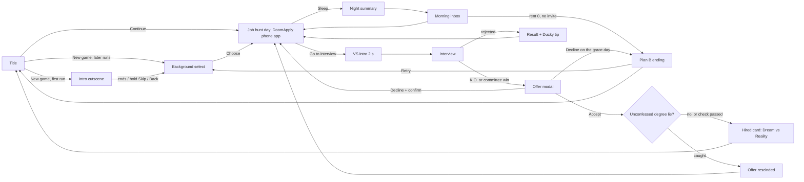

# Software Engineer Simulator - Game Design Document (MVP)

| | |
|---|---|
| Version | 1.1, portrait and iPhone first (design source of truth for the MVP) |
| Date | 2026-09-26 |
| Engine | Godot 4.7.2-stable, GDScript, `gl_compatibility` renderer |
| Platforms | iPhone first (built on the developer's MacBook; free Apple ID signing for development), Android LATER |
| Companion file | `docs/CONTENT.md`: every player-facing string, with the ids used below |
| Scope of this doc | MVP = intro -> background select -> job hunt -> interview -> offer -> Hired or Plan B ending. The Work loop is Phase 2. |

How to read this:
- Every decision has a one-line **Why**.
- Your (the developer's) decisions are marked **Decided (Dn)** and collected in section 12. All eight, plus the platform decision P1, were decided on 2026-09-26; `docs/DECISIONS.md` is the log.
- Every number here is a starting value. Section 11 lists them all with the file that owns them. Section 5.12 shows what they produce in a 4,000-runs-per-background simulation.
- **MUST / SHOULD / LATER** tags follow the cut line in section 10.

---

## 0. The whole game on one page

- **Hook.** In influencer videos, software engineers wake at 10:47, "work" for 12 minutes and live in a cozy studio. It's 2026, the market is brutal, and you want that life anyway. You tailor (or fake) your CV, swipe through job postings, survive a fighting-game-style interview with Dana from HR, and get an offer that's never quite what the video promised.
- **Run.** One run is one job search: about 8-16 minutes, 2-4 interviews, a median of 3-7 in-game days to an offer, with rent due in 12-15 days.
- **Background = difficulty + character.** The Intern (Easy), The Graduate (Medium) or The Self-Taught (Hard). The choice changes numbers at every stage of the loop (section 6).
- **Day loop.** Played portrait, one-handed: the hub screen is your phone, running the DoomApply job app. Morning inbox -> spend energy pips (apply, tailor, study) -> sleep. Rent is due in N days.
- **Interview.** A 2-second VS intro, then an HP duel (your Composure against Dana's Doubt) on a side-view stage across the top of the screen, with the answers under your thumb. 5 prompts: 2 workplace-ethics choices and 3 knowledge questions answered on the one-tap **Answer Meter**. Stats decide most of it; your thumb nudges it.
- **Offer.** A contract modal: salary, work mode, commute, perks, fine print. Accept, Negotiate (once) or Decline.
- **Endings.** Hired card with a "Dream vs Reality" score, or the Plan B ending when rent runs out ("You became a ClikClok career coach").
- **Teaching.** Every failure shows the joke, then the cause, then one true career tip from Ducky the rubber duck.

---

## 1. Vision

### 1.1 Hook
"Chase the influencer's dream job through the 2026 hiring gauntlet." The satire is the gap between the dream (remote, rich, relaxed) and the process (ghost jobs, knockout filters, 5-round interviews, exploding offers).

### 1.2 Pillars
Every feature must serve at least one. If it serves none, cut it.

1. **The satire is the mechanic.** Every joke is a rule you play against: ghost jobs really never reply, the "3+ years for entry level" filter really rejects you, the committee really spins a wheel. If a joke can't be a rule, it is one line of flavor text, not a feature.
   *Why:* jokes that are rules get remembered; jokes that are text get skipped.
2. **One thumb, one decision.** Each screen has at most 3 main actions and reads in about 5 seconds. No typing except an optional name. Tap-anywhere wherever possible.
   *Why:* portrait phone, one thumb, short sessions.
3. **Stats decide, skill nudges.** Character stats plus visible luck decide about 75% of each outcome; the player's input decides about 25%. Odds are shown as 5-dot bands, never as exact percentages.
   *Why:* the brief says interviews depend mostly on intelligence and experience; visible luck is forgiven, hidden luck feels rigged.
4. **Laugh, then learn.** Every failure has a visible cause and exactly one true tip. The tip always comes after the joke.
   *Why:* comedy first keeps it a game; the tip is the reward for reading.

### 1.3 Tone and satire rules
- **Punch up.** Targets: hiring systems, corporate doublespeak, hype culture, influencer grift, AI hype. Never individuals, genders, ethnicities, nationalities, ages, rural people, or people who are struggling (the player, other applicants, laid-off workers).
- **Parody names only.** No real company, product, platform, school or person. The world naming sheet is in CONTENT.md section 1. Archetype parodies ("OmniGlobal Dynamics") are fine; one-letter-off brand parodies ("Amazoom") are not.
  - `tests/test_content_lint.gd` fails the build if any string contains a banned real brand (list in CONTENT.md section 1.3). Run a trademark and app-store search on every name before a public release.
- **Real tech terms are allowed for teaching** (SQL, HTTP, Git, REST, hash map). When a technology is the butt of a joke, invent one.
- **Dana, the interviewer, is competent, dry, overworked and fair.** She keeps getting laid off and rehired at another company (running gag). The punchline is always the process, never her.
  *Why:* the brief's "HR lady" can easily become a demeaning stereotype; making her the most competent person in the room avoids that and is funnier.
- **Hard mode is "the filters are stacked", not "self-taught people are worse."** Dana to the Self-Taught: "Our ATS hates 'no degree'. I don't. Show me what you shipped."
- **PG-13, no profanity.** Burnout and layoffs: the employer is the joke, never the person's mental health.
- **Tips are true.** Exaggeration only lives in the joke half of a line. No statistics in tips.
- **Second person.** UI text says "you". The protagonist has a default name (Alex) the player can re-roll.
- **Topical 2026 AI-hype jokes live in data** (news ticker, recruiter spam, influencer posts), so they can be refreshed without code changes.

### 1.4 Education goals
By the end of one run a player should have met these real ideas, each through a mechanic, not a lecture:

| Real lesson | Where the game makes it true |
|---|---|
| ATS systems auto-reject on **knockout questions** (degree, years, location), not on keyword percentages | Knockouts are the only auto-reject; the rejection email names the knockout |
| Tailored applications beat spraying | Tailor & Apply has better odds per energy pip; only relevant applications fill the Recruiter Radar |
| Reframe honestly instead of lying | Polished lines give most of a lie's benefit with zero risk; lies can be probed and degree lies can rescind the offer |
| A referral gets a human to read your CV | Referrals skip knockouts and multiply odds |
| Research the company | Research unlocks the insider "Why us?" answer (the strongest choice answer in the game; research before every interview raises first-interview pass rates by 10-15 points) |
| Ghost jobs exist | Some postings never reply; research shows "Posted 412 days ago" |
| Think aloud, use STAR, ask a question at the end | Knowledge and choice questions reward these; the model answer is always shown |
| Negotiating politely rarely backfires | Negotiate never rescinds in the MVP |
| Compare total compensation, including commute | The offer shows commute hours; the Dream vs Reality score counts them |
| Rest matters | Arriving Tired speeds up the interview needle |

---

## 2. Platform and presentation

### 2.1 Orientation: portrait only
**Decided (D1, 2026-09-26): portrait only** (`display/window/handheld/orientation = 1`, SCREEN_PORTRAIT; no upside-down).
*Why:* the developer's call, and it suits the game. One-handed play fits the 3-5 minute sessions it is built for (bus, queue, bed); the job hunt becomes the thing it satirizes, a swipe-card app on the same phone the influencer hooked you through; one orientation still halves UI work.
*Art consequence:* the 16:9 side-view reference is re-composed for tall frames: its bands (sky, trees and buildings, fence, ground) stack top to bottom (2.5). The side-view scenes (interview, VS, commute) become a horizontal **stage band** across the upper part of the screen. The influencer's video needs no phone drawn inside a panel: the screen is the phone.

### 2.2 Base resolution and scaling
**Decided (D2): 270x480 base** (the portrait mirror of 480x270), stretch mode `viewport`, aspect `expand`, scale mode `integer`, plus a runtime **scale guard** in the `Device` autoload.
*Why:* one art pixel stays 4 screen pixels on 1080-class phones, the density of the reference (about 450 px wide at native resolution), so art cost and text capacity (about 40 characters x 40 lines) match the landscape plan. 360x640 would need about 1.8x more art pixels for the same look. A 12 px text line at 4x is physically the same size as a 16 px line at 3x. `canvas_items` + fractional was rejected: at 3.275x a pixel font renders with uneven 3 px and 4 px rows.

Verified engine behavior (Godot 4.7.2 source, `Window::_update_viewport_size`): integer + expand on its own **letterboxes** (e.g. 1179x2556 would show 270x585 with 50/108 px black bars). The guard sets `content_scale_size = floor(window / s)`, so the game area grows to fill the screen with square pixels. With the guard, players see:

| Device (portrait px) | Scale used | Visible game area | Notes |
|---|---|---|---|
| 540x960 / 1080x1920 (desktop test window) | 2x / 4x integer | 270x480 | exact |
| 750x1334 (iPhone SE 2/3) | 2.78x **fractional** | 270x480 | integer 2x would make a 34 px target only 34 pt; expect slightly uneven pixel rows |
| 828x1792 (iPhone 11) | 3x integer | 276x597 | |
| 1080x2340 (iPhone 12/13 mini) | 4x integer | 270x585 | |
| 1170x2532 (iPhone 12-14) | 4x integer | 292x633 | |
| 1179x2556 (iPhone 14 Pro-16) | 4x integer | 294x639 | leftover 3/0 px |
| 1206x2622 (iPhone 16 Pro) | 4x integer | 301x655 | |
| 1290x2796 / 1320x2868 (Pro Max) | 4x integer | 322x699 / 330x717 | the tallest and widest iPhones |
| 1640x2360 (iPad, only if iPad-native ships: LATER) | 4x integer | 410x590 | |
| 1080x2400 (Android, LATER) | 4x integer | 270x600 | |
| 720x1600 (budget Android, LATER) | 2.67x **fractional** | 270x600 | integer 2x would waste 25% |

Design rules that follow:
- **All critical content fits the central 270x480, which is inside the safe area on every iPhone above (2.9).** Extra width shows more background, never more UI: the UI column stays 254 px wide and centered (2.7). Extra height goes to the middle zone (2.8): the stage or card area grows, and backgrounds show more sky.
- Backgrounds are built from layers that tile sideways and are anchored to the screen bottom (2.5). Never stretch pixel art.
- Test every screen at game sizes 270x480 (the default 540x960 window), 294x639 and 330x717: resize the desktop window to those sizes, or to double them where the monitor allows.

The guard code (tech-verified; in `autoload/device.gd`):

```gdscript
var _base := Vector2(
	int(ProjectSettings.get_setting("display/window/size/viewport_width")),
	int(ProjectSettings.get_setting("display/window/size/viewport_height")))  # 270x480

func _update_scale_mode() -> void:
	var win := get_tree().root
	var w := Vector2(win.size)
	if w.x <= 0.0 or w.y <= 0.0:
		return
	var exact := minf(w.x / _base.x, w.y / _base.y)
	var s := floorf(exact)
	var stretch := Window.CONTENT_SCALE_STRETCH_INTEGER
	var game_size := Vector2i(_base)
	if s >= 1.0 and s / exact >= 0.8:
		game_size = Vector2i(floori(w.x / s), floori(w.y / s))  # 1179x2556 (iPhone 15) -> 294x639 @4x
	else:
		stretch = Window.CONTENT_SCALE_STRETCH_FRACTIONAL       # 720x1600 -> 270x600 @2.67x
	if win.content_scale_stretch != stretch or win.content_scale_size != game_size:
		win.content_scale_stretch = stretch
		win.content_scale_size = game_size
		layout_changed.emit()
```

On desktop, `size_changed` doesn't always fire when a resize leaves the viewport size unchanged, so `Device` compares `win.size` every frame (phones are fine: their window size is fixed at launch).

### 2.3 Project settings (applied; all keys verified to exist in 4.7.2)

| Key | Value | Why |
|---|---|---|
| `display/window/size/viewport_width` / `_height` | 270 / 480 | base resolution (D2) |
| `display/window/size/window_width_override` / `_height_override` | 540 / 960 | desktop test window, 270x480 at 2x (believed ignored on phones; unverified) |
| `display/window/stretch/mode` | `viewport` | renders at low res, so pixels are uniform |
| `display/window/stretch/aspect` | `expand` | plus the guard above |
| `display/window/stretch/scale_mode` | `integer` | the guard switches to fractional on SE- and 720p-class screens |
| `display/window/handheld/orientation` | `1` (SCREEN_PORTRAIT) | portrait only (D1); the iOS export writes it as `UIInterfaceOrientationPortrait` only |
| `rendering/textures/canvas_textures/default_texture_filter` | `0` (Nearest) | crisp pixels |
| `rendering/2d/snap/snap_2d_transforms_to_pixel` | `true` | no half-pixel shimmer |
| `rendering/textures/vram_compression/import_etc2_astc` | `true` | required by the iOS and Android exporters; reimport after changing it |
| `input_devices/pointing/emulate_touch_from_mouse` | `true` | mouse acts like a finger on desktop |
| `application/config/quit_on_go_back` | `false` | Android Back (LATER) goes back instead of quitting; no effect on iOS |
| `application/run/max_fps` | `60` | stops 120 Hz iPhones rendering at 120 fps |
| `gui/common/default_scroll_deadzone` | `6` | about 1.3 mm on an iPhone 15 if the unit is game px (unit unverified; test on the device) |
| `application/boot_splash/use_filter` | `false` | crisp splash |
| `application/boot_splash/bg_color` and `rendering/environment/defaults/default_clear_color` | `Color(0.07, 0.07, 0.10)` | near-black, so any 1-3 px leftover is invisible |
| `debug/gdscript/warnings/untyped_declaration` | `1` (warn) | keeps code typed; `res://addons` is already excluded |
| `application/config/version` | `"0.1.0"` | |
| `gui/theme/custom` | `res://ui/theme/main_theme.tres` | not yet: only after the file exists |
| `application/run/main_scene` | `res://features/title/title.tscn` | via `project_manage set_main_scene` (settings_set refuses this key) |

Keep as they are: renderer `gl_compatibility` (on iOS that is native OpenGL ES 3.0, its only iOS driver in 4.7.2), vsync on, `keep_screen_on`, low-processor mode off, and the iOS keys `display/window/ios/hide_home_indicator`, `hide_status_bar`, `suppress_ui_gesture` and `allow_high_refresh_rate` (all `true`, checked 2026-09-26). `suppress_ui_gesture` makes system edge swipes need two swipes, which protects the card swipe.

### 2.4 Viewpoint per scene

| Scene | Viewpoint (portrait) | MVP tag |
|---|---|---|
| Title | Side-view street at dawn in the 2.5 vertical template: sky and logo on top, skyline and street in the middle, buttons over the road | MUST (static), parallax SHOULD |
| Intro cutscene | Still 270x480 panels with pans or tilts; the influencer's video fills nearly the whole screen, as the phone in your hand | MUST |
| Background select | Flat UI: one full-width background card plus a 3-button selector | MUST |
| Job hunt hub | Flat UI: **the screen is your phone**. The DoomApply job app fills it, with a HUD strip on top and an app dock at the bottom | MUST |
| Job hunt hub, room version | **Top-down** static room illustration with 4 tappable hotspots in the lower 60% (phone, laptop, bed, door); the character is drawn into the image, no walking sprite | SHOULD |
| Hard-mode commute strip | Side-view parallax bus-window band (270x160) across the middle of the screen, 2 s | SHOULD |
| VS intro | Flat UI, diagonal split: Dana top-right, you bottom-left, VS on the diagonal | MUST |
| Interview | **Side-view stage band** in the upper part (you left, Dana right, desk between, company background); dialogue and answers below | MUST |
| Offer | Paper contract that slides up over the dimmed stage | MUST |
| Endings | Illustration card: side-view illustration on top, text below | MUST (one per ending), per-tier variants SHOULD |
| Work loop (Phase 2) | Top-down office that scrolls vertically, with walking characters | LATER |

*Why top-down is SHOULD/LATER:* every viewpoint needs its own character sprite set. A static illustration with hotspots gets the top-down feel with zero extra sprites.

### 2.5 Art direction (derived from the reference image)
What the reference does, and the rule we take from it:

| Reference observation | Our rule |
|---|---|
| Native art is about 400-500 px wide, upscaled about 4-5x | 1 art pixel = 1 base pixel at 270x480, everywhere (4 screen pixels on 1080-class phones, the reference's density). Never scale art by non-integer factors. |
| Bright daylight: a 4-5 step sky-blue ramp, big dithered cumulus clouds | Sky and clouds are the only places with heavy dithering. In portrait the sky is the tallest band: each ramp step is a horizontal stripe 25-40 px tall, and 2-3 big clouds stack vertically. Hunt and title scenes use daylight. |
| Two greens: dark conifer and bright leafy, 5-6 steps total | Plants, parks and office greenery reuse these ramps. |
| Architecture in warm beige and cool greys, glass as blue-grey planes | Offices use the same grey/beige ramps; glass = 2-3 flat blue-greys with one highlight diagonal. |
| Clean, mostly dark-hued outlines (not pure black); selective, lighter on inner edges | 1 px outline in the darkest shade of the object's own hue; inner lines one step lighter. |
| Light from the upper left | Always light from the upper left; shadows fall to the lower right. |
| Spectators readable by one dominant outfit color (white tee, mustard sweater, brown jacket, black, navy suit) | Every character has one dominant outfit color. The player's hoodie color is fixed per background (Intern teal, Graduate maroon, Self-Taught mustard). |
| Clear layering: sky, clouds, trees, building, fence, track | The same layers, stacked top to bottom in a tall frame (template below), built as 4-5 `Parallax2D` layers that still scroll **horizontally** (2.6). |

**Portrait composition.** Full-screen scenes (Title, room hub, intro panels) share one vertical template, anchored to the screen bottom, so taller phones show more sky, never more floor:

| Band | y in the 480 frame | Holds |
|---|---|---|
| Sky | 0-130 | The ramp and 2-3 cumulus. Logo and HUD panels sit here on solid panels. It continues upward under the Dynamic Island. |
| Skyline | 130-220 | Far buildings, one pine and one leafy tree as vertical anchors, and one focal building (the reference's grandstand becomes an office tower or an apartment block). |
| Character | 220-288 | The ground line with a rail or fence; the 40-48 px characters stand on it, just above the thumb band. |
| Foreground / UI | 288-480 | Flat road, floor or grass with little detail, because buttons cover it. It continues downward under the home indicator. |

- **Side-view stages** (interview, VS, commute) are a wide vignette inside a band at least 270x160, anchored at its bottom edge (the desk or road line). Extra height shows wall, window and sky above the characters.
- **Cropping the reference:** keep its scale and crop its width. Long horizontal runs (the grandstand, the fence, a pack of jockeys) show one segment and run off both edges; never shrink them to fit. Favor tall subjects (pine, tower, lamp post, ring light) for vertical rhythm.
- **Motion** stays horizontal: the Title's slow idle drift, the commute bus, sideways intro pans. Vertical movement appears only as intro tilts.
- **Palette:** one master palette of about 32 colors (Endesga 32 from Lospec is a good starting point) plus at most 8 UI and brand accents. Tier mood comes from which ramps dominate: Big corp cool blue-greys and glass; Mid-size warm beige and fluorescent; Startup purple and teal neon over a dark warehouse.
- **Detail level:** match the reference's density. Big readable shapes, 2-4 shade ramps, no noise textures.
- **Art sourcing:** grey-box first. For final art, draw or commission only the hero pieces (player busts x3, Dana bust with 3 outfits and 4 expressions, 6 intro panels, 3 interview backgrounds). Buy office props and UI frames from **one** itch.io pack family and palette-map them. AI-generated art: reference and mood boards only, never shipped. Double every art estimate you make.

### 2.6 Asset sizes (at 270x480)

| Asset | Size | Notes |
|---|---|---|
| Side-view full-body character | 40-48 px tall | matches the reference spectators (about 40 px) |
| VS and interview busts | 96 px tall, at most 80 px wide | player x3 backgrounds, Dana x3 tier outfits x4 expressions (neutral, impressed, unimpressed, glasses-glint). Two busts plus the desk share 254 px. S03 shows the bust cropped to its top 72 px (crop, never scale). |
| Interview background | 330x400, bottom-anchored at the desk line | The essential area is the bottom-center 270x160 (you, desk, Dana). Above it is wall, window and sky: the visible background runs from the screen top to the dialogue box, 188 px on a 270x480 screen, 321 on an iPhone 15, 399 on the largest Pro Max. One per tier; per-company prop swaps SHOULD. |
| Title background | `Parallax2D` layers, tiles at least 270 wide; the sky layer 720 tall; bottom-anchored | extra height = more sky |
| Room hub (SHOULD) | 330x720, bottom-anchored | hotspots in the lower 60% |
| Intro panels | 270x480 (up to 480x480 for a sideways pan, 270x720 for a tilt) | 6 panels. On taller phones the panel sits centered on the near-black clear color like a comic panel, so no bleed is needed. Keep the focal content in the top 350 px: captions cover the bottom. |
| Ending illustrations | 254x140 | inside the Hired and Plan B cards |
| Job card header strip | 238x48 | a crop of the tier's interview background; no new art |
| Company logos | 16x16 | one per company |
| Icons | 16x16 (energy pip 6x8) | dock icons sit above a 12 px label |
| App icon | 32x32 or 64x64 pixel art, upscaled by a whole number to 1024x1024 | the iOS preset's icon interpolation must be Nearest (2.10) |
| UI panels | 9-slice, 4 px border + 3 px padding, whole-pixel margins | one panel style; a full-width panel is 254 px outside and 240 px of text |

Parallax layer defaults (`Parallax2D.scroll_scale.x`): sky 0.1 (clouds `autoscroll` -4 px/s), far 0.3, buildings 0.6, props 0.9, ground 1.0. Set `repeat_size.x` to the texture width and `repeat_times` to 2-3, so 330 px wide screens are covered.

### 2.7 UI and typography
- **Body font: monogram (CC0) at size 16** = a 12 px line with a 6 px advance: 45 characters edge to edge and 40 lines in the 270x480 frame (47 lines in an iPhone 15's 568 px safe height). Use it for everything except titles. The Step 2 font test measured a 6 px advance, as assumed, and a 13 px glyph height; the theme's line spacing of -1 keeps the 12 px line (DECISIONS A3, ARCHITECTURE 1.4). How it reads at 4x still needs the iPhone.
- **Text column:** a full-width panel or button is 254 px (8 px gutter each side); with a 4 px border and 3 px padding it leaves **240 px = 40 characters**, and every budget below is checked at 40 columns. Narrower slots: action-bar primary 168 px = 25 characters; Back 80 px = 11; half-width button 124 px = 18; dock labels 6.
- **Display font: Press Start 2P (OFL)** at 8/16/24/32 (30/15/10/7 characters per 240 px line), only for the title logo, the VS screen and big banners (K.O., OFFER!, BUSTED!). Banners wrap by word; a banner that needs more than 3 lines drops one size. Ship its OFL license text in the Credits.
- **Font import settings** for every `.ttf`: antialiasing = **None**, hinting = None, subpixel_positioning = Disabled, mipmaps off, MSDF off. Use fonts only at their native size or whole multiples.
- **Text always sits on solid panels**, never directly over dithered sky or parallax.
- **Text budgets** (enforced by `tests/test_content_lint.gd`, which also word-wraps each string at 40 columns and checks the line cap):

| Field | Max | Lines at 40 columns | Where / why |
|---|---|---|---|
| Dialogue / reaction line | 120 characters | up to 4 | dialogue box (4 lines tall: word wrap loses about 10%) |
| Question prompt | 100 characters | up to 3 | dialogue box |
| Answer button | 40 characters | 1 | 254 - 2 x (4 + 3) = 240 px = exactly 40 x 6 px: zero slack, so no icons, letters or numbers in front of answer text, autowrap off |
| Knowledge spoken answer (green/yellow/red) | 80 characters | up to 3 | dialogue box, with your name tab |
| Posting joke, company card joke, background one-liner | 60 characters | up to 2 | job card / background card |
| CV line text | 60 characters | up to 2 | CV row |
| Tip on screen | 120 characters | up to 4 | full-width Ducky note (full version in the Notebook) |
| Email body | 240 characters | up to 7 | inbox card (the list scrolls) |
| Player name | 10 characters | 1 | `LineEdit.max_length`; the VS plate fits 9 at Press Start 2P 16, so longer names use size 8 |

- **Colorblind-safe:** green/red is never the only signal. Match tags carry a check or cross icon; Answer Meter zones carry text labels; odds bands are dots plus a word.
- **All displayed strings go through `tr()`** from day one (content JSON stores keys or English text used as keys), so a translation CSV can be dropped in later. If you plan Vietnamese or another language, check monogram's glyph coverage before committing to it.
- **Theme:** one `main_theme.tres`, default font monogram 16, type variations `PrimaryButton`, `DangerButton`, `PaperPanel`, `HeaderLabel`.

### 2.8 Touch rules (portrait, one thumb)
1. **Target size:** art at least 32x32 game px, **hit area at least 34x34**, with at least 4 px gaps. At 4x on a 3x iPhone, 34 px is 45 pt (32 px would be 42.7 pt, just under Apple's 44 pt minimum). Answer buttons and the action bar are 36 px tall (48 pt). Hit areas may be larger than the art.
2. **Three zones** in the 270x480 frame (y measured from the safe-area top):
   - **Top band, y 0-72:** information only (HUD, HP bars, headers). It sits just below the Dynamic Island and is the hardest reach for one thumb.
   - **Middle, y 72-288:** content (cards, stage, dialogue, lists). Large surfaces may be tappable anywhere (the job card, tap-anywhere); occasional small controls are allowed (Research, the invite's GO NOW, interview pause).
   - **Thumb band, y 288-480 (bottom 40%):** every control used more than once a day: answers, SKIP/APPLY, primary buttons, the dock.

   Extra height on taller phones goes to the middle zone. The thumb band stays glued to the bottom safe edge, so buttons sit the same distance from the thumb on every iPhone.
3. **Action bar** at the bottom of the thumb band: `[ < Back ][ PRIMARY ]`, 80 + 168 px, 6 px gap, 36 px tall. The primary is bottom-right and spans the screen center (x 94-262), so left and right thumbs both reach it; Back and secondary actions go bottom-left. A screen with one action uses a full-width 254 px button, never a lone small primary in a corner.
4. **Hub navigation is a bottom dock, not a left rail:** 5 app slots of 47 px (6 of 39 px with Network, SHOULD), 4 px gaps, 40 px tall, each an icon plus a label of up to 6 characters. A left rail would cost 32 of 270 px and put its top icons out of reach.
5. **Gestures:** tap; swipe left/right on job cards (always mirrored by visible SKIP and APPLY) and on the S03 card (mirrored by the selector); hold only for Skip in cutscenes. No swipe-up, no long-press menus, no drag except the SHOULD drag-to-sign. Swipe surfaces stay out of the safe-area insets: `suppress_ui_gesture` only defers the home-indicator swipe, it doesn't disable it.
6. **Tap-anywhere** stops the Answer Meter needle and advances text. A control that consumes its own tap (the interview pause) never counts as the needle tap.
7. **250 ms input lock** whenever answer buttons appear, so a tap meant to finish the typewriter text can't pick an answer.
8. Answer buttons are stacked full width (254x36) with 6 px gaps, anchored to the bottom of the thumb band.
9. Controls handle mouse events only (touch arrives as emulated mouse). Only swipe code reads `InputEventScreenTouch/Drag`.
10. Buttons use `action_mode` Button Release. **Test in week 1 on the iPhone** whether dragging a ScrollContainer triggers a button release; if it does, ignore releases when the pointer moved more than the deadzone since the press.

### 2.9 Safe area (Dynamic Island, notch, home indicator)
Portrait only, so each device's insets are fixed: **top** = the Dynamic Island or notch (the status bar is hidden, but the inset stays reserved), **bottom** = the home indicator (reserved even while it auto-hides), **left and right** = 0 on iPhones. Backgrounds are full-bleed: sky runs up under the island, ground down under the home indicator. Everything the player reads or taps goes inside a `SafeAreaMargin` container (at least 4 px per side; left and right use the larger of the two insets in case a device reports them unevenly). The 270x480 design frame is the safe rect, and every iPhone below leaves at least that much.

Verified: in `viewport` stretch mode `get_final_transform()` is the identity for the root, and on iOS `get_display_safe_area()` returns native pixels, so the safe area is converted by hand (`Device.safe_insets()`):

```gdscript
var win := get_tree().root
var game := win.get_visible_rect().size      # real render size, e.g. 294x639
var px := Vector2(win.size)
var s := minf(px.x / game.x, px.y / game.y)
if win.content_scale_stretch == Window.CONTENT_SCALE_STRETCH_INTEGER:
	s = maxf(floorf(s), 1.0)
var origin := ((px - game * s) * 0.5).round() # letterbox offset
var safe := Rect2(DisplayServer.get_display_safe_area())
var tl := (safe.position - origin) / s
var br := (safe.end - origin) / s
inset = Vector4(maxf(tl.x, 0.0), maxf(tl.y, 0.0), maxf(game.x - br.x, 0.0), maxf(game.y - br.y, 0.0))
```

Results at the guard's scale (SafeAreaMargin rounds up):

| Device | Game area | Insets top / bottom | Usable |
|---|---|---|---|
| iPhone 14 Pro-16 (1179x2556) | 294x639 | 59 / 34 pt -> 44.25 / 25.5 -> **45 / 26** | **294x568** |
| Pro Max (1290x2796) | 322x699 | 59 / 34 pt -> 45 / 26 | 322x628 |
| iPhone 12-14 (1170x2532) | 292x633 | 47 / 34 pt -> 36 / 26 (unverified) | 292x571 |
| iPhone 12/13 mini (1080x2340) | 270x585 | 50 / 34 pt -> 38 / 26 (unverified) | 270x521 |
| iPhone 11 (828x1792, game at 3x) | 276x597 | 48 / 34 pt -> 32 / 23 (unverified) | 276x542 |
| iPhone SE 2/3 (750x1334) | 270x480 | 0 / 0 with the status bar hidden (unverified) | 270x480 |

On an iPhone 15 the 88 px beyond the 480 frame go to the middle zone (2.8). Desktop preview: a 294x639 window with `debug_fake_insets = Vector4i(0, 45, 0, 26)` on the scene's root SafeAreaMargin. Week-1 device check: confirm Godot still reports the 59 pt top inset while the status bar is hidden (unverified).

### 2.10 Platform constraints to plan around
- **iOS first (P1).** Built on the MacBook with Godot 4.7.2 (the godotengine.org zip, which never auto-updates), the matching iOS export templates and the Xcode that supports the iPhone's iOS version (iOS 27 needs Xcode 27 on macOS Tahoe 26.6+). Export the Xcode project (`application/export_project_only` on) to `builds/ios/` and run it from Xcode. A free Apple ID's Personal Team is enough for your own iPhone: its builds expire after 7 days (run again from Xcode) and it allows 10 App IDs per 7 days, so pick one bundle id (`com.<you>.swesimulator`, also a valid Android package name) and never change it. TestFlight, the App Store, Game Center and iCloud need the paid Apple Developer Program (99 USD a year): not before the release candidate.
- **iOS preset:** `application/targeted_device_family` = iPhone. iPad-native is LATER: iPadOS 26 deprecated `UIRequiresFullScreen`, so an iPad build must handle any window size and orientation (iPhone-only apps run on iPads in compatibility mode; how iPadOS 26 presents them is unverified). `application/icon_interpolation` = Nearest neighbor (the default Lanczos blurs pixel art). Orientation is not a preset option; it comes from 2.3.
- **iOS runtime (verified: 4.7.2 source and docs):** Compatibility = native OpenGL ES 3.0 (deprecated by Apple since iOS 12, still works). No Back button (`NOTIFICATION_WM_GO_BACK_REQUEST` is Android-only): every screen has an on-screen Back (4.4). After `NOTIFICATION_APPLICATION_PAUSED` iOS allows about 5 s before it may kill the app: keep `save()` small. The exported PCK is case-sensitive while Windows and macOS are not: match `res://` path case exactly.
- **Android (LATER):** JDK 17 and the Android SDK with `platforms;android-36` (the 4.7.2 Gradle template targets API 36, which Google Play has required for new apps and updates since 2026-08-31); the editor generates the debug keystore itself; `permissions/vibrate` for haptics; Play needs a Data safety form even for apps that collect nothing.
- **Both machines** run exactly 4.7.2 with matching export templates. The Windows Steam build can auto-update: commit first and update both machines together. **Exclude** `addons/godot_ai/*, tests/*` from every export (the addon's export plugin already strips its autoload). Setup steps: ARCHITECTURE.md section 13 and ROADMAP Step 2.

---

## 3. Core loop and meta loop

### 3.1 Loop diagram

```
META (across runs): Career Notebook of tips (SHOULD) - best Dream score per background - intro_seen - run_count
 |
 RUN = one job search
 |-- Title -> [Intro cutscene: first run only, skippable] -> Background select (difficulty + name)
 |
 |-- DAY CYCLE (shared skeleton; HUNT is the MVP mode, WORK plugs in for Phase 2)
 |     MORNING  inbox reveal: invites first, rejections as one stack, ghosts silent
 |              [+ 1 event card, SHOULD]  [+ Hard: 2 s commute strip, SHOULD]
 |     DAY      spend energy pips:
 |                Jobs deck: Skip / Quick Apply (1) / flip -> [Research (1)] / Tailor & Apply (2) / referral
 |                CV (free): 3 lines x Honest / Polished / Lie
 |                Study (2): KNOWLEDGE +5
 |                [Network (2), SHOULD]
 |                Interview (3, +1 travel for the Self-Taught in person) if an invite is waiting
 |                   VS intro -> 5 prompts -> K.O. | Committee wheel | Rejection
 |                     K.O. / wheel win -> OFFER modal -> Accept -> [background check] -> HIRED card (MVP ends)
 |                                                      -> Decline -> back to the day
 |                     Rejection -> Ducky tip + model answer -> back to the day
 |     NIGHT    Sleep -> "Rent due in N days" -1 -> summary card
 |              N = 0 and no invite waiting -> PLAN B ending
 |
 |-- WORK mode (Phase 2): commute -> standup -> tasks/meetings -> evening -> payday
       laid off / quit / startup folds -> back to HUNT with more EXPERIENCE
```

*Why one Day Cycle:* HUNT and WORK share morning, energy, commute, sleep and the rent/paycheck tick. Building the cycle generically now makes Phase 2 "add a mode", and getting laid off sending you back to HUNT is both the joke and the replay loop.

### 3.2 Pacing targets

| Target | Value | How it's enforced |
|---|---|---|
| First interview | by day 2 (minute 3-5) on every background | first-run day-2 guarantee; good startup odds after |
| Hunt day length | at most 90 s | 6 new cards/day, 6-9 pips, one-tap actions |
| Interview length | at most 90 s including the 2 s VS | 5 prompts, 250 ms lock, typewriter 40 chars/s with tap-to-finish |
| Interviews per run | 2-4 | tier odds, Doubt HP, Recruiter Radar |
| Run length | 10-15 min, Hard at most 20 | sim: Easy about 8, Medium about 14, Hard about 16 (section 5.12, D8) |
| Mobile session | any 3-5 min bite | autosave after every committed action |

---

## 4. MVP screen flow

### 4.1 Flow



Game-flow phases (the `GameFlow` enum): `TITLE, INTRO, BACKGROUND_SELECT, JOB_HUNT, INTERVIEW, OFFER, PHASE2_STUB (Hired card), GAME_OVER (Plan B)`. Night, Morning and Result are states inside their phase's scene, not phases. Only `GameState.change_phase()` changes phase; scenes call verbs.

### 4.2 Screens

Transitions are a 0.2 s fade (SceneRouter) unless noted. Every screen has an on-screen way back, because iOS has no Back button (4.4). Positions are in the 270x480 frame with y measured from the safe-area top; extra height on taller phones goes to the middle zone (2.8). Mockups are schematic (the real text column is 40 characters).

**S01 Title** (MUST) - side-view, 2.5 portrait template
- Contents: a static street at dawn (parallax SHOULD). The logo sits on a sign panel in the sky band (y 40-130): "SOFTWARE" and "ENGINEER" in Press Start 2P 24, "SIMULATOR" in 16, 216 px wide. [News ticker strip under the logo, SHOULD.] Skyline and street fill the middle, the road runs under the buttons, version text bottom-right.
- Touch without a save: tap anywhere = New game ("Tap to start" blinks at about y 400).
- Touch with a save: `[ New game ]` (y 350-386) above `[ CONTINUE ]` (y 392-428, full width, primary); "Replay intro" is a small text button bottom-left (y 440-474).
- Back: Android Back (LATER) and desktop Esc show "Quit?". iOS apps never quit themselves, so iOS has no quit.

**S02 Intro cutscene** (MUST) - side-view panels
- Contents: 6 still panels (270x480), 40 s or less, 2022 (age 17) to 2026, typewriter captions, background-neutral (it plays before the pick). Script: CONTENT.md section 2. Build it as text-only slides first; final art goes in last.
- Layout: captions on a solid band at y 360-432 (up to 4 lines). **Skip** is a "Hold to skip" pill bottom-right (96x34, y 442-476): hold 0.5 s while a ring fills. Panel 2's ClikClok video fills nearly the whole screen: the screen becomes the kid's phone.
- Touch: tap = finish the current caption, tap again = next caption (never skips the whole thing). Android Back (LATER) and desktop Esc also skip. Captions never advance by themselves (Step 6 agent default): the 40 s is the panels' pan time, and the player sets the reading pace.
- Auto-plays on the first run only (`intro_seen` in settings). Pauses when the app loses focus.
- Out: the title slams in on panel 6 (its third caption), the last caption follows, then Background select.

**S03 Background select = customization** (MUST) - flat UI with portraits

```
+-------------------------------------------+
| How did you spend those four years?       |   header, info only
| +---------------------------------------+ |
| | +------+ THE GRADUATE - MEDIUM        | |
| | | bust | Energy/day oooooooo..        | |   .. = commute pips, greyed
| | | 72px | Rent runway: 12 days         | |
| | +------+                              | |
| | "One diploma, one student loan, zero  | |
| |  callbacks."                          | |
| | KNOWLEDGE  [###--]                    | |
| | EXPERIENCE [#----]                    | |
| | NETWORK    [#----]                    | |
| | + DIPLOMA: passes 'degree required'   | |
| |   filters. TEXTBOOK ANSWER: wider     | |
| |   zone on your first tech question.   | |
| | - ENTRY-LEVEL PARADOX: '1+ years'     | |
| |   filters reject you unless your      | |
| |   Experience line is Polished.        | |
| +---------------------------------------+ |   swipe the card = switch background
| NAME [ Alex                    ] [dice]   |
| +-----------+ +-----------+ +-----------+ |
| |  INTERN   | |*GRADUATE* | |SELF-TAUGHT| |   selector, 80x40 each
| |   EASY    | |  MEDIUM   | |   HARD    | |
| +-----------+ +-----------+ +-----------+ |
| [ < Title ] [           CHOOSE          ] |   action bar
+-------------------------------------------+
```

- Contents: the header; **one full-width background card** (254 wide, about 250 tall) with the 96 px bust cropped to 72 px, name + difficulty, energy pips per day (commute pips greyed), rent runway in days, the one-liner, 3 stat bars (5 segments each: KNOWLEDGE, EXPERIENCE, NETWORK), perk (+) and flaw (-), and for the Self-Taught its 2 rolled knowledge gaps. Below the card: the name row (Alex + dice), a 3-button **selector** and `[ < Title ][ CHOOSE ]`.
- *Why a selector plus one card:* three cards side by side would be 80 px wide each (13 characters a line), three stacked full cards need about 750 px, and a plain carousel hides two of the three choices. The selector keeps all three visible in the thumb band and jumps straight to any of them.
- Touch: tap a selector button, or swipe the card left/right, to switch; CHOOSE confirms. The last background played is preselected, otherwise The Graduate. Dice re-rolls the name from 20 neutral names (CONTENT.md section 3.2). Typing is optional (tap the field, 10 characters max); the iOS keyboard covers roughly the bottom 40%, so the name row lifts above it while typing (`DisplayServer.virtual_keyboard_get_height()`, implemented on iOS; its unit, likely native pixels, is unverified). The dice stays the main path.
- Out: the chosen card flies up and the phone "boots" DoomApply (0.35 s) -> day 1.

**S04 Job hunt hub: your phone, DoomApply open** (MUST) - flat UI, full screen

The screen is your phone and DoomApply is the job app: the influencer hooked you through a phone video, DoomApply's tagline is already "Swipe right on your future", and a portrait screen already is a phone, so the frame costs nothing. The old laptop dashboard maps 1:1: top bar -> HUD, left rail -> app dock, deck -> the app's main view.

```
+-------------------------------------------+
| Day 3                 Rent due in 10 days |   HUD, info only (y 0-32)
| Energy oooooo.. 6/8      Radar [###---]   |
| ----------------------------------------- |
| DoomApply              (*) Invite waiting |   app header, info only
| +---------------------------------------+ |
| | ~~~~ office strip (tier bg crop) ~~~~ | |
| | [logo] Beigeware Financial        MID | |
| | Backend Developer                     | |
| | [v Java]  [v SQL]  [x APIs]           | |   job card, 254 wide:
| | "Read code from someone who left in   | |   tap = flip, swipe = skip/apply
| |  2009."                               | |
| | [ Knockout: 1+ years experience ]     | |
| | Quick apply  [##---] Unlikely         | |
| +---------------------------------------+ |
| [ MegaBoard ] [HumbleBrag ] [LaunchPadd ] |   site tabs (SHOULD)
| [=] [   SKIP   ] [       APPLY  1       ] |   action row; [=] = menu/pause
| [Jobs ] [ CV  ] [Mail*] [Study] [Sleep]   |   dock; * = invite badge
+-------------------------------------------+
```

| y (of 480) | Element |
|---|---|
| 0-32 | HUD, information only: day, rent countdown (red at 3 days), energy pips (commute pips greyed), Recruiter Radar |
| 36-52 | App header, information only: "DoomApply", plus a gold "Invite waiting" pill while one is waiting |
| 56-348 | Job card, 254 wide, anchored just above the site tabs; extra height on taller phones goes above the card |
| 356-384 | Site tabs (SHOULD): 3 segments of 82 px; without them the card is 36 px taller |
| 392-428 | Action row: `[=]` menu 34, SKIP 80, APPLY 128 (APPLY spans the screen center, 2.8) |
| 436-476 | Dock: Jobs, CV, Mail, Study, [Network, SHOULD], Sleep (moon) at the right end |

- **Dock:** each app opens full screen and `[ < Back ]` returns to Jobs. Jobs = DoomApply; CV = Buzzwordsmith (S05); Mail = the inbox, with a gold badge while an invite is waiting (its GO NOW lives there); Study = BigOhNo; [Network = HumbleBrag coffee chat, SHOULD]; Sleep.
- **Jobs deck:** 6 new cards per morning (2 per tier), at most 10 on the board, oldest drop off. Card front: a 238x48 header strip cropped from the tier's interview background, logo + company + tier, job title, 3 tags marked check/cross against the CV as currently set, 1 joke line (60 chars), a knockout chip if the CV fails one, the Quick Apply odds band. Swipe right or APPLY = Quick Apply (1 pip). Swipe left or SKIP = skip (card goes to the back of the deck). Tap the card = flip.
- **Card back:** tier, applicants ("1,247 applicants in 2 hours"), posted N days ago, salary text, tailored odds band. In the card's lower half: [Research (1), SHOULD], whose ghost flag, red flags and real salary band expand inside the card, and the [Use referral (n left)] toggle if you have tokens. The action row becomes `[ < Back ][ TAILOR & APPLY  2 ]`.
- `[=]` opens Pause (S13): it is the hub's on-screen Back.
- The first 3 applications play the full Parsinator 3000 scan (1 s) over the card; after that a 0.3 s "SENT" stamp.
- Sleep: if 2+ pips remain, confirm "You still have N energy. Sleep anyway?" with `[ < Back ][ Sleep ]`.
- **Night summary:** the phone's lock screen at night with one notification card, "Applied 4 - Rejected 2 - Ghosted 1 - Rent due in 9 days". Tap anywhere -> Morning inbox.

**S04 room version** (SHOULD) - top-down static illustration of your room (330x720, bottom-anchored; props differ per background). Wall and window fill the top 40%, and ghosts float there (one per ghosted application). 4 pulsing hotspots (48x48 or larger) sit in the lower 60%: phone on the desk bottom-right (opens DoomApply; the most used, so the easiest reach), laptop (Study), bed (Sleep), door bottom-left (Network). Ramen cups stack on the desk as rent runs down. The camera zooms into the phone (0.35 s) before DoomApply opens; DoomApply's `[=]` then becomes `[ < Room ]`, and the room gets the `[=]`.

**S05 CV screen (Buzzwordsmith)** (MUST) - flat UI, full screen, opened from the dock
- Header (information only, 2 rows): the tag set, the chips "Degree: yes/no" and "Counts as 1+ yrs: yes/no", and a "Lie risk" meter of 0-3 red dots.
- **3 stacked rows** (Education, Experience, Projects), each 254 wide and about 90 tall: the label, the current line text (60 chars, 2 lines), a full-width segmented control **Honest | Polished | Lie** (3 x 82 x 34) and the tags it adds (1 line). The first row's control sits below y 72.
- Touch: tap a segment. Changes are free and apply to future applications. Action bar `[ < Back ][ DONE ]`.
- First open: Ducky tip `tip_quantify_impact`, in the free space above the action bar.
- Players visit it about once per run; Tailor & Apply does the per-job work automatically.

**S06 Morning inbox** (MUST) - DoomApply's Mail, full screen, a vertical list
- The HUD sits on top as in S04. Below it, a scrolling list in this order: (1) invites: golden envelope, fanfare, confetti, the email, "Interview with {company}: today or tomorrow", and inside the card `[ Later ]` and `[ GO NOW  3 energy ]` (4 for the Self-Taught in person); (2) rejections as **one stack card** "5 rejections" [Flip all], which expands in place to one short line each, knockout rejections showing the knockout reason; (3) a quiet footer "2 applications: no reply. Probably ever." (ghosts are silent); (4) the Radar update; (5) [event card, SHOULD].
- `[ Start day ]` is pinned full width at the bottom, outside the scroll, always visible. Later keeps the invite in Mail (gold dock badge) until it expires.
- The first rejection ever shows the Ducky tip `tip_ats_knockouts` or `tip_rejection_numbers` as a full-width note under the stack.

**S07 VS intro** (MUST) - flat UI with busts, 2 s, portrait split
- Layout: a diagonal split across the middle (about y 210-270). Dana's half is on top (company color, company background behind), her 96 px bust top-right with her plate to its left: name, her title on 2 lines, the joke stats ("Candidates today: 11", "Coffee: 4th cup"), then her special moves full width. Your half is below (hoodie color), your bust bottom-left with your plate to its right: name, nickname ("THE THEORIST") and 3 stat bars. The tier banner sits at the bottom (Press Start 2P 16, up to 2 lines). You stay left and Dana right, as on the interview stage.
- 0.00 s white flash. 0.05-0.35 s the busts slide in along the diagonal (Dana down from the top-right, you up from the bottom-left). 0.35 s "VS" slams onto the diagonal (hit-stop 100 ms, 4 px whole-pixel shake, haptic). 0.4-0.9 s the plates and the banner appear. 2.0 s end.
- Skippable (tap anywhere) immediately from the second interview of a run (first viewing: after 1 s).

**S08 Interview** (MUST) - side-view stage band

```
+-------------------------------------------+
| COMPOSURE        ROUND 2/5         DOUBT  |   bars band, info only (y 0-28)
| [##################] [################--] |
|       (company background layers)         |   stage band (y 28-188; grows
|                                           |   to 248 px on an iPhone 15)
|   +------+                   +------+     |
|   | you  |                   | Dana |     |
|   | 96px |                   | 96px |     |
| ==+======+=======desk========+======+==== |
| +---------------------------------------+ |
| | DANA                            [II]  | |   dialogue box 254x76 (y 188-264),
| | "Friday, 4:55 PM. Your change is      | |   4 lines; [II] = pause
| | untested. What do you do?"            | |
| |                                       | |
| +---------------------------------------+ |
|                                           |   answer area (y 268-480)
|                                           |
| [ Test it, get a review, ship Monday.   ] |   answers 254x36, 6 px gaps,
| [ Ask the team channel what to do.      ] |   y 348-468, 250 ms lock
| [ Deploy and turn off my phone.         ] |
+-------------------------------------------+
```

| y (of 480) | Element |
|---|---|
| 0-28 | Bars band, information only: COMPOSURE (left) and DOUBT (right), 122x8 each, ROUND n/5 between the labels |
| 28-188 | Stage band: company background, you left and Dana right (96 px busts), desk. It grows with extra height (248 px on an iPhone 15). Damage numbers, sweat drops, K.O. and the committee wheel play here. |
| 188-264 | Dialogue box, 254x76: a name tab (DANA, or your name in your hoodie color) and 4 lines; pause `[II]` at its top-right (34x34 hit area) |
| 268-480 | Answer area: the meter row (y 280-320), then the thumb band (2.8) with answers, the tap pad, probe buttons or the Ducky card |

- Top: fighting-game bars (drain with a trailing white "ghost" bar over 0.4 s; damage numbers pop over the stage).
- Choice prompt: Dana's line types out in the dialogue box; 3 shuffled answers appear stacked at y 348-468 behind the 250 ms lock; tap one; Dana reacts (expression + reaction line); bars move.
- Knowledge prompt: Dana asks (100 chars). The **Answer Meter** (5.8.4) appears in the meter row, its zone width visible before the needle starts. The "Tap anywhere!" pad fills y 348-468 under the resting thumb, so the thumb never covers the needle; any tap on the screen counts except `[II]`, which consumes its own tap. "TIRED: needle is faster" shows under the bar when Tired. Your character then speaks the green, yellow or red answer in the dialogue box; on red, Ducky's "Real answer: ..." appears as a full-width note in the thumb band.
- **`answer_meter_width_px` stays 200.** Timing is tuned in bar-widths, so the pixel width changes looks, not balance. At 200 px it keeps the landscape plan's physical size (267 pt, 68% of an iPhone 15's width), the smallest NAILED IT zone stays 24 px wide and PERFECT about 10 px, the needle moves 2.0-2.9 px per frame, and the bar sits 35 px from each edge of the 270 frame, away from the gripping hand. Try 240 in Playtest #1 if the zone reads small.
- Lie probe (if triggered): Dana asks in the dialogue box; two half-width buttons (124x44) at the bottom of the thumb band: [Come clean] left, [Bluff] right with its odds band on a second line.
- Remote startup interviews (SHOULD): the stage band becomes a video call on your phone (Dana's feed fills the band, your small self-view in a corner).
- App loses focus: the tree pauses; on return "Ready? Tap to continue".

**S09 Result** (MUST) - stage band + banner
- K.O.: 0.5 s slow-mo in the stage band; "K.O.!" (Press Start 2P 32, 160 px) morphs into "OFFER!" (192 px) over the stage, sting, haptic -> Offer modal.
- Committee: "TIME OVER! THE COMMITTEE DECIDES..." (Press Start 2P 16, 3 lines) over the stage; a 128 px wheel with the win wedge sized to the real odds spins 2 s in the stage band -> win (Offer) or lose.
- Rejection: "We've decided to move forward with other candidates." in the dialogue box; the thumb band becomes the Ducky card: one tip (up to 4 lines) + the model answer of your worst knowledge question (up to 3 lines) + a full-width `[ Back to the hunt ]`. Rejections use up the day's interview; the day continues.

**S10 Offer modal** (MUST) - paper contract over the dimmed stage

```
+-------------------------------------------+
|        (dimmed stage: Dana watches)       |
| +---------------------------------------+ |
| | OFFER OF EMPLOYMENT - Hierarchai      | |   paper slides up from the bottom
| | Dear Alex,                            | |
| | We are thrilled (legally required     | |
| | wording) to offer you the role of     | |
| | Mobile Dev (Also Barista).            | |
| |                                       | |
| | Salary:     $71,000/year              | |   one field per line,
| | Work mode:  Fully remote              | |   12-character label column
| | Commute:    0 minutes. The influencer | |
| |             was right about one thing | |
| | Perks:      Ping-pong table.          | |
| |             Kombucha on tap.          | |
| | Fine print: Equity: 0.0001%, 4-year   | |   [?] = all 3 lines (SHOULD)
| |             vest, 1-year cliff. Worth | |
| |             one sandwich at target    | |
| |             valuation.            [?] | |
| | Please decide before you sleep.       | |
| | x____________________ (sign, SHOULD)  | |   drag-to-sign line
| +---------------------------------------+ |
| [               Negotiate               ] |   once, SHOULD
| [ Decline ] [           ACCEPT          ] |   action bar
+-------------------------------------------+
```

- Contents: the paper (254 wide, about 250 tall) slides up from the bottom over the dimmed stage; Dana stays visible above it. One field per line after a 12-character label column (values wrap at 28 columns): role and company, **yearly salary**, at startups an "Equity: 0.0001%" line under it (section 7's joke equity; built in Step 6 as an agent default), work mode, commute preview (e.g. "4 days x 95 min each way = 12.7 h a week", 2 lines), 2 perks, 1 fine-print joke (up to 4 lines; `[?]` shows all 3, SHOULD), "Please decide before you sleep." One Ducky tip sits under the paper (8.3).
- Buttons: [**Negotiate**, full width above the action bar, once, SHOULD], then `[ Decline ][ ACCEPT ]` (80 + 168). Decline holds the action bar's bottom-left, so the on-screen Back (4.4), `[ < Back ]` (it opens Pause; Back never declines), has its own row above the action bar, where Negotiate would go. Decline opens a confirm dialog; on the grace day it says the run ends. SHOULD: ACCEPT becomes drag-to-sign along the 200 px line, left to right.
- Out: Accept -> background check (degree lies, 5.9.4) -> Hired card. Decline -> Dana's line -> DoomApply (same day), or Plan B on the grace day (5.10).

**S11 Hired card** (MUST) - side-view illustration card, in two beats
- Beat 1: the "HIRED!" stamp (Press Start 2P 32) slams onto a 254x140 illustration; below it company, role and salary (3 lines) and the Hired line for that tier (up to 3 lines). Tap anywhere to continue.
- Beat 2: the **Dream vs Reality** panel slides up over the illustration: its 5 rows (section 5.9.5; label left, points right with one decimal, one line each, tallying one by one), the score and grade, "The video scored 100. The video was sponsored.", `tip_written_offer`, "TO BE CONTINUED - Phase 2: The Working Life" (`end_tbc`).
- Buttons: `[ < Title ][ NEW RUN ]`, in beat 2. Leaving it deletes the run save.
- *Why two beats:* everything at once needs about 500 px, more than the 480 frame, and the pause lets the joke land before the score.

**S12 Plan B ending** (MUST) - side-view illustration card, one beat (about 400 px)
- The "PLAN B" stamp over a 254x140 illustration (you, a ring light, ClikClok); "Rent's due. You became a ClikClok career coach..." (3 lines); the background-specific line; the closing line (a 17-year-old watching your video, 5.10; `end_plan_b_final`); one tip; run stats (days, applications, interviews, rejections; 2 lines).
- Buttons: `[ < Title ][ RETRY ]` (one tap -> Background select with the same background preselected, fresh run).

**S13 Pause** (MUST: Resume, Quit to Title) / **Settings** (SHOULD: music, SFX, haptics, reduced motion, Relaxed Timing, text speed, replay intro) / **Career Notebook** (SHOULD)
- Pause is a bottom sheet, buttons stacked full width with the most used lowest: Quit to title (top), [Notebook], [Settings], RESUME (bottom, primary). Tapping outside the sheet = Resume.
- Settings: a full-screen list, one control per 36 px row, `[ < Back ]`.
- Notebook: a vertical list of collected tips, one row each; tap a row for the full tip; `[ < Back ]`.

### 4.3 Scripted first run (FTUE)
Only on the first run. Coach marks are full-width Ducky sticky notes (40 columns, up to 4 lines) placed in the middle zone with an arrow toward one control. They never cover that control, the thumb band's buttons or the text they talk about (on the Jobs screen they sit over the card's header strip), they disappear when you do the action, and they never block input.

| When | Ducky says (CONTENT.md section 10.2) | Highlight |
|---|---|---|
| Day 1, deck opens | "Swipe right or tap APPLY to send your CV. Costs 1 energy." | APPLY in the action row, plus a swipe-right arrow on the card |
| After the 1st application | "Tap a card to flip it. Tailor & Apply sends a better CV." | the card |
| Energy at 2 or less, or 4 applications | "Tired? Tap the moon to sleep. Replies come in the morning." | Sleep (the moon at the dock's right end) |
| Day 2 morning | the day-2 guarantee delivers an invite (section 5.7) | the invite's GO NOW |
| Before the first interview | "Research the company first. It unlocks a secret answer." (Research is SHOULD; without it: "Rest up: tired thumbs are slow thumbs.") | Research on the card back |
| First knowledge question | a practice question "Warm-up - doesn't count": "Tap anywhere when the needle is in NAILED IT." | the Answer Meter and the tap pad |
| First rejection | tip + "Tips go in your Career Notebook." | Notebook (Pause, via `[=]`) |

### 4.4 Back button, pause and interruptions
- **On-screen Back everywhere.** iOS has no Back button, so every screen shows its own: the bottom-left `[ < Back ]` of the action bar, `[=]` on the hub, `[II]` in the interview. These, Android Back (LATER, `NOTIFICATION_WM_GO_BACK_REQUEST`) and desktop Esc all call `Device.handle_back()`, which asks the current scene's `handle_back() -> bool` first: close a modal, flip a card back, return from an app to Jobs, skip the cutscene, open Pause. If nothing handled it, the Title shows "Quit?" (Android and desktop only). Scenes must not handle the notification themselves.
- **No edge-swipe back gesture:** iOS gives games none, and a custom one would fight the job-card swipe.
- **Interruptions:** save on `NOTIFICATION_APPLICATION_PAUSED` and `NOTIFICATION_APPLICATION_FOCUS_OUT`. On iOS, going home or to the app switcher sends PAUSED (then about 5 s before iOS may kill the app); Control Center, Notification Center and call banners send only FOCUS_OUT / FOCUS_IN. During an interview, also pause the tree: the needle must not auto-miss while Control Center is open.

---

## 5. Systems

### 5.0 Data model at a glance
Numbers you tune in the Inspector live in `.tres` Resources; text lives in JSON keyed by id. Loaded data is never modified at runtime; the run copies what it needs into `RunState` (ids and numbers only).

| File | Kind | Holds |
|---|---|---|
| `data/balance/balance_config.tres` | `BalanceConfig` | global constants (section 11) |
| `data/backgrounds/intern.tres`, `graduate.tres`, `self_taught.tres` | `BackgroundData` | per-background numbers |
| `data/tiers/startup.tres`, `mid.tres`, `big.tres` | `TierData` | per-tier numbers |
| `data/content/naming.json` | JSON | world names, keyword and topic labels (the banned-brand list lives only in `tests/test_content_lint.gd`, so real brand names never ship: ARCHITECTURE 12.3) |
| `data/content/backgrounds.json`, `tiers.json` | JSON | display text for backgrounds and tiers |
| `data/content/companies.json` | JSON | 9 companies |
| `data/content/postings.json` | JSON | 20 posting templates (+ the Unicorn, SHOULD) |
| `data/content/cv_lines.json` | JSON | 27 CV lines |
| `data/content/questions_choice.json` | JSON | ethics/choice questions |
| `data/content/questions_knowledge.json` | JSON | knowledge questions |
| `data/content/barks.json` | JSON | Dana, VS announcer, Ducky coach lines |
| `data/content/emails.json` | JSON | invites, rejections, ghosts, offer letter, fine print, perks |
| `data/content/tips.json` | JSON | career tips |
| `data/content/endings.json`, `events.json`, `cutscene.json`, `names.json`, `news.json` | JSON | the rest |

Stable ids: backgrounds `intern`, `graduate`, `self_taught`; tiers `startup`, `mid`, `big`; stats `knw`, `exp`, `net`; CV lines `edu`, `exp`, `proj` with variants `honest`, `polished`, `lie`; keywords `python, javascript, java, sql, git, cloud, testing, apis, mobile, data, agile, ai`; knowledge topics `algorithms, data_structures, databases, web, tools, concurrency, system_design, security, behavioral`. Content ids use the prefixes `co_ job_ cv_ eq_ kq_ tip_ mail_ fp_ perk_ bark_ vs_ end_ evt_ intro_ news_`.

### 5.1 Stats

| Stat | Id | Range | Shown as | Drives |
|---|---|---|---|---|
| KNOWLEDGE (the brief's "intelligence") | `knw` | 0-100, cap 80 | 5-segment bar (value / 20, rounded) | 70% of tech answers, 30% of behavioral answers, bluff odds |
| EXPERIENCE | `exp` | 0-100, cap 80 | 5-segment bar | 70% of behavioral answers, 30% of tech answers, bluff odds |
| NETWORK | `net` | 0-100, cap 80 | 5-segment bar | invite odds (x(1 + NET/100)), committee wheel, negotiation |
| Energy | - | pips per day | pips | every action |
| Rent runway | - | days | "Rent due in N days" | fail state |

Hidden per-background values: `teamwork_mult` (lone-wolf penalty for the Self-Taught), `gap_topics` (2 random knowledge topics rolled for the Self-Taught at run start). No cash stat. *Why:* three visible stats are readable at a glance; money as days is one number instead of cash, burn and fares.

Stat growth in the MVP: Study +5 KNOWLEDGE; Network (SHOULD) +5 NETWORK. EXPERIENCE doesn't grow during a hunt (it grows in Phase 2 at work).

### 5.2 Backgrounds
The difficulty screen is the character creator: the background is who you are. Full per-stage effects are in section 6; text is in CONTENT.md section 3.

| | The Intern (EASY) | The Graduate (MEDIUM) | The Self-Taught (HARD) |
|---|---|---|---|
| KNW / EXP / NET | 50 / 40 / 45 | 55 / 15 / 15 | 55 / 10 / 5 |
| Energy per day | 10 - 1 commute = **9** | 10 - 2 = **8** | 10 - 4 = **6** |
| Commute (minutes each way) | 20 (coffee shop) | 45 (campus library, alumni pass) | 95 (home Wi-Fi is one bar; the library is two buses away) |
| Rent runway | 15 days | 12 days | 12 days |
| Perk | **Warm Intros:** 2 referral tokens; high NETWORK | **Diploma:** passes degree knockouts. **Textbook Answer:** wider zone on the first knowledge question | **Breadth:** 6 honest tags. **Scrappy Builder:** startups x1.3 invites, +5 EXPERIENCE in startup interviews |
| Flaw | **Big-Tech Aura:** startup invites x0.8; algorithm questions are its weak spot | **Entry-Level Paradox:** "1+ years" knockouts fail unless the Experience line is Polished; practical questions are its weak spot | **The Long Way:** 6 energy, no degree, 2 random knowledge gaps, teamwork answers x0.6, arrives Tired to in-person interviews |

*Why these three shapes:* Easy wins on people (network, referrals), Medium on paper (degree, theory), Hard on breadth and grit. Each has a different best path: Intern -> mid-size via referrals, Graduate -> big-corp pipeline or mid-size, Self-Taught -> startups.

**Decided (D6):** customization = background card + name dice only. Cosmetics (skin, hair, hoodie palette swaps) are LATER. *Why:* every cosmetic layer has to be redrawn in every sprite set (busts, cutscene, endings, Phase-2 top-down), and the intro plays before the choice so it can't show them anyway.

### 5.3 Time and energy
- A day = Morning (automatic) -> Day (spend pips) -> Night (Sleep). No real-time clock.
- Energy pips per day = 10 - commute pips (1/2/4). The same rule becomes Phase-2 work-day energy on office days. *Why:* it implements "lives far = less energy per day" literally, in both modes.
- Unspent pips are lost. Pips never go negative; an action you can't afford is greyed out.

| Action | Pips | Effect | MVP tag |
|---|---|---|---|
| Quick Apply (swipe right / APPLY) | 1 | sends the CV as set, x0.6 odds | MUST |
| Tailor & Apply (card back) | 2 | Honest lines are sent as Polished; x1.5 odds | MUST |
| Use referral (toggle on card back) | 0 (uses a token) | x2.5 odds, skips knockouts | MUST (Intern's 2 tokens) |
| Research (card back) | 1 | reveals ghost flag, red flags, real salary band; unlocks insider "Why us?" | SHOULD |
| Study (BigOhNo) | 2 | KNOWLEDGE +5 (cap 80) | MUST |
| Network (HumbleBrag coffee chat) | 2 | NETWORK +5; referral token with P = 0.35 + NET/200; the Self-Taught's first Network sets teamwork x1.0 | SHOULD |
| Interview | 3 (+1 travel for the Self-Taught when in person) | at most 1 per day | MUST |
| Edit CV / Sleep | 0 | | MUST |

**Tired:** if the pips left after paying for an interview are 2 or fewer, you are Tired: needle speed x1.15 and Dana says so. The Self-Taught is always Tired at in-person (Big, Mid) interviews: 6 - 3 - 1 = 2. Startup interviews are video calls: no travel.

### 5.4 CV and lying
**Decided (D4):** this medium-depth model.

The CV has 3 lines: **Education, Experience, Projects**. Each is set to **Honest, Polished or Lie**. Each variant carries a tag list and gates (CONTENT.md section 6):

| Variant | Tags | Gates | Risk |
|---|---|---|---|
| Honest | the background's true tags | Education honest decides the degree; Experience honest passes the years knockout only for the Intern | none |
| Polished (honest reframing: projects and TA work count as experience, numbers added) | +1 tag | Experience Polished passes the "1+ years" knockout | **none**; it's true |
| Lie | +1 more tag (so +2 over Honest) | a fake degree passes degree knockouts; fake jobs pass years knockouts | lie probe in interviews (5.8.5); a degree claim risks a background check after Accept (5.9.4) |

- The tag set sent = the union of the 3 lines' tags. Honest sets: Intern 5 tags, Graduate 4, Self-Taught 6. Setting all 3 lines to Polished adds 3 tags; Lie adds 2-3 more. Polished gives about 60-80% of a Lie's benefit (the Lie's extra tag plus the degree gate) with zero risk. *Why:* the numbers teach "reframe, don't fabricate" without moralizing.
- Tailor & Apply sends every Honest line as its Polished version for that application (never downgrades a Lie).
- CV edits are free and affect only future applications.

### 5.5 Companies and tiers
Three tiers with deliberately different fantasies (full matrix in section 7):

| | Startup | Mid-size | Big corp |
|---|---|---|---|
| Fantasy | replies overnight, chaotic interview, fully remote, lowest pay, joke equity | steady, fair, hybrid | knockout gates, slowest replies, 1,500+ applicants, best pay, return-to-office |
| Base invite | 0.10 | 0.065 | 0.03 |
| Reply delay | next morning | 2 mornings | 3 mornings |
| Doubt HP / difficulty | 118 / 40 | 128 / 42 | 132 / 44 |
| Needle | 0.60 bar/s, zone jumps once ("PIVOT!") | 0.60 steady | 0.75 fast |
| Salary band | $50-70k + joke equity | $65-90k | $95-125k |
| Work mode | remote (0 office days) | hybrid (2) | office (4) |

9 companies (3 per tier) are in CONTENT.md section 4. MUST ships the 6 marked `mvp: true` (2 per tier); the other 3 are data-only additions (logo + text) once logos exist. Companies share one interview background per tier; each company adds a logo, a card joke, an insider fact, a Dana one-liner and red flags.

### 5.6 Job board and applications

**Board.** Each morning 6 new cards are drawn (2 per tier) from the posting templates in CONTENT.md section 5. A template is tier-bound; unless it pins a company, it is paired with a random company of that tier. With the 6 MVP companies that gives **38 template+company pairs** (Startup 10, Mid 14, Big 14; the SHOULD Unicorn isn't dealt). Once a tier's MVP pairs run dry, the tier falls back to its non-MVP company, so the board never starves: 58 pairs with all 9 companies (agent default, ARCHITECTURE 7.1). The board holds at most 10 cards; the oldest drop off. A skipped card moves to the back of the deck. A template+company pair you applied to never reappears this run; pairs that dropped off unapplied can come back later labelled "Reposted".

Each generated card rolls: `posted_days_ago` (Big 1-30, Mid 1-14, Startup 0-5; ghost postings 60-500), `applicants` (tier range), and `is_ghost` (tier ghost-job rate, unless the template forces it). A card on the board ages 1 day each night (`posted_days_ago` + 1 at every Sleep). Ghost status is hidden until Research.

**Formulas:**

```
tags_sent   = union of the 3 CV lines' tags as sent
              (Quick Apply: as set on the CV screen; Tailor & Apply: Honest lines sent as Polished)
M           = |posting.tags  intersect  tags_sent| / 3            -> 0, 1/3, 2/3 or 1
knockout    = (posting.degree_required and not cv_shows_degree)
           or (posting.min_years > 0 and not cv_passes_years)     -> ignored when a referral is used
relevant    = M >= 2/3                                              (counts for the Recruiter Radar)

P_invite = clamp( tier.base_invite
                  * (0.5 + M)
                  * apply_mult            # Quick 0.6, Tailor 1.5
                  * (1 + NET/100)
                  * bg.invite_mult[tier]  # Intern 1.0/1.0/0.8, Graduate 1.2/1.0/1.0, Self-Taught 1.0/1.0/1.3 (big/mid/startup)
                  * (2.5 if referral else 1),
                  0.01, 0.60 )
```

Odds bands on cards (Quick odds on the front, Tailored odds on the back; ghost risk is not included; knockouts show as a separate red chip):

| P_invite | Band | Word |
|---|---|---|
| < 3% | [#----] | Long shot |
| 3-7% | [##---] | Unlikely |
| 7-12% | [###--] | Possible |
| 12-20% | [####-] | Decent |
| >= 20% | [#####] | Good |

**Worked examples.**
1. *Graduate, Mid-size "Backend Developer" (tags Java, SQL, APIs; 1+ years).*
   - Quick Apply with an all-Honest CV (Java, Python, SQL, Git): the Honest Experience line (TA work) fails the years knockout -> auto-rejected next morning: "Knockout: 1+ years experience."
   - Tailor & Apply: the Experience line goes out Polished ("Capstone team of 4 + TA for 120 students"), which passes the knockout; tags now include APIs, so M = 3/3.
     P = 0.065 x 1.5 x 1.5 x 1.15 x 1.0 = **16.8%** ([####-] Decent). Reply in 2 mornings.
2. *Self-Taught, Startup "Mobile Dev (Also Barista)" (Mobile, JavaScript, Git).* Honest tags already match 3/3.
   - Quick: 0.10 x 1.5 x 0.6 x 1.05 x 1.3 = **12.3%**. Tailored: 0.10 x 1.5 x 1.5 x 1.05 x 1.3 = **30.7%**. Reply next morning.
3. *Intern, Big corp "Junior Software Engineer I" (Java, Testing, Agile; degree; 5+ years), Tailor & Apply using a referral.* M = 2/3.
   - No knockout applies here: the Intern's honest CV already shows a degree, and its honest Experience line (3 internships) counts as experience. `passes_years` is a yes/no, so a line that counts passes the "5+ years" gate as well as "1+ years".
   - The referral still multiplies the odds by 2.5: P = 0.03 x 1.167 x 1.5 x 1.45 x 1.0 x 2.5 = **19.0%**. (A referral would also skip a knockout if the CV failed one.)

Reference: tailored, M = 2/3, no referral, starting NETWORK:

| | Startup | Mid | Big |
|---|---|---|---|
| Intern | 20.3% | 16.5% | 7.6% |
| Graduate | 20.1% | 13.1% | 7.2% |
| Self-Taught | 23.9% | 11.9% | 5.5% (and 70% of Big postings need a degree) |

*Why these bases:* the proposed tier targets were 8/15/25% for a Medium tailored application; the simulation needed about 15% less to stretch runs to the pacing targets, so it's 7/13/20%.

Per pip, Tailor beats Quick at the same match (Graduate, Mid, M = 2/3: 6.5% vs 5.2% per pip), and Tailor also raises M and passes years knockouts. That's the "fewer, targeted applications" lesson in numbers.

### 5.7 Responses, ghosting and the Recruiter Radar
Outcomes are rolled **on the reveal morning** (not at send time) with the run's seeded RNG, in send order:

1. Knockout failed -> auto-rejection **the next morning** ("3:07 AM"), whatever the tier. The email names the knockout. Not counted by the Radar (your CV's fault, fixable).
2. Ghost posting -> nothing, ever. Counts for the Radar if relevant.
3. Recruiter Radar full (`pity_count >= bg.pity_n`) and relevant -> **invite** ("A human actually read it!").
4. Otherwise roll P_invite -> invite, or a non-invite that is silent with probability `tier.silent_share` (Big 50%, Mid 30%, Startup 40%) or a rejection email otherwise.

Reveal morning = send day + `tier.reply_delay` (Startup 1, Mid 2, Big 3). Silent applications turn into "ghosted" 7 days after sending (grey card; a ghost sprite joins the room, SHOULD).

**Recruiter Radar (bad-luck protection):** `pity_count` +1 for every relevant application that doesn't produce an invite; reset to 0 on any invite. When it reaches N = **6 / 8 / 10** (Intern / Graduate / Self-Taught), the next relevant application's reveal is a guaranteed invite. The Radar bar in the top bar shows pity_count / N and updates each morning. *Why only relevant applications:* otherwise spamming 1-pip Quick Applies to mismatched jobs would farm guaranteed invites and teach the opposite lesson.

**First-run day-2 guarantee:** on the first run only, if at least 3 applications were sent on day 1 and no invite is revealed on the morning of day 2, the best eligible day-1 application (highest P, not ghost, not knocked out, not to a blacklisted company) becomes an invite revealed that morning. If none is eligible, the highest-odds startup on the board (never a ghost job) sends a "saw your profile!" invite. Resets pity_count.

**Invites** are valid on the day they arrive and the next day; at most 1 interview per day. Expired invites become "The role was filled internally. It always was." Declined offers, BUSTED companies and rescinded offers (5.9.4) are blacklisted for the run: their cards leave the board at once, and their waiting invites and pending applications quietly go nowhere (agent default, ARCHITECTURE 7.1).

### 5.8 Interview

#### 5.8.1 Fighting-game framing
- VS intro (2 s), round counter, two HP bars: **your Composure** (left) and **Dana's Doubt** (right). You win by K.O.: Doubt to 0.
- Dana is one character with one bust, 3 tier outfits (blazer + 3 lanyards / cardigan / company hoodie), 4 expressions, and titles by tier. From the second interview of a run she remembers you ("Didn't I interview you at {last_company}? ...Yeah. Laid off. Rehired. Hi."). Her lines are in CONTENT.md section 8.
- Remote startup interviews use the same stage inside a pixel video-call frame (SHOULD; MVP can use the same stage).

#### 5.8.2 Structure: 5 prompts
`[choice, knowledge, knowledge, knowledge, choice]`
- If you Researched this company (SHOULD), prompt 1 is always "Why do you want to work here?" with the company's insider answer.
- A lie probe (5.8.5) replaces knowledge prompt 2.
- The first interview of the first run adds a practice knowledge question before prompt 2 ("Warm-up - doesn't count").
- No question repeats within a run (except the Research opener). Choice and knowledge questions are drawn from pools filtered by tier: every tier has at least 11 choice and 19 knowledge questions, enough for 5 interviews.
- Starting values: Doubt = `tier.doubt_hp` (Startup 118, Mid 128, Big 132). Composure = `bg.composure_max` (100 / 100 / 90).

#### 5.8.3 Choice (ethics) questions
Three buttons, shuffled; the right answer is jokingly obvious and the wrong one is a joke.

| Answer kind | Doubt | Composure |
|---|---|---|
| good | -10 (x `bg.teamwork_mult` if the question is teamwork-tagged: Intern x1.25, Graduate x1.0, Self-Taught x0.6) | 0 |
| neutral | -4 | 0 |
| bad (the joke) | +8 | -15 |
| insider "Why us?" (Researched) | -18 | 0 |

Each background has one exclusive answer that replaces the neutral button on one question (e.g. the Intern's "At my internship we shared credit."). *Why cap good answers at -10:* obvious answers must not win interviews alone; with 128 HP, two good ethics answers are 16% of Doubt, so knowledge questions carry the fight.

#### 5.8.4 Knowledge questions: the Answer Meter
**Decided (D3):** the one-tap stop-the-needle Answer Meter. (Not quick-tap mashing, not player-picked multiple choice.)

How it plays: Dana asks (100 chars max). A 200 px bar appears at the top of the answer area (4.2 S08) with zones labelled `Rambling | Vague | NAILED IT | Vague | Overthinking`. **The NAILED IT zone's width shows how well your character knows this topic before the needle moves** (visible luck). The needle ping-pongs; tap anywhere once to lock it. Your character then says the green, yellow or red version of the answer from the content pack.

```
P   = 0.7*KNW + 0.3*EXP_eff      (tech)         | 0.3*KNW + 0.7*EXP_eff (behavioral)
      EXP_eff = EXP + bg.startup_exp_bonus when the tier is Startup (Self-Taught +5)
      P -= 15 if question.weak_for == your background, or question.topic is one of your gap topics
d   = tier.difficulty + {1: -5, 2: 0, 3: +5}[question.difficulty]      # tier: 40 / 42 / 44
S   = clamp(50 + 0.7*(P - d) + U(-12, +12), 5, 95)                    # Stat Score
h   = 0.06 + 0.12*S/100 of the bar width  (+0.04 for the Graduate's first knowledge question)
      -> NAILED IT = [c - h, c + h];  Vague = up to 2h;  c = random in [h, 1 - h]
needle speed = tier.needle_speed bar-widths/s (0.60 / 0.60 / 0.75) x 1.15 if Tired
      Startup: once per question, 1.0-2.5 s after start, the zone jumps to a new random c ("PIVOT!")
I   = 1.0 PERFECT (|tap - c| <= 0.4h) | 0.8 GOOD (<= h) | 0.5 CLOSE (<= 2h) | 0.2 MISS or no tap after 3 round trips
      Relaxed Timing setting: I = 0.9 always
Q   = 0.75*S + 25*I
Doubt     -= 0.9 * max(0, Q - 30)
Composure -= max(0, 50 - Q)
Spoken answer: Q >= 60 green (model answer) | 45 <= Q < 60 yellow (hedged) | Q < 45 red ("confidently incorrect" + Ducky's real answer)
```

Stat vs thumb, in numbers: stats set S (the zone width *and* 75% of Q); the tap moves Q by at most 20 points. In the simulation, a poor vs skilled tapper swings first-interview pass rates by about +/-10 percentage points, while background (stats) swings them by 20-50 points depending on tier. A weak character tapping perfectly still does worse than a strong one tapping averagely.

*Why the Answer Meter:*
1. It is exactly the brief's rule: stats decide the zone and 75% of the score, the thumb adds a real but smaller part.
2. One tap anywhere works one-handed in portrait (the tap pad sits under the thumb, so it never covers the needle) and is accessible (Relaxed Timing).
3. Cheapest to build: one Control with `_draw`, about half a day.
4. It reuses the content pack 1:1 (green/yellow/red answers + Ducky's real answer), so every question still teaches.
5. It fits the fighting-game frame: the tap is your "hit".

*Why not quick-tap mashing:* finger fatigue over 9-15 questions a run, touch sampling differs between phones so tap counts aren't comparable, an accessibility barrier, and "mashing is not knowing". It returns LATER as the take-home "CRUNCH!" mini-game, where frantic typing is the joke. *Why not multiple choice:* the player's own CS knowledge would dominate (contradicts the brief), and 4 dense 2-3-line answer cards plus a timer don't fit the 192 px thumb band. It returns LATER as the BigOhNo study quiz.

Implementation notes: the Answer Meter Control (`AnswerMeter`, ARCHITECTURE 17.11; "TimingBar" in earlier drafts) must call `set_process(false)` in `_ready()` and start `_process` with `if _done: return` (tech-verified bug: otherwise it auto-resolves as a miss after about 6.7 s). Needle speed must be at least 0.6 bar/s and the minimum zone half-width 0.06, so the GOOD window is at least about 160 ms (below that, touch sampling and frame jitter make input noise).

The needle will feel samey by interview 4; the tier personalities (fast / steady / pivot) and no-repeat pools are the MVP answer. Variety mini-games come after playtest #1.

#### 5.8.5 Lie probe
Trigger, rolled once when you take the invite: a CV line sent as **Lie** in the application that invite answers counts if its tags overlap the posting (an Education degree claim always counts). In CV order, each counting line rolls `tier.lie_probe_chance` (Startup 0.30, Mid 0.45, Big 0.60) until one hits. At most one probe per interview; it replaces knowledge prompt 2. A first-run "saw your profile!" invite (5.7) answers no application, so it never probes. Dana asks the line's probe question (CONTENT.md section 6). Two buttons with visible odds:

```
Come clean: Composure -10, Doubt -5 ("Thank you for being honest. Genuinely rare."),
            the line is marked confessed for this company (no background check), tip_say_i_dont_know
Bluff:      P = clamp(0.50 + (KNW - 50)/200 + (EXP - 20)/200 - tier.bluff_detect - weight, 0.10, 0.80)
            tier.bluff_detect: Startup 0, Mid 0.05, Big 0.15;  weight: 0.20 degree claim, else 0.10
            win:  Doubt -15 ("...Okay. I'll allow it.")
            lose: BUSTED! Composure -30, Doubt +20, company blacklisted this run, tip_honesty_checks
```

Example: Intern bluffing an Experience lie at a Mid-size company: 0.50 + 0 + 0.10 - 0.05 - 0.10 = **45%**. Expected Doubt change of bluffing = 0.45 x (-15) + 0.55 x (+20) = **+4.3** (worse than coming clean's -5, and it risks 30 Composure). Coming clean is the better play on average; bluffing is the gamble. The game never says "don't lie"; the numbers do.

#### 5.8.6 Outcomes

| Condition | Result |
|---|---|
| Doubt reaches 0 at any point | **K.O.** -> Offer |
| Composure reaches 0 | Dana: "Let's stop here. Get some rest. Seriously." -> rejection |
| After prompt 5, Doubt <= 15% of max | **Hiring Committee wheel**: P_win = min(0.85, 0.40 + 0.20 x (1 - Doubt / (0.15 x max)) + NET/200). The wheel's win wedge is drawn at P_win. |
| Otherwise | Rejection: "We've decided to move forward with other candidates." + Dana's off-the-record tip + the model answer of your worst question |

*Why 15% and not the proposed 20%:* at 20% the simulation ended 40-55% of all interviews on the wheel, which makes outcomes feel random. At 15% it's 30-42%. If it still feels too frequent in playtest, try 0.10.

#### 5.8.7 Worked example: Intern vs Dana at Hierarchai (Startup, Doubt 118, difficulty 40)
1. Choice `eq_credit_theft` (teamwork). The Intern taps the exclusive answer "At my internship we shared credit." (good): -10 x 1.25 = -12.5 -> **105.5**.
2. Knowledge `kq_hash_map` (difficulty 1 -> d = 35; not weak). P = 0.7x50 + 0.3x40 = 47. Luck +3 -> S = 50 + 0.7x12 + 3 = 61.4. Zone h = 0.134. PERFECT (I = 1.0) -> Q = 46.1 + 25 = 71.1 -> Doubt -36.9 -> **68.6**. Green answer.
3. Knowledge `kq_deadlock` (difficulty 3 -> d = 45; weak_for intern -> P = 32). Luck -5 -> S = 50 - 9.1 - 5 = 35.9. GOOD (0.8) -> Q = 26.9 + 20 = 46.9 -> Doubt -15.2 -> **53.4**; Composure -3.1 -> 96.9. Yellow answer.
4. Knowledge `kq_estimate` (behavioral, difficulty 2 -> d = 40). P = 0.3x50 + 0.7x40 = 43. Luck +6 -> S = 58.1. GOOD -> Q = 63.6 -> Doubt -30.2 -> **23.2**. Green.
5. Choice `eq_any_questions`, good: -10 -> **13.2**.
6. 13.2 <= 0.15 x 118 = 17.7 -> Committee wheel: P_win = 0.40 + 0.20 x (1 - 13.2/17.7) + 45/200 = 0.40 + 0.051 + 0.225 = **68%**.
7. Win -> Offer (5.9, continued there).

### 5.9 Offer and contract

#### 5.9.1 When it appears
Immediately after a K.O. or committee win. One offer at a time; no stacking in the MVP. The "exploding offer" is flavor text: "Decide before you sleep."

#### 5.9.2 Salary

```
band_pos = clamp(0.25 + 0.50 * Composure_left / Composure_max, 0, 1)
salary   = round_to_1000( lerp(tier.salary_min, tier.salary_max, band_pos) * bg.salary_mult )
           bg.salary_mult: Intern 1.10, Graduate 1.00, Self-Taught 0.90
```

Example (continuing 5.8.7): Composure 96.9/100 -> band_pos = 0.734 -> $50k + $20k x 0.734 = $64.7k x 1.10 = **$71,000/year** at Hierarchai, fully remote, "0.0001% equity".

#### 5.9.3 Negotiate (SHOULD, once per offer)
**Decided (D7):** one tap, one attempt.

```
P_success = min(0.85, 0.55 + NET/200 + (0.15 if another invite is waiting))
success: salary x (1 + U(0.05, 0.08)), rounded to $1,000; Startup offers also "double" the equity (0.0001% -> 0.0002%)
failure: "This is our best and final." No change. Never rescinded in the MVP.
```

Intern 77.5%, Graduate 62.5%, Self-Taught 57.5% (+15 with a pending invite, cap 85%). Tip: negotiating politely "rarely backfires".

#### 5.9.4 Accept, background check, Decline
- **Accept:** if a degree-claim Lie was sent to this company and not confessed, roll `tier.background_check` (Startup 0, Mid 0.30, Big 0.70). Caught -> "OFFER RESCINDED" ("'Very Famous University' has no record of you. Or of itself.") -> company blacklisted -> back to the hunt, same day. Otherwise -> Hired card. (The background-check screen is SHOULD; if lying ships without it, degree lies are only probed.)
- **Decline:** confirm dialog -> Dana: "No worries! (Our ATS will remember this.)" -> company blacklisted -> back to the hunt, same day, rent keeps ticking.

#### 5.9.5 Dream vs Reality score (on the Hired card)
Compares the offer with the influencer's promise ($150k, fully remote, 3-step commute, no red flags). Gives Decline a real reason: chasing a better score.

```
salary_pts  = 40 * min(1, salary / 150000)
remote_pts  = 25 * (5 - tier.office_days) / 5              # Big 4 days -> 5, Mid 2 -> 15, Startup 0 -> 25
commute_pts = 15 * max(0, 1 - weekly_commute_h / 10)       # weekly_commute_h = office_days * 2 * bg.commute_minutes / 60
flags_pts   = max(0, 10 - 5 * company.red_flags.size())
runway_pts  = 10 * rent_days_left / bg.runway_days
score = round(sum)   -> <40 "Reality" | 40-59 "Doable" | 60-79 "Pretty good" | 80+ "Suspiciously close to the video"
```

Examples:
- Intern at Hierarchai, $71k, hired on day 3 (13 of 15 rent days left): 18.9 + 25 + 15 + 0 + 8.7 = **68, "Pretty good"**.
- Intern at OmniGlobal, $126k, day 5: 33.6 + 5 + 11.0 + 0 + 7.3 = **57, "Doable"**.
- Self-Taught at Beigeware, $72k, day 8: 19.2 + 15 + 5.5 + 5 + 4.2 = **49, "Doable"**.

Nobody realistically reaches 100. The card says so: "The video scored 100. The video was sponsored."

### 5.10 Fail state: Plan B
**Decided (D5):** one funny ending, never a punishment.
- Each Sleep: rent days -1. At 3 days left the HUD turns red (and the music shifts, SHOULD).
- When it reaches 0: the next morning's inbox still reveals. If an invite is waiting (or arrives), you get a **grace day** ("Your landlord gave you one more day. ONE.") to take it. Pass -> offer (Decline -> Plan B). Otherwise -> **Plan B ending**: "You became a ClikClok career coach. Your course 'How I Almost Got Into Tech' has 40,000 students." A teen somewhere watches your video; the loop closes.
- One-tap Retry (fresh run, same background preselected). Losing an interview never ends the run.
- Scam postings, unpaid-internship traps and other game-overs are LATER (as events that cost rent days, not run-enders). *Why:* one mis-tap must never wipe 15 minutes of play.

### 5.11 Save and resume
- One slot, JSON at `user://save_v1.json`, written to a temp file then renamed. 64-bit RNG seed/state are stored as strings. Never load `.tres`/`.res` from `user://`.
- **Save after every committed action** (apply, skip, research, study, CV change on leaving the CV screen, sleep, start day, starting an interview, the interview result, offer decision) and on `APPLICATION_PAUSED` / `FOCUS_OUT`.
- An interrupted interview resumes **at its start with the same seed and the same questions**, so quitting can't re-roll it. That is why nothing is saved per prompt: Doubt and Composure live only in the interview scene (ARCHITECTURE 8).
- Flow rules (tech-verified fixes): don't save when entering TITLE, BACKGROUND_SELECT or GAME_OVER; delete the save on entering GAME_OVER and on leaving PHASE2_STUB; Retry creates a fresh RunState; Continue falls back to a new game if the saved phase can't legally follow TITLE.
- Settings (volumes, haptics, Relaxed Timing, text speed, `intro_seen`, `run_count`) live in `user://settings.cfg` (ConfigFile), separate from the run.

### 5.12 Balance targets and simulation results
Simulated with the defaults in section 11: 4,000 runs per background. The "average player" bot keeps a Polished CV, tailors when at least 2 tags match, uses referrals on Mid/Big, researches before 30% of interviews, studies once after each lost interview, taps with about 75 ms timing error, picks good/neutral/bad ethics answers 85/10/5%, and accepts the first offer. First run (day-2 guarantee on).

| Result | Easy (Intern) | Medium (Graduate) | Hard (Self-Taught) |
|---|---|---|---|
| Runs ending in an offer | 100% | 95% | 87% |
| Median offer day (90th percentile) | 3 (6) | 5 (10) | 7 (12) |
| First interview (median day) | 2 | 2 | 2 |
| Interviews per run (mean) | 2.2 | 3.0 | 3.4 |
| Applications per run (mean) | 10 | 19 | 15 |
| First-interview pass rate | 37% | 22% | 15% |
| Pass rate by tier: Startup / Mid / Big | 63 / 37 / 33%* | 37 / 21 / 6% | 28 / 10 / 0% |
| Interviews ending on the committee wheel | 43% | 35% | 30% |
| Estimated run length | about 8 min | about 14 min | about 16 min |
| Rent used by the offer (median) | 13% | 33% | 50% |

*Few Big interviews happen for the Intern; treat that number as noisy. The Self-Taught effectively can't pass Big-corp interviews without research and study: that is the "filters are stacked" satire, and startups are its path.

Sensitivity checks from the same simulation:
- **Researching before every interview:** first-interview pass 51 / 34 / 25%, offers 100 / 99 / 95%, median offer day 2 / 4 / 5. Research is the single strongest lever, which is exactly the lesson.
- **Poor vs skilled tapper:** first-interview pass Easy 25% vs 45%, Medium 13% vs 29%, Hard 8% vs 20%. The thumb matters, but less than the background.
- **Relaxed Timing (input fixed at 0.9):** slightly below an average tapper (31 / 18 / 12%), so it helps players who struggle without beating players who don't.
- **Later runs (no day-2 guarantee):** median offer day about +1, offers 100 / 91 / 81%.
- **Honest vs Polished CV setting:** small difference, because Tailor already sends Polished lines. The CV screen matters for Lies and for Quick Apply.

Comparison with the proposed targets (offers 95/85/70%, median day 6/8/9): Easy is faster and Medium/Hard more forgiving than proposed, because the proposed Easy pace needs a first-interview pass rate near 25%, which makes Easy feel punishing. **D8** covers this (decided: the current defaults for Playtest #1, section 12). Tuning knobs, in order of effect:
1. `doubt_hp` for all tiers: +6 HP -> first-interview pass about -10 pp, median offer day +1 to +2 (D8 option b).
2. `base_invite` per tier: -10% -> about +0.5 day.
3. `pity_n`: +2 -> longer dry spells on Hard.
4. `committee_band`: lower = fewer wheels, fewer lucky wins.

Port the simulation to GDScript (`tests/test_balance.gd`) once the loop exists, and assert these bands (e.g. Medium offer rate 88-98%).

### 5.13 Randomness rules
- One `RandomNumberGenerator` per run in GameState, seeded at Background select; never call the global `randf()`/`randi()` in gameplay code; pass the RNG into pure functions (`Odds`).
- Rolls that use it: posting generation, ghost flags, reveal outcomes, silent-vs-email, gap topics, question selection and order, answer shuffling, luck U(-12, +12), zone center and pivot timing, probe, bluff, wheel, negotiation, background check.
- Show luck: odds bands on cards, the zone width before the needle, the wheel wedge, the bluff odds band.

---

## 6. Difficulty matrix: the background changes every stage

| Stage | The Intern (Easy) | The Graduate (Medium) | The Self-Taught (Hard) |
|---|---|---|---|
| Intro | same for all (plays before the pick) | same | same |
| Background card | "Three internships, 214 connections..." | "One diploma, one student loan, zero callbacks." | "437 hours of tutorials, 6 languages, 2 bus transfers." |
| Stats KNW / EXP / NET | 50 / 40 / 45 | 55 / 15 / 15 | 55 / 10 / 5 |
| Energy per day (commute pips) | 9 (1) | 8 (2) | 6 (4) |
| Rent runway | 15 days | 12 days | 12 days |
| Hard-mode commute strip (SHOULD) | none | none | 2 s bus ride each morning: "-4 energy" |
| Honest CV tags | 5: Python, SQL, Testing, Agile, Git | 4: Java, Python, SQL, Git | 6: JavaScript, APIs, Python, SQL, Git, Mobile |
| Degree knockout | passes | passes | fails unless Education = Lie (or referral) |
| Years knockout | passes with Honest | needs Polished (Tailor does it) | needs Polished (Tailor does it) |
| Invite multiplier Big / Mid / Startup | 1.0 / 1.0 / 0.8 | 1.2 / 1.0 / 1.0 | 1.0 / 1.0 / 1.3 |
| NETWORK factor on invites | x1.45 | x1.15 | x1.05 |
| Referral tokens | 2 | 0 (Network, SHOULD) | 0 (Network, SHOULD) |
| Recruiter Radar N | 6 | 8 | 10 |
| Interview cost in person | 3 | 3 | 4 (travel) -> always Tired at Big/Mid |
| Composure | 100 | 100 | 90 |
| Knowledge P tech / behavioral | 47 / 43 | 43 / 27 | 41.5 / 23.5 (43 / 27 at startups) |
| Weak topics (-15) | `weak_for: intern` (algorithms, some concurrency/security) | `weak_for: graduate` (tools, web, practical) | `weak_for: self_taught` (theory, teamwork) + 2 rolled gap topics |
| Interview perk | exclusive answer "At my internship..." | Textbook Answer: +0.04 zone on the first knowledge question | Scrappy: +5 EXP at startups |
| Teamwork ethics answers | x1.25 | x1.0 | x0.6 (x1.0 after the first Network, SHOULD) |
| Bluff odds (Mid, normal lie) | 45% | 35% | 32.5% |
| Committee wheel NETWORK bonus | +22.5 pp | +7.5 pp | +2.5 pp |
| Dana's opener | "Three internships. Why didn't they keep you? ...Budget freeze. Right. Same." | "A fresh grad. The ATS wants 3 years. I want to hear what you built." | "Our ATS hates 'no degree'. I don't. Show me what you shipped." |
| Offer salary | x1.10 | x1.00 | x0.90 |
| Negotiation odds | 77.5% | 62.5% | 57.5% |
| Commute on the offer / Dream score | 20 min each way | 45 min | 95 min (an office job costs up to 15 Dream points) |
| Plan B line | "Your old internship mentor liked your post." | "Your diploma now holds up the ring light." | "Your course is called 'Self-Taught, Self-Employed'." |
| Phase 2 hooks | work-day energy 9 on office days; mentor events | work-day energy 8; student-loan payday deductions | work-day energy 6 on office days (10 remote); lone_wolf teamwork events; fastest skill growth |

Simulated outcome differences are in section 5.12.

---

## 7. Company tier matrix: the tier changes every stage

| Stage | Startup | Mid-size | Big corp |
|---|---|---|---|
| Companies (MVP in bold) | **Hierarchai**, **Entangled Greens**, Stealth Mode Inc. | **Beigeware Financial**, **Lukewarm Express**, Scope & Creep Digital | **OmniGlobal Dynamics**, **Murkcloud**, Engagement Farms Inc. |
| Board share | 2 new cards/day | 2 | 2 |
| Where it's listed (SHOULD site tabs) | LaunchPadd | MegaBoard, HumbleBrag | MegaBoard, HumbleBrag |
| Applicants shown | 20-120 | 150-500 | 1,500-3,000 |
| Posted days ago | 0-5 | 1-14 | 1-30 (ghosts 60-500) |
| Knockouts | none ("the founder reads it at 3 AM") | min years on 3 of 7 templates | degree on 5 of 7 templates, min years on 4 of 7 |
| Ghost-job rate | 5% | 10% | 20% |
| Base invite | 0.10 | 0.065 | 0.03 |
| Reply delay | next morning | 2 mornings | 3 mornings |
| Silent share of non-invites | 40% ("founder forgot") | 30% | 50% |
| Interview mode | video call, no travel | in person | in person |
| Dana's title / outfit | Head of People & Vibes & Snacks / company hoodie | Recruiter (also Office Manager) / cardigan | Senior Talent Acquisition Partner II / blazer + 3 lanyards |
| Interview background | warehouse co-working: neon HUSTLE sign, beanbags, hockey-stick graph with no axes | open-plan beige office, plants, whiteboard, fax machine "DO NOT UNPLUG - PROD" | glass atrium, badge gates, LED wall: stock up, HEADCOUNT down |
| VS banner | "ROUND 1: VIBE CHECK" | "ROUND 1: CULTURE FIT" | "ROUND 1 OF 7" |
| Doubt HP / difficulty | 118 / 40 | 128 / 42 | 132 / 44 |
| Needle | 0.60 bar/s, zone jumps once ("PIVOT!") | 0.60, steady | 0.75, fast |
| Question pool emphasis | generalist, web, AI hype, hustle ethics | practical: databases, Git, testing, collaboration | algorithms, system design, process/compliance ethics |
| Lie probe chance | 30% | 45% | 60% |
| Bluff detection | 0 | -5 pp | -15 pp |
| Background check (degree lie) | 0% ("we don't check anything") | 30% | 70% |
| Salary band | $50-70k + "0.0001% equity" | $65-90k | $95-125k |
| Work mode / office days | fully remote / 0 | hybrid / 2 | return to office / 4 |
| PTO line | "Unlimited*" (*average taken: 4) | 20 days | 15 days |
| Perks (2 shown) | ping-pong, kombucha tap | Pizza Friday (Fridays subject to change), free snacks (1 banana/week) | great insurance, RSUs with a 1-year cliff |
| Fine print pool | equity, runway, on-call | probation, on-call, perks | non-compete, RTO, IP clause, laptop |
| Negotiation gain | +5-8% and equity "doubled" | +5-8% | +5-8% ("paid as a sign-on bonus") |
| Dream score tendency | wins remote and commute, loses salary | balanced | wins salary, loses remote and commute |
| Phase 2 hooks (stored now) | fast skill growth, overtime and pivot events, can fold | legacy-code events, steady raises, a mentor | meetings drain energy, slow promotions, layoff waves |

---

## 8. Education design

### 8.1 Rules
1. **Joke -> consequence -> tip.** The tip is always last and always true.
2. **One tip per screen**, at most 120 characters on screen; the Notebook keeps the full version (SHOULD).
3. **Tips appear only at natural pauses**: morning inbox, result screen, offer fine print, CV screen first open, night summary. Never during the needle or a choice.
4. **Tips match the cause** (table below). The same tip isn't shown twice in a row.
5. **Mechanics teach first.** The best lessons need no text: tailoring works, research wins interviews, Polished beats Lie, referrals get a human to read your CV.
6. **Messenger: Ducky**, a rubber debugging duck, shown as a full-width sticky note (40 columns, up to 4 lines, 2.7), never a blocking popup.
7. **Accuracy review:** you (the developer) sign off every tip before release. No statistics. Where a claim depends on jurisdiction, say so ("enforceability varies by country and state; ask a lawyer").

### 8.2 Corrected lessons (don't teach myths)
- **ATS:** knockouts auto-reject; keyword percentages don't. Keyword match only shifts the odds that a human skim goes your way. Tip: "ATS rarely auto-rejects on keywords; knockout questions do. Use the posting's real terms for skills you have." (Source consulted: enhancv.com/blog/does-ats-reject-resumes/.)
- **Referral:** "gets a human to read it", not "skips the ATS".
- **Negotiation:** "rarely backfires", not "never".
- **Buzzwords:** never rewarded, at any tier.
- **Non-competes:** "enforceability varies by country and state".

### 8.3 Where tips fire (ids in CONTENT.md section 11)

| Moment | Tip |
|---|---|
| Knockout rejection | `tip_ats_knockouts` |
| CV screen first open | `tip_quantify_impact` |
| Choosing Polished on Experience (Graduate/Self-Taught) | `tip_projects_count` |
| 8 Quick Applies without an invite | `tip_tailor_over_spray` |
| First referral used | `tip_referrals` |
| Research reveals a ghost job | `tip_ghost_jobs` |
| First rejection email / every 10th rejection | `tip_rejection_numbers` |
| Tired at an interview / Sleep with 0 pips for 3 days | `tip_rest` |
| Committee loss or rejection without research | `tip_research_company` |
| Red knowledge answer | `tip_think_aloud` |
| Red behavioral answer | `tip_star_stories` |
| Self-Taught teamwork answer | `tip_teamwork_without_job` |
| Bad closer answer | `tip_ask_questions` |
| Come clean | `tip_say_i_dont_know` |
| BUSTED or rescinded | `tip_honesty_checks` |
| Specific ethics questions | each question's own tip (e.g. `tip_secrets`, `tip_ai_tools`, `tip_small_changes`) |
| Offer opens | `tip_negotiate` (Negotiate shipped) or `tip_total_comp` |
| Startup offer | `tip_equity_lottery` |
| Fine print opened | `tip_fine_print` |
| Hired card | `tip_written_offer` |
| Study action (first time) | `tip_fundamentals` |

### 8.4 The knowledge-question teaching loop
Every knowledge question has a model answer (green), a hedged answer (yellow), a confidently-wrong answer (red) and Ducky's "Real answer" line. After a rejection, the result screen shows the model answer for your worst question. Every answered question goes into the Notebook (SHOULD), which doubles as a real study sheet.

---

## 9. Juice, audio, haptics, accessibility

### 9.1 Juice
| Where | Effect |
|---|---|
| Every button | scale 0.92 -> 1.0 over 80 ms, 1 px press-down, click SFX, 10 ms haptic (SHOULD) |
| Text | typewriter 40 chars/s with blips; tap finishes the line |
| Job card | tilt (at most 6 degrees), then fling off the side edge in 0.15 s; it commits past 68 px (a quarter of 270) or on a flick, and the next card rises from the stack; whoosh. The first 3 applications show the Parsinator 3000 scan, then a 0.3 s SENT stamp. |
| Rejection stack | REJECTED stamp with squash and stretch, 2 px shake, thud |
| Invite | golden envelope glow, fanfare, confetti falling the full screen height; the Mail dock badge bounces |
| Energy / rent | pips pop when spent; rent number flips like an odometer |
| VS | busts slide along the diagonal; 100 ms hit-stop, 1-frame white flash, 4 px shake |
| Damage | bars drain with a trailing white bar (0.4 s); damage numbers pop over the stage band, never over the dialogue or answers; Dana flinches or looks impressed; sweat drops on you below 40 Composure |
| Answer Meter | PERFECT chime; zone flashes "PIVOT!" when it jumps (startups) |
| K.O. | 0.5 s slow motion, "K.O.!" morphs into "OFFER!", sting |
| BUSTED | cracked-glass overlay, record scratch, Dana's glasses glint |
| Offer | paper slides up from the bottom; HIRED stamp; pixel fireworks |

Rules: shakes and tweens snap to whole pixels; **shake only the stage and backgrounds, never the thumb band** (a button moving under a thumb causes mis-taps); never more than 3 flashes per second; Reduced Motion (SHOULD) removes shake, flash and card tilt.

### 9.2 Audio
- **MUST, about 10 SFX** (make them with jsfxr; generated sounds are yours): tap, apply whoosh, reject stamp, invite fanfare, hit, K.O. sting, VS slam, BUSTED record scratch, typewriter blip, error buzz. 16-bit WAV.
- **SHOULD, 2 music loops** (OGG, loop enabled): lo-fi hunt loop (minor-key variant at 3 rent days left) and chiptune interview loop. Buses Master / Music / SFX; music about -8 dB under SFX.
- Per-scene `AudioStreamPlayer`s until an Audio autoload is needed (LATER).

### 9.3 Haptics (SHOULD)
`Input.vibrate_handheld(duration_ms, amplitude)` via `Device.haptic(ms)`: tap 10 ms, job card crossing the swipe threshold 10 ms (a one-thumb swipe "clicks" before release), PERFECT 20 ms, VS slam 40 ms, K.O. 60 ms, BUSTED two 30 ms pulses. Settings toggle.
- **iOS (verified in the 4.7.2 source):** on iOS 13+ with haptic hardware, Godot plays one Core Haptics event lasting `duration_ms`; an amplitude of 0-1 sets its intensity and -1 (the default) uses the system default. Without Core Haptics it plays the fixed system vibration and ignores the duration. No permission prompt (no entitlement expected; unverified). Whether 10 ms is felt, and whether haptics survive a background/resume, are unverified: check both on the iPhone in week 1. If taps feel harsh, pass 0.3-0.5 for tap-level events (`Device.haptic` needs an amplitude parameter for that).
- **Android (LATER):** enable `permissions/vibrate` in the export preset.

### 9.4 Accessibility
Relaxed Timing (Answer Meter input fixed at 0.9), Reduced Motion (also stops card tilt), text speed (40/80 chars/s/instant), haptics off, colorblind-safe icons and labels, hold-to-skip for cutscenes (plus Android Back, LATER), no time pressure outside the needle. **One-handed by design:** every repeated control is in the bottom 40% and every primary spans the screen center, so left- and right-handed players reach the same controls without a mirror setting.

---

## 10. Scope

### 10.1 MUST (the MVP)
1. **Foundation:** section 2.3 settings; Device guard and safe area (section 2.2, 2.9); git (already installed; repo `swe-simulator`) plus `.gitignore` and `.gitattributes` **before the first commit**.
2. **Debug build on your own iPhone in week 1 (from the MacBook)** (portrait lock, fonts, safe area, thumb reach, ScrollContainer release test, haptics).
3. Autoloads `GameState`, `Content`, `SceneRouter`, `Device`; pure classes `GameFlow`, `RunState`, `SaveIO`, `Odds` (Steps 4-5 added `InterviewPlan` and `HuntTips`: ARCHITECTURE 3); godot-ai tests for every formula.
4. Title: static art, Tap to start, Continue.
5. Background select = customization: one background card (3 stat bars, pips, runway, perk, flaw) + a 3-button selector + name dice.
6. Phone-app job hunt (DoomApply + bottom dock): swipe deck (6/day, max 10), card front (logo, title, 3 match tags, joke, odds band), Quick Apply (1), card flip -> Tailor & Apply (2), Study (2), the Intern's 2 referrals, Sleep, energy and rent always visible, Recruiter Radar.
7. CV screen: 3 lines x Honest / Polished / Lie.
8. Morning inbox batch reveal: invites first, rejections as one stack, ghosts silent; Radar + first-run day-2 guarantee.
9. 6 companies (2 per tier), 3 interview backgrounds (1 per tier); tiers differ in odds, reply speed, Doubt HP, needle, question pool, salary and work mode.
10. VS intro (2 s, skippable after the first view) with a player bust per background and one Dana bust with 3 outfit swaps.
11. Interview: Doubt/Composure bars, 5 prompts, Answer Meter, lie probe (Come clean / Bluff), K.O. / committee wheel / rejection, always a tip + model answer.
12. Offer modal: role, yearly salary, work mode, commute preview, 2 perks, 1 fine-print joke; Accept; Decline with confirm.
13. Endings: Hired card with Dream vs Reality; Plan B with one-tap Retry; grace day.
14. Ducky tip card after failures.
15. Autosave on every action and on pause; an on-screen Back on every screen (Android Back LATER); pause during interview on focus loss.
16. Intro: 6 still panels with pans/tilts and captions, skippable; text slides first, art last.
17. Content: at least 15 knowledge Qs, 10 ethics Qs, 20 posting templates, 27 CV strings, 10 rejection lines, 15 tips (CONTENT.md has more).
18. About 10 SFX.

### 10.2 SHOULD (in this order once MUST works)
1. Research on the card back (ghost flag, red flags, real salary, insider "Why us?"). *First SHOULD to build: balance and teaching lean on it.*
2. One-tap Negotiate.
3. Network action (referrals, Self-Taught lone-wolf fix); 3 site tabs that filter the same deck, one modifier each (MegaBoard: all tiers, ghost-job rate +5 pp; HumbleBrag: Big and Mid only, invite odds x1.1; LaunchPadd: startups only).
4. Static top-down room hub with 4 hotspots in the lower 60%, ghosts and ramen cups.
5. Hard-mode morning commute strip (2 s bus parallax, "-4 energy").
6. Drag-to-sign; background check screen for degree lies.
7. Parallax on Title and interview backgrounds; 2-4-frame idle animations.
8. 6-10 morning event cards; the Unicorn remote ghost posting (the thesis gag).
9. Career Notebook; Settings (audio, haptics, reduced motion, Relaxed Timing, text speed, replay intro).
10. Haptics; 2 music loops.
11. Dana's per-company one-liners and the "laid off too" running gag; video-call frame for startup interviews; per-company background prop swaps.

### 10.3 LATER
The Work loop (Phase 2) with walking top-down characters and an office map; cosmetic customization; take-home CRUNCH mash mini-game; Keyword Grab / Buzzword Catch; BigOhNo multiple-choice quiz; meetups, doomscroll, specialize, career fair, side projects; cash, burn, fares and gig shifts; emotional damage, reps and prep bonuses; the 8 extra interviewers; stacked offers, live exploding timers, full haggling, rescinds; scam and unpaid-intern traps (as rent-cost events); imposter-debt events (Phase 2); Android build; Play closed testing (reportedly 12 testers x 14 days for new personal accounts; verify); App Store release (TestFlight starts with the release candidate, 2.10); iPad-native layout (any window size, 2.10); achievements, cloud save, localization.

### 10.4 Phase 2 hooks: state the MVP must already store
`RunState` (saved) must hold, even if the MVP never reads some of it:

| Field | Why Phase 2 needs it |
|---|---|
| `background_id`, `player_name`, `knw`, `exp`, `net`, `lone_wolf`, `gap_topics` | the same character goes to work |
| `commute_pips`, `commute_minutes` (copied from BackgroundData) | work-day energy on office days |
| `cv_levels` {edu, exp, proj} and `lies_carried` (Lie line ids never busted or confessed) | imposter-debt tasks in week 1 |
| `employment`: `company_id`, `tier`, `job_title`, `salary`, `work_mode`, `office_days`, `perks`, `red_flags`, `equity_text`, `negotiated` | the job you took |
| `day`, `rent_days_left`, `dream_score` | carry-over and ending comparisons |
| `interviews_taken`, `times_met_dana`, `dana_last_company` | Dana cameos, "laid off too" gag |
| `blacklist` (company ids), `applied` (template+company pairs) | "you declined us" events |
| `rng_seed`, `rng_state` (strings), `phase` | deterministic resume |

Meta (settings file): `intro_seen`, `run_count`, `tips_unlocked`, best Dream score per background.

Code hooks: a generic Day Cycle where HUNT is one mode; `GameFlow.Phase` leaves room for `WORK`; `TierData` already holds `meeting_load`, `layoff_risk`, `growth_mult` (unused); a "laid off -> JOB_HUNT" entry point.

### 10.5 Build order
1. Foundation (settings, git, folders, autoloads, test harness).
2. **iPhone debug build** (MacBook + Xcode, 2.10).
3. Stub flow through every screen, grey boxes and text only (about 1 day). You can tap from Title to the Hired card.
4. **Interview grey-box** (the riskiest fun): bars, choice buttons, Answer Meter, outcomes. Formula tests alongside.
5. Hunt grey-box: deck, CV, inbox, Radar, sleep.
6. Offer, endings, save/resume, on-screen Back.
7. **Playtest #1** (3-5 people, you stay silent). Tune data, not code. Port the Python sim to GDScript here.
8. SHOULD items, then art (hero art first, intro last).

### 10.6 Tests (godot-ai `test_run`, files in `res://tests/`, `@tool`, extend `McpTestSuite`)
The minimum set is below; ARCHITECTURE 12.2 lists every suite as built (19 at the end of Step 5).
- `test_odds.gd`: P_invite worked examples (16.8%, 12.3%, 30.7%, 19.0%), band thresholds, knockout logic.
- `test_interview.gd`: S/h/Q/damage for the 5.8.7 example with a fixed luck value; wheel formula; bluff formula; Tired.
- `test_offer.gd`: salary, negotiation cap, Dream score examples (68, 57, 49).
- `test_flow.gd`: legal transitions, Continue fallback, Retry resets the run.
- `test_save.gd`: RunState round trip with a 64-bit RNG state (no writes to `user://`).
- `test_content_lint.gd`: every id referenced exists; text budgets from 2.7, including the line caps after word-wrapping at 40 columns; banned brand list; ASCII only.
- `test_balance.gd` (after the loop exists): the 5.12 table within bands.

---

## 11. Tuning constants
Owner: **B** = `BalanceConfig` (one file); **BG** = `BackgroundData` (value per background: intern / graduate / self_taught); **T** = `TierData` (value per tier: startup / mid / big).

### 11.1 Energy, time, board

| Constant | Default | Owner |
|---|---|---|
| `energy_max` | 10 | B |
| `commute_pips` | 1 / 2 / 4 | BG |
| `commute_minutes` | 20 / 45 / 95 | BG |
| `runway_days` | 15 / 12 / 12 | BG |
| `rent_warning_days` | 3 | B |
| `cost_quick_apply` | 1 | B |
| `cost_tailor_apply` | 2 | B |
| `cost_research` | 1 | B |
| `cost_study` | 2 | B |
| `cost_network` | 2 | B |
| `cost_interview` | 3 | B |
| `interview_travel_pips` | 0 / 0 / 1 | BG |
| `in_person` | false / true / true | T |
| `tired_threshold` (pips left) | 2 | B |
| `tired_needle_mult` | 1.15 | B |
| `max_interviews_per_day` | 1 | B |
| `invite_valid_days` | 2 | B |
| `board_new_per_day` | 6 (2 per tier) | B |
| `board_max` | 10 | B |
| `posted_days_range` (rolled when a card is dealt; a card on the board then ages 1 day each night) | 0-5 / 1-14 / 1-30 | T |
| `ghost_posted_days_range` | 60-500 | B |
| `applicants_range` | 20-120 / 150-500 / 1500-3000 | T |
| `full_scan_animations` | 3 | B |

### 11.2 Stats and growth

| Constant | Default | Owner |
|---|---|---|
| `knw` / `exp` / `net` start | 50/40/45, 55/15/15, 55/10/5 | BG |
| `stat_cap` | 80 | B |
| `study_knw_gain` | 5 | B |
| `network_net_gain` | 5 | B |
| `network_ref_base` / `network_ref_net_div` | 0.35 / 200 | B |
| `referral_tokens` | 2 / 0 / 0 | BG |
| `gap_topics_count` | 0 / 0 / 2 | BG |
| `teamwork_mult` | 1.25 / 1.0 / 0.6 | BG |
| `teamwork_mult_after_network` | 1.0 (Self-Taught only) | BG |

### 11.3 Applications and responses

| Constant | Default | Owner |
|---|---|---|
| `base_invite` | 0.10 / 0.065 / 0.03 | T |
| `invite_mult` (big / mid / startup) | 1.0/1.0/0.8, 1.2/1.0/1.0, 1.0/1.0/1.3 | BG |
| `match_base` (in 0.5 + M) | 0.5 | B |
| `quick_apply_mult` | 0.6 | B |
| `tailor_apply_mult` | 1.5 | B |
| `referral_mult` | 2.5 | B |
| `net_divisor` | 100 | B |
| `p_invite_min` / `p_invite_max` | 0.01 / 0.60 | B |
| `relevant_min_tags` | 2 | B |
| `ghost_job_rate` | 0.05 / 0.10 / 0.20 | T |
| `silent_share` | 0.40 / 0.30 / 0.50 | T |
| `reply_delay_days` | 1 / 2 / 3 | T |
| `knockout_reply_delay_days` | 1 | B |
| `ghosted_after_days` | 7 | B |
| `pity_n` | 6 / 8 / 10 | BG |
| `day2_guarantee_min_apps` | 3 (first run only) | B |
| `band_thresholds` | 0.03 / 0.07 / 0.12 / 0.20 | B |
| `site_megaboard_ghost_add` (SHOULD) | +0.05 | B |
| `site_humblebrag_invite_mult` (SHOULD) | 1.1 | B |
| `has_degree_honest` | true / true / false | BG |
| `years_pass_honest` | true / false / false | BG |

### 11.4 Interview

| Constant | Default | Owner |
|---|---|---|
| `prompt_pattern` | choice, knowledge, knowledge, knowledge, choice | B |
| `doubt_hp` | 118 / 128 / 132 | T |
| `composure_max` | 100 / 100 / 90 | BG |
| `tier_difficulty` | 40 / 42 / 44 | T |
| `question_diff_offsets` (1/2/3) | -5 / 0 / +5 | B |
| `stat_sensitivity` | 0.7 | B |
| `luck_range` | 12 | B |
| `weak_penalty` | 15 | B |
| `tech_knw_w` / `tech_exp_w` | 0.7 / 0.3 | B |
| `behav_knw_w` / `behav_exp_w` | 0.3 / 0.7 | B |
| `startup_exp_bonus` | 0 / 0 / 5 | BG |
| `textbook_zone_bonus` | 0 / 0.04 / 0 | BG |
| `zone_half_base` / `zone_half_per_s` | 0.06 / 0.12 | B |
| `perfect_frac` / `close_mult` | 0.4 / 2.0 | B |
| `input_perfect` / `good` / `close` / `miss` | 1.0 / 0.8 / 0.5 / 0.2 | B |
| `relaxed_input` | 0.9 | B |
| `q_stat_weight` / `q_input_scale` | 0.75 / 25 | B |
| `needle_speed` (bar-widths/s) | 0.60 / 0.60 / 0.75 | T |
| `zone_jumps` / `jump_window_s` | true / false / false; 1.0-2.5 s | T / B |
| `max_round_trips` | 3 | B |
| `answer_meter_width_px` | 200 | B |
| `doubt_dmg_scale` / `doubt_dmg_floor` | 0.9 / 30 | B |
| `comp_dmg_ceiling` | 50 | B |
| `green_q_min` / `yellow_q_min` | 60 / 45 | B |
| `ethics_good` / `neutral` / `bad_doubt` / `bad_comp` | -10 / -4 / +8 / 15 | B |
| `insider_why_us` | -18 | B |
| `committee_band` | 0.15 | B |
| `committee_base` / `close_bonus` / `net_div` / `cap` | 0.40 / 0.20 / 200 / 0.85 | B |
| `input_lock_ms` | 250 | B |
| `vs_duration_s` / `vs_min_view_s` | 2.0 / 1.0 | B |
| `typewriter_cps` | 40 | B |

### 11.5 Lying

| Constant | Default | Owner |
|---|---|---|
| `lie_probe_chance` | 0.30 / 0.45 / 0.60 | T |
| `max_probes_per_interview` | 1 | B |
| `bluff_base` / `bluff_knw_div` / `bluff_exp_ref` / `bluff_exp_div` | 0.50 / 200 / 20 / 200 | B |
| `bluff_detect` | 0 / 0.05 / 0.15 | T |
| `bluff_weight_lie` / `bluff_weight_degree` | 0.10 / 0.20 | B |
| `bluff_min` / `bluff_max` | 0.10 / 0.80 | B |
| `bluff_win_doubt` | -15 | B |
| `busted_doubt` / `busted_comp` | +20 / 30 | B |
| `come_clean_doubt` / `come_clean_comp` | -5 / 10 | B |
| `background_check` | 0 / 0.30 / 0.70 | T |

### 11.6 Offer and endings

| Constant | Default | Owner |
|---|---|---|
| `salary_min_k` / `salary_max_k` | 50-70 / 65-90 / 95-125 | T |
| `salary_mult` | 1.10 / 1.00 / 0.90 | BG |
| `band_base` / `band_perf_weight` | 0.25 / 0.50 | B |
| `salary_round` | 1000 | B |
| `nego_base` / `nego_net_div` / `nego_leverage` / `nego_cap` | 0.55 / 200 / 0.15 / 0.85 | B |
| `nego_gain_min` / `nego_gain_max` | 0.05 / 0.08 | B |
| `office_days` | 0 / 2 / 4 | T |
| `dream_salary_target` | 150000 | B |
| `dream_weights` (salary, remote, commute, flags, runway) | 40 / 25 / 15 / 10 / 10 | B |
| `dream_commute_zero_h` | 10 h/week | B |
| `dream_flag_penalty` | 5 | B |
| `grace_day` | true | B |
| Phase 2 (unused): `meeting_load`, `layoff_risk`, `growth_mult` | 0.2/0.5/0.8, 0.3/0.1/0.2, 1.5/1.0/0.8 | T |

---

## 12. Decisions
All eight, plus the platform decision P1, were decided on 2026-09-26; `docs/DECISIONS.md` is the log. To change one, add a superseding row there first, then update this section and the section it points to.

**D1 - Orientation.** Decided: **portrait only** (`orientation = 1`). The options were landscape (sensor), portrait, or mixed per scene; the first draft recommended landscape for the horizontal art reference, and the developer chose portrait. See 2.1.

**D2 - Base resolution.** Decided: **270x480**, the portrait mirror of the recommended 480x270, with viewport + integer + the scale guard. Rejected: 360x640 (about 1.8x more art) and 360x640 canvas_items + fractional (uneven pixel fonts). See 2.2.

**D3 - Knowledge-question mechanic.** Decided (the default): **the one-tap Answer Meter.** Rejected: quick-tap mashing (returns LATER as the take-home "CRUNCH!"), multiple choice (LATER as the BigOhNo quiz), Keyword Grab. See 5.8.4.

**D4 - Lying depth.** Decided (the default): **3 CV lines x Honest/Polished/Lie, a Come clean/Bluff probe, a background check only for degree lies.** Rejected: one "embellish" toggle; per-skill claim chips. See 5.4.

**D5 - Fail state.** Decided (the default): **one funny Plan B ending when rent runs out, a grace day for a pending invite, one-tap Retry.** Rejected: no fail state; several game-overs (LATER as rent-cost events). See 5.10.

**D6 - Customization depth.** Decided (the default): **background + name dice** (second-person text, default name Alex); palette swaps and layered cosmetics are LATER. The protagonist's look follows the brief ("he") by default; the text never needs a pronoun. See 5.2.

**D7 - Negotiation.** Decided (the default): **one-tap Negotiate, once, never rescinded**, the first SHOULD after Research. Rejected: Accept/Decline only; full haggling (LATER). See 5.9.3.

**D8 - How brutal are interviews.** Decided (the default): **(a) Doubt HP 118 / 128 / 132 for Playtest #1** (first-interview pass 37 / 22 / 15%, offers 100 / 95 / 87%, runs about 8 / 14 / 16 min). Afterwards move toward (b) +6 HP, harsher (offers 100 / 88 / 75%, runs about 11 / 16 / 20 min), or (c) -8 HP, gentler (offers 100 / 99 / 95%, runs about 6 / 10 / 12 min), depending on whether testers say "too easy" or "too random". See 5.12.

**P1 - Platform.** Decided: **iPhone first**, built and deployed from the developer's MacBook (Xcode, free Personal Team signing); Android LATER, because there is no Android phone to test on. See 2.10.
